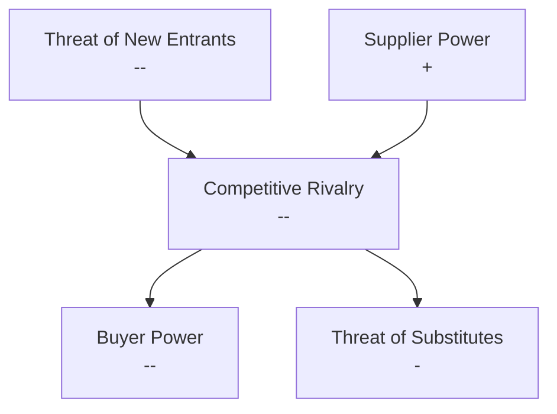
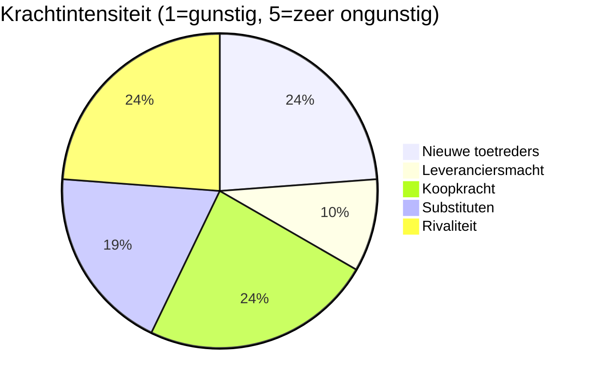
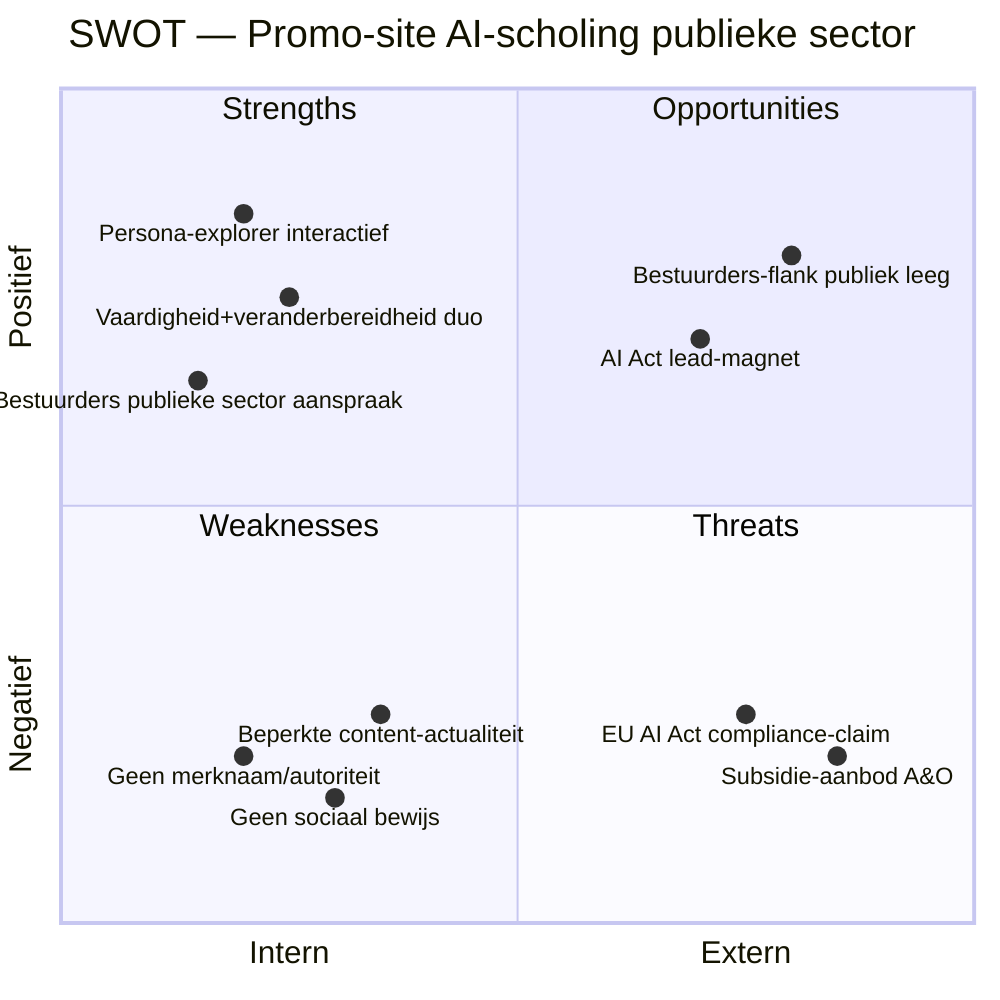

# Competitive Analysis: Promo-site AI-scholing voor de publieke sector

**Datum**: 2026-05-13
**Subject**: voorgestelde promo-website voor AI-scholing publieke sector (prototype-fase)
**Scope**: website-laag — positionering, content-structuur, functionaliteit, CTA-strategie van concurrerende NL-aanbieders. Niet de onderliggende didactiek.
**Industry**: AI-training / L&D voor de Nederlandse publieke sector (gemeenten, rijk, provincies, uitvoeringsorganisaties >1000 medewerkers)
**Geographic scope**: Nederland
**Competitors analyzed**: RADIO, VNG Academie, A&O fonds Gemeenten, Berenschot Academy, Highberg Academy, AI-Certified Publieke Sector, Bestuursacademie, Passionned

---

## Executive Summary

De NL-markt voor AI-scholing in de publieke sector is **vol maar oppervlakkig gedifferentieerd op site-niveau**. Vrijwel elke concurrent communiceert vergelijkbare boodschappen ("praktisch", "verantwoord", "EU AI Act-conform", "voorbeelden uit overheid") via vergelijkbare site-patronen (thema-/onderwerp-gestuurde catalogi, lineaire training-detailpagina's, beperkte interactiviteit). De **persona-aanpak die mijn opzet als UVP voert komt nergens als interactief site-element terug** — alleen Bestuursacademie segmenteert het aanbod expliciet naar rol, maar zonder interactieve explorer. Dit is een reële gap.

Drie aanscherpingen zijn nodig om écht onderscheidend te zijn:
1. **Persona-explorer moet interactief op de homepage**, niet als statische kaarten — anders verdwijnt het verschil met Bestuursacademie's roloverzicht.
2. **Bestuurders-laag aanspreken** is een open flank: Passionned doet het generiek, niemand publieke-sector-specifiek. Sterk te claimen.
3. **Sociaal bewijs is mijn grootste zwakte** — Highberg (5K orgs), Passionned (1.040 reviews 8,9/10), AI-Certified (Amsterdam/Breda/WaterNet) hebben dit al. "Trackrecord opbouwen via eerste trajecten" is té zacht; ik moet expliciete launch-partners benoemen voordat de site live gaat.

Branche-aantrekkelijkheid: **matig aantrekkelijk** — hoge rivaliteit en sterke koopmacht (mantelcontracten, aanbestedingen), maar drempels voor onderscheid liggen specifiek in *executie van persona-belofte* en *vertrouwen via referenties*.

---

## PESTEL Context (website-relevante factoren)

| Categorie | Factor met website-implicatie |
|---|---|
| **Political** | Kabinetsfocus op digitale weerbaarheid en AI-strategie overheid; bestuurders staan onder druk om "iets met AI" zichtbaar te tonen → site moet bestuurder-aanspraak voeren |
| **Economic** | Overheidsbudgetten staan onder druk; opdrachtgevers willen ROI/effectmeting expliciet → site moet meetbaarheid (30/60/90 dagen adoptie) tonen |
| **Social** | Weerstand bij medewerkers + ongelijkheid tussen early adopters/achterblijvers is breed erkend → site moet "veranderbereidheid"-laag prominenter maken |
| **Technological** | GenAI evolueert snel, content veroudert binnen kwartalen → site moet "actualisatie"-belofte zichtbaar maken (laatste updates, agenda) |
| **Environmental** | Niet primair relevant voor deze categorie | — |
| **Legal** | EU AI Act-geletterdheid is per februari 2025 verplicht voor organisaties die met AI werken → AI-Certified claimt dit centraal, ik moet hier minstens *gelijke* zichtbaarheid voeren |

**Bron-implicatie**: AI Act-deadline en verplichte AI-geletterdheid hebben de markt vol gemaakt — onderscheid komt niet meer uit "wij doen het ook" maar uit *hoe* de doelgroep wordt herkend.

---

## Porter's Five Forces — markt voor AI-scholing publieke sector NL

| Force | Rating | Sleutelfactoren | Evidence |
|---|---|---|---|
| Threat of new entrants | `--` | Lage technische drempel om generieke AI-training te leveren; AI Act-deadline creëert tijdelijke kans; veel consultants pivoten naar AI-academy | RADIO, VNG, Berenschot, Highberg, AI-Certified, Passionned, Bestuursacademie, A&O fonds, SBO, Academie Nederland — minstens 10 aanbieders al actief in NL publieke sector |
| Supplier power | `+` | Trainers + content-makers zijn vervangbaar; AI-tooling (LLM-API's) is gecommoditiseerd | Geen aanwijzing van vendor-lock bij concurrenten; meeste aanbieders bouwen eigen materiaal |
| Buyer power | `--` | Grote opdrachtgevers (>1000 medewerkers) onderhandelen via aanbesteding/mantelcontract; A&O-fondsen subsidiëren breed aanbod → "gratis" optie drukt prijzen | A&O fonds Gemeenten biedt 45-minuten kennismaking en webinar gratis aan; subsidiekanaal verandert beslissingscriteria |
| Threat of substitutes | `-` | Interne L&D-afdelingen bouwen eigen aanbod; Microsoft Learn / Copilot-trainingen via licentie; Coursera/LinkedIn Learning corporate accounts | Microsoft Learn heeft eigen "AI-bedrijfsopleiding voor de overheid"-pad; meeste rijksorganisaties hebben Microsoft 365-contracten |
| Competitive rivalry | `--` | 10+ aanbieders met overlappende boodschap ("praktisch", "verantwoord", "EU AI Act"); RADIO heeft publieke autoriteit; consultants gebruiken AI-training als acquisitie-funnel | Berenschot, Highberg, KPMG, Deloitte gebruiken AI-training als entry-point voor consultancy-opdrachten |

### Industry attractiveness diagram



**Industry attractiveness conclusie**: **Matig onaantrekkelijk** — drie sterke negatieve krachten (rivaliteit, buyer power, nieuwkomers). Onderscheid moet komen uit (a) *uitvoering van persona-belofte*, (b) *vertrouwen via referenties*, (c) *aanspraak van bestuurders-laag*. Generieke positionering verliest.

### Industry attractiveness — visuele weergave



---

## SWOT — Voorgestelde Promo-site

### SWOT diagram



### Strengths (jouw site, intern, positief)

| # | Sterkte |
|---|---|
| S1 | **Persona-aanpak als interactief site-element** — geen concurrent biedt op homepage-niveau een persona-explorer; statische rol-tekst (Bestuursacademie, AI-Certified) is het maximum |
| S2 | **Duo vaardigheid + veranderbereidheid** als positionering — geen concurrent maakt dit duo zichtbaar; allen blijven op "praktische vaardigheid" |
| S3 | **Bestuurders publieke sector** expliciet aanspreken — Passionned doet bestuurders maar generiek; concurrent-sites richten zich vrijwel uitsluitend op medewerker-niveau |
| S4 | **AI-readiness self-assessment** als interactief lead-element — geen concurrent biedt dit aan |

### Weaknesses (jouw site, intern, negatief)

| # | Zwakte |
|---|---|
| W1 | **Geen sociaal bewijs** — Highberg toont "5K organisaties / 50K deelnemers / 95% aanbevolen", Passionned "8,9 uit 1.040 reviews", AI-Certified Amsterdam/Breda/WaterNet. "Trackrecord opbouwen" is té zacht |
| W2 | **Geen institutionele autoriteit** — RADIO is *de* rijksacademie; VNG is *de* gemeentekoepel; A&O-fonds heeft sectorale legitimiteit. Nieuwkomer mist deze positie |
| W3 | **Beperkte launch-content** — concurrenten hebben podcasts (RADIO "Bits en beleid"), masterclass-reeksen (A&O fonds), uitgebreide knowledge hubs (Highberg). Mijn site start leeg |
| W4 | **Geen duidelijke prijspositionering** — A&O fonds = gratis via subsidie, AI-Certified = certificering, Bestuursacademie = "gebruik je opleidingsbudget"-CTA. Onduidelijkheid hier remt conversie |

### Opportunities (extern, positief — markt geeft openingen)

| # | Kans |
|---|---|
| O1 | **Bestuurders-flank publieke sector is leeg** — geen enkele concurrent maakt CIO/CHRO/SG/DG-aanspraak met persona-onderbouwing van de onderliggende organisatie |
| O2 | **AI Act-deadline (feb 2025) creëert acute vraag** — kan ingezet worden als lead-magnet (assessment "Voldoet jullie organisatie aan AI Act-geletterdheid?") |
| O3 | **Geen concurrent koppelt strategie aan executie zichtbaar** — bestuurder vraagt strategie, medewerker krijgt training; de "vertaalslag" tussen die twee lagen is een open positionering |
| O4 | **Persona-explorer als showcase** verdedigt UVP elke seconde die een bezoeker op de site doorbrengt — moeilijk te kopiëren door consultants met grote portfolio's |

### Threats (extern, negatief)

| # | Bedreiging |
|---|---|
| T1 | **A&O-fondsen subsidiëren 'gratis' aanbod** — drukt prijsverwachting en commodificeert het bestuurlijke beslismoment |
| T2 | **EU AI Act-compliance is table-stakes** geworden — AI-Certified, Bestuursacademie en RADIO claimen dit allemaal. Niet meer onderscheidend, alleen verplicht zichtbaar |
| T3 | **RADIO + VNG + A&O hebben kanaal-monopolie** — directe lijn naar HR/L&D-beslissers via institutionele kanalen die nieuwkomer niet heeft |
| T4 | **Consultants gebruiken AI-training als acquisitie-funnel** — Berenschot/Highberg kunnen lage prijs accepteren omdat training de opmaat is naar grotere consultancy-omzet |

---

## Competitor Website-SWOTs (kort)

### RADIO — `it-academieoverheid.nl`

| Strengths | Weaknesses |
|---|---|
| Publieke autoriteit als *de* rijksacademie | Geen rol-/persona-segmentering zichtbaar |
| Breed leeraanbod (webinars, podcasts, e-learning, op-maat) | Minimale interactiviteit op site |
| Eigen podcast "Bits en beleid" voor bestuurders | Generieke positionering "leren van elkaar" |
| Toon laagdrempelig-vriendelijk | Geen meetbaarheid/effectmeting zichtbaar |

### VNG Academie — `vng.nl/leren-bij-de-vng`

| Strengths | Weaknesses |
|---|---|
| 6 thematische pijlers (kansengelijkheid, bestaanszekerheid, etc) — sluit aan op bestuurlijke agenda | Geen rol-segmentering, geen persona-aanpak |
| Reach binnen gemeenten enorm | AI niet als hoofdthema; "Vraag het AI" is een gimmick-knop |
| Praktijkgericht ("praktijk van morgen") | Beperkt interactief |

### A&O fonds Gemeenten — `aeno.nl/ai-en-chatgpt-academy`

| Strengths | Weaknesses |
|---|---|
| Gratis aanbod via subsidie — onverslaanbare drempel | Geen rol-segmentering; brede generalistische aanspraak |
| Video-first ("45 min wat je moet weten") | Geen testimonials/cases |
| Institutionele partners (FNV, VNG, CNV, CMHF) als logo-bewijs | Aanbod is kennismaking, geen diepgaand traject zichtbaar |

### Berenschot Academy — `berenschot.nl/.../ai-voor-beleidsmedewerkers`

| Strengths | Weaknesses |
|---|---|
| Eén expliciete rol-aanspraak ("beleidsmedewerker") | Eén rol, geen multi-persona-aanbod |
| Incompany-flexibiliteit (woningopgave, sociaal domein) | Geen testimonials/cases zichtbaar |
| Trainer-foto's en contact-info | Lineaire pagina-structuur, weinig interactief |
| Sterke merknaam (consultancy-autoriteit) | Hoge prijsverwachting via consultancy-merk |

### Highberg Academy — `highbergacademy.nl`

| Strengths | Weaknesses |
|---|---|
| Sterk sociaal bewijs (5K orgs, 50K deelnemers, 95% aanbevolen) | Publieke sector niet expliciet aangesproken op homepage |
| Trainingen per thema gestructureerd (3 categorieën) | Geen persona-explorer of rol-filter |
| Knowledge Hub aanwezig | Generieke "transformatie"-positionering |

### AI-Certified Publieke Sector — `aicertified.nl/programma/publieke-sector/`

| Strengths | Weaknesses |
|---|---|
| EU AI Act-compliance als centrale positionering | "2-uur training" voelt licht voor strategisch niveau |
| Cases: Amsterdam, Breda, WaterNet | Geen rol-/persona-segmentering |
| Certificaat na afronding | Modulair maar niet persona-routing |
| Modulair met animaties/interactieve werkvormen | Brede aanspraak ("iedereen in publieke sector") |

### Bestuursacademie — `bestuursacademie.nl/opleidingen/ai-rijksoverheid`

| Strengths | Weaknesses |
|---|---|
| **4 opleidingen rol-gesegmenteerd** (basiscursus / strategisch / praktisch / hands-on) — dichtst bij mijn UVP | Geen interactieve persona-explorer — alleen rol-tekst |
| Doelgroepen expliciet (beleidsmedewerkers, adviseurs, projectleiders, uitvoeringsprofessionals, leidinggevenden) | Geen cases/testimonials |
| WhatsApp + telefoon + formulier — multi-kanaal CTA | Lineaire detailpagina's per opleiding |
| "Gebruik jouw opleidingsbudget" als prominente CTA | Bestuurders-laag niet expliciet aangesproken |

### Passionned — `passionned.nl/opleidingen/artificial-intelligence/`

| Strengths | Weaknesses |
|---|---|
| **Expliciete aanspraak bestuurders/directie/managers** | Geen publieke-sector-specifieke positionering |
| Sterk sociaal bewijs (8,9 uit 1.040 reviews; ASR, KPN, Gemeente Woerden) | Eén traject, geen persona-routing |
| 6+ CTA's verspreid op pagina | Feedback signaleert te hoog niveau voor beginners |
| Heldere dagindeling (ochtend/middag, 8 modules) | Generiek aansprekend, geen sectorbinding |

---

## Side-by-side comparison (website-niveau)

| Dimensie | **Mijn opzet** | RADIO | VNG | A&O fonds | Berenschot | Highberg | AI-Certified | Bestuursacademie | Passionned |
|---|---|---|---|---|---|---|---|---|---|
| Persona-segmentering op site | ✅ interactief (gepland) | ❌ | ❌ | ❌ | ⚠️ 1 rol | ❌ | ❌ | ✅ 4 rollen (statisch) | ❌ |
| Bestuurders-aanspraak | ✅ expliciet | ⚠️ via podcast | ❌ | ❌ | ❌ | ❌ | ❌ | ⚠️ in lijst | ✅ generiek |
| Publieke-sector-fit | ✅ | ✅✅ instituut | ✅✅ instituut | ✅✅ instituut | ✅ | ❌ | ✅ | ✅ | ❌ |
| EU AI Act-claim | ✅ | ✅ | ⚠️ | ⚠️ | ⚠️ | ⚠️ | ✅✅ centraal | ✅ | ⚠️ |
| Sociaal bewijs (cases/cijfers) | ❌ | ⚠️ podcast/columns | ⚠️ partner-logos | ⚠️ partner-logos | ❌ | ✅✅ 5K orgs / 95% | ✅ 3 gemeenten | ❌ | ✅✅ 1.040 reviews / 8,9 |
| Interactieve site-elementen | ✅ explorer + assessment | ❌ | ⚠️ themafilter | ⚠️ like/share | ❌ | ❌ | ⚠️ modules | ⚠️ WhatsApp | ⚠️ download brochure |
| Veranderbereidheid expliciet | ✅ | ❌ | ❌ | ❌ | ❌ | ⚠️ "verandering" generiek | ❌ | ❌ | ❌ |
| Pricing-signaal | ⚠️ indicatie | ❌ | ✅ per training | ✅ gratis/subsidie | ✅ open | ❌ | ❌ | ✅ "opleidingsbudget" | ✅ open |
| Effectmeting (ROI, adoptie) | ✅ 30/60/90d | ❌ | ❌ | ❌ | ❌ | ⚠️ aanbevelingscijfer | ❌ | ❌ | ⚠️ rating |

**Lezing**: mijn opzet is sterk op persona, veranderbereidheid en effectmeting; zwak op sociaal bewijs en autoriteit. Bestuursacademie ligt het dichtst bij mijn positionering en is dus de **directe benchmark**.

---

## Competitive Positioning Map

Twee dimensies die het scherpst differentiëren in deze markt: **diepte van persona-/rol-segmentering op de site** en **focus op publieke sector**.

```mermaid
quadrantChart
    title Positionering — persona-diepte vs publieke-sector-focus
    x-axis Lage persona-segmentering --> Hoge persona-segmentering
    y-axis Generiek/breed --> Publieke-sector-focus
    quadrant-1 Onderscheidend in publieke sector
    quadrant-2 Diep maar generiek
    quadrant-3 Niche/zwak
    quadrant-4 Breed publieke sector
    Mijn opzet (gepland): [0.9, 0.92]
    Bestuursacademie: [0.75, 0.85]
    Berenschot: [0.45, 0.7]
    AI-Certified: [0.35, 0.78]
    RADIO: [0.2, 0.95]
    VNG: [0.15, 0.92]
    A&O fonds: [0.25, 0.88]
    Highberg: [0.3, 0.35]
    Passionned: [0.4, 0.25]
```

**Interpretatie**:
- Rechtsboven (mijn doelpositie) is leeg op één concurrent na — Bestuursacademie. Maar die heeft geen interactieve persona-explorer en geen bestuurders-aanspraak. Daar valt mijn onderscheid.
- Linksboven (publiek-instituut, lage persona-diepte) is bezet door RADIO/VNG/A&O. Mijn site kan daar niet winnen op autoriteit — moet de strijd voeren op persona-diepte.
- Linksonder/rechtsonder is voor mij niet relevant (geen publieke-sector-focus).

---

## TOWS Strategy Matrix

```mermaid
quadrantChart
    title TOWS — promo-site aanscherping
    x-axis Strengths --> Weaknesses
    y-axis Threats --> Opportunities
    quadrant-1 WO Strategies
    quadrant-2 SO Strategies
    quadrant-3 ST Strategies
    quadrant-4 WT Strategies
    Persona-explorer bouwen als signature feature: [0.15, 0.85]
    AI Act readiness self-assessment lanceren: [0.2, 0.7]
    Bestuurders-spread publieke sector claimen: [0.1, 0.65]
    Launch-partners contracteren voor proof: [0.75, 0.8]
    Podcast/serie voor bestuurders starten: [0.7, 0.65]
    Co-branding met A&O of VNG verkennen: [0.85, 0.6]
    Persona-explorer kopieerbaar maken risico: [0.2, 0.2]
    Compliance niet als UVP voeren: [0.25, 0.3]
    Geen consultancy-funnel mimicken: [0.15, 0.25]
    Indicatieve pricing transparant maken: [0.8, 0.2]
    Voorkom kennismaking-gimmicks (45 min A&O): [0.75, 0.15]
```

| | **Strengths (S)** | **Weaknesses (W)** |
|---|---|---|
| **Opportunities (O)** | **SO — exploit your edge** | **WO — close gaps to unlock opportunities** |
| | SO1. Bouw de **persona-explorer als signature site-feature** (S1+O4): interactief, niet PDF-geleverd. Elke bezoeker doorloopt een rol → krijgt previewdeck + casus + leerpad. Verdedigt UVP elke sessie. | WO1. **Contracteer 2–3 launch-partners** vóór site-launch (W1+O3): één gemeente, één uitvoeringsorganisatie, één rijks-DG. Hun logo/quote sluit het sociaal-bewijs-gat. |
| | SO2. Lanceer **AI Act self-assessment** (S4+O2): 8–10 vragen, gepersonaliseerd rapport, lead-magnet. Geen concurrent doet dit. | WO2. Start een **podcast/serie voor publieke-sector-bestuurders** (W3+O1): bouwt thought-leadership-positie waar alleen RADIO opereert. |
| | SO3. Claim **"vertaling van bestuurlijke ambitie naar uitvoering"** als kern-narratief (S3+O3): geen concurrent koppelt strategie-laag aan persona-laag zichtbaar. | WO3. **Verken co-branding** met A&O-fonds of VNG voor pilot-traject (W2+O1): leen institutionele autoriteit zonder eigen merk op te bouwen. |
| **Threats (T)** | **ST — defend with strengths** | **WT — minimize exposure** |
| | ST1. **Patenteer/copyright de persona-bibliotheek** of leg eigendom vast (S1+T4): consultancies kunnen het na-bouwen; methodische lock-in vertraagt. | WT1. **Voer EU AI Act niet als UVP** (W2+T2) — alleen als compliance-comfort. Concurrenten domineren dit narratief al. |
| | ST2. **Vaardigheid + veranderbereidheid als duo-narratief** voor alle pagina's (S2+T1): de A&O "gratis kennismaking" dekt alleen vaardigheid; mijn duo positioneert mij in andere koopcategorie. | WT2. **Geen consultancy-funnel-look** kopiëren (W4+T4): Berenschot/Highberg lijken academies maar verkopen vervolgopdrachten. Mijn site moet de trainingsbelofte zelf-afsluitend tonen. |
| | ST3. **Effectmeting (30/60/90d) prominente positie** geven (S4+T1): differentieert van A&O "kennismaking"-model en commodity-content. | WT3. **Indicatieve prijsbandbreedte tonen** (W4+T3): voorkomt dat opdrachtgevers afhaken bij "neem contact op" en bij A&O's gratis-anker blijven steken. |

---

## Strategic Action Plan — site-aanscherping

| # | Actie | Bron | Prioriteit | Termijn | Verwacht effect |
|---|---|---|---|---|---|
| 1 | **Persona-explorer als interactieve hero-feature** bouwen (rol-kiezer → preview-leerpad + 1 casus + uitkomst); statische kaarten zijn onvoldoende | SO1 / W1 vs Bestuursacademie | Kritisch | Korte termijn | Verdedigt UVP elke bezoek; bouwt zichtbaar verschil met dichtste benchmark |
| 2 | **2–3 launch-partners** contracteren met benoembare quote en logo vóór site-launch | WO1 | Kritisch | Korte termijn | Sluit het grootste gat (W1) tov Highberg/Passionned/AI-Certified |
| 3 | **AI Act self-assessment** ontwikkelen — 8–10 vragen, gepersonaliseerd rapport, light-gated (resultaat direct, rapport via mail) | SO2 | Hoog | Korte termijn | Unieke lead-magnet die geen concurrent biedt |
| 4 | **Bestuurders-laag** expliciet aanspreken in hero + eigen sectie ("Voor CIO/CHRO/SG/DG") | SO3 / O1 | Hoog | Korte termijn | Claim van lege flank in publieke sector |
| 5 | **"Vaardigheid + veranderbereidheid"** als duo-narratief consequent op homepage, persona-pagina's, traject-pagina's | ST2 | Hoog | Korte termijn | Verschuift framing weg van commodity-vaardigheidstraining |
| 6 | **Effectmetingsbelofte** (30/60/90 dagen adoptie, pre/post-meting) prominent op homepage en traject-pagina | ST3 | Hoog | Korte termijn | Tegen-anker voor A&O "gratis kennismaking" — wij verkopen *resultaat* |
| 7 | **Indicatieve prijsbandbreedte** per traject-type tonen | WT3 | Middel | Korte termijn | Verhoogt conversie-bereidheid; voorkomt onnodige A&O-vergelijking |
| 8 | **Podcast of artikel-serie voor bestuurders** opzetten — minimaal 3 afleveringen klaar bij launch | WO2 | Middel | Middellange termijn | Sluit autoriteits-gat (W2); positioneert tegenover RADIO's "Bits en beleid" |
| 9 | **EU AI Act-claim** behouden maar niet als UVP voeren — alleen als compliance-comfort-strip op traject-pagina | WT1 | Middel | Korte termijn | Voorkomt commodity-positionering naast AI-Certified |
| 10 | **Co-branding-verkenning** met A&O-fonds of VNG voor 1 pilot | WO3 | Laag-Middel | Middellange termijn | Leen institutionele autoriteit; subsidie-kanaal beschikbaar |
| 11 | **Persona-bibliotheek-eigendom** vastleggen (©, format-licentie) zodra eerste set af is | ST1 | Laag | Middellange termijn | Maakt na-bouwen door consultants duurder |

---

## Sources

- [RADIO Homepage](https://www.it-academieoverheid.nl/)
- [RADIO — AI en Generatieve AI](https://www.it-academieoverheid.nl/onderwerpen/a/artificiele-intelligentie)
- [RADIO — Opleidingen en cursussen](https://www.it-academieoverheid.nl/onderwerpen/o/opleiding-en-cursussen)
- [RADIO — Opleidingen op maat](https://www.it-academieoverheid.nl/onderwerpen/o/opleidingen-op-maat)
- [VNG Academie — Leren bij de VNG](https://vng.nl/leren-bij-de-vng)
- [VNG — Workshop Kunstmatige intelligentie](https://www.vngconnect.nl/academie/Training/Workshop-Kunstmatige-intelligentie--KI--/9a3f862d-3854-44b5-9932-5240467ae101)
- [A&O fonds Gemeenten — AI en ChatGPT Academy](https://www.aeno.nl/ai-en-chatgpt-academy)
- [A&O fonds Gemeenten — Werken met AI](https://www.aeno.nl/nieuwe-skills-voor-werken-met-ai)
- [Berenschot Academy — AI voor beleidsmedewerkers](https://www.berenschot.nl/opleidingen-en-trainingen/ai-voor-beleidsmedewerkers)
- [Highberg Academy Homepage](https://www.highbergacademy.nl/)
- [Highberg Academy — Digitale Transformaties Publieke Sector](https://www.highbergacademy.nl/trainingen/digital-strategy-execution/digitale-transformaties-in-de-publieke-sector)
- [AI-Certified — Publieke Sector](https://aicertified.nl/programma/publieke-sector/)
- [Bestuursacademie — AI-opleidingen Rijksoverheid](https://www.bestuursacademie.nl/opleidingen/ai-rijksoverheid)
- [Passionned — AI training voor managers en bestuurders](https://www.passionned.nl/opleidingen/artificial-intelligence/)
- [Digitale Overheid — AI-trainingen overzicht](https://www.digitaleoverheid.nl/overzicht-van-alle-onderwerpen/artificiele-intelligentie-ai/ai-trainingen/)
- [Dutch IT Leaders — Nieuwe AI-cursus voor ambtenaren](https://www.dutchitleaders.nl/news/722737/nieuwe-ai-cursus-voor-ambtenaren)

## Assumptions & Limitations

- **`[Assumption]`** "Persona-explorer" als interactief site-element is op deze 8 concurrent-sites niet aanwezig. Andere niet-onderzochte aanbieders (SBO, Academie Nederland, NobleProg, ICTRecht, Skillsoft/Global Knowledge, IBM/Microsoft Learn) niet diepgaand getoetst — kan in zeldzame gevallen wel bestaan.
- **`[Assumption]`** Plotcoördinaten op de positioning map zijn relatief, niet metrisch — bedoeld voor strategische lezing, niet voor schaalbare meting.
- **`[Limited data]`** Hoogberg's publieke-sector-portfolio is mogelijk dieper dan de homepage suggereert; detail-trainingspagina was niet bereikbaar (HTTP 500).
- **`[Limited data]`** VNG-detailpagina van de AI-workshop redirected naar de algemene leerpagina; specifieke workshop-opzet niet direct getoetst.
- **`[Assumption]`** Het "gratis"-aanbod van A&O-fondsen geldt via subsidie voor sectorale doelgroep — niet automatisch voor rijk/uitvoeringsorganisaties buiten de fondsen.
- **Geen prijsdata vergeleken** — concurrenten tonen prijzen of vragen contact; geen systematische vergelijking gemaakt omdat dit buiten de website-scope viel.
- **Geen evaluatie van onderliggende didactiek/kwaliteit** — expliciet door gebruiker uitgesloten.
- **Markt verandert snel** — content gewijzigd na 2026-05-13 kan deze analyse op punten achterhalen.
