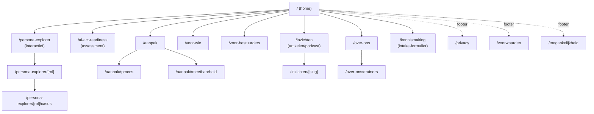

# Plan: Promo-site AI-scholing publieke sector

**Datum**: 2026-05-13
**Status**: voorgesteld plan (niet uitvoering-vrijgegeven)
**Bouwt op**: `business-case-lean-canvas.md` · `competitive-analysis-promo-site.md` · 20 trainee-persona's in `documentatie/business/personas/trainees/` · `design-system/` · `temp/gtm/gtm-plan.md` · `temp/business/segmentation.md`

---

## 1. Doel & succesmaatstaven

**Hoofddoel**: bestuurders en HR/L&D-beslissers van publieke organisaties (>1000 medewerkers) een intake-gesprek laten boeken.

**Secundaire doelen**:
- Lead-capture via AI Act-readiness self-assessment (gated rapport)
- Thought-leadership-positie opbouwen (artikelen, podcast)
- Persona-explorer als signature site-feature die het UVP elke sessie waarmaakt

**Site-succesmaatstaven**:
| Maatstaf | Doel jaar 1 |
|---|---|
| Self-assessment voltooiingsratio | ≥40% van starters voltooit |
| Intake-formulier-conversie (van bezoek → ingevuld) | 1,5–3% |
| Intake-gesprekken via site | 4–6 per maand vanaf maand 4 |
| Median bezoekduur op homepage | ≥75s |
| Persona-explorer engagement (vanaf v1.2) | ≥30% van bezoekers raakt ≥1 rol aan |

Deze doelen sluiten aan op de GTM-target (10–15 klantgemeenten, jaar 1).

---

## 2. Architectuur & stack-keuzes

### 2.1 Repo-structuur (npm workspaces)

```
/home/sven/Projects/ai-educatie/
├── package.json                  # workspaces root
├── design-system/                # bestaande package: @your-org/design-system
├── promotion-site/               # NIEUW: marketing-site
│   ├── package.json              # declareert @your-org/design-system als workspace-dep
│   ├── nuxt.config.ts
│   ├── pages/
│   ├── components/
│   ├── composables/
│   ├── content/                  # markdown-content (insights, persona-overlay)
│   └── public/
├── documentatie/                 # bestaande VitePress-docs (intern)
└── .vitepress/                   # bestaande config voor documentatie/
```

**Voordeel workspaces**:
- `design-system` is via `file:`/workspace-protocol direct als lokale package beschikbaar in `promotion-site`
- Tokens-rebuild (`npm run build:tokens` in design-system) propageert naar promo-site zonder publish
- Componenten-imports zijn echte module-imports, geen copy
- Eén `npm install` op root installeert alles

### 2.2 Promo-stack: Nuxt 3

| Beslissing | Reden |
|---|---|
| **Nuxt 3** (boven Vite-SPA of VitePress) | Marketing-site → SEO-essentieel. Nuxt biedt SSG via `nuxt generate`, file-based routing, `<NuxtImage>`, meta-management out of the box |
| **Static generation** (`nuxt generate`) | Geen runtime-server nodig; deploy naar Netlify/Vercel/CDN. Past bij design-system's bestaande Netlify-config |
| **TypeScript** | Past bij design-system; voorkomt regressies op data-types van persona's |
| **Tailwind UITGESCHAKELD** | Design-system levert tokens + SCSS-mixins; Tailwind zou doubleren en risico op visuele drift |
| **Inhoud via `@nuxt/content`** | Persona-overlay (marketing-versies van de persona's), insights/blog, casussen — markdown-driven |
| **i18n: nee in jaar 1** | NL-only |

### 2.3 Design-system koppeling

`promotion-site/package.json` (skelet):
```jsonc
{
  "name": "promotion-site",
  "private": true,
  "dependencies": {
    "@your-org/design-system": "workspace:*"
  }
}
```

In Nuxt-config / setup:
- Tokens: `import '@your-org/design-system/css'` (light theme)
- SCSS-mixins: `@use '@your-org/design-system/scss/mixins/typography' as *;`
- Componenten: `import { ButtonPrimary, Card } from '@your-org/design-system/components/...'` — selectief

**Brand-aanpassing voor marketing-toon**: design-system is white-label; promo-site kan via een eigen brand-override (`brand.json`-variant of CSS-override-laag) een warmere, meer narratieve uitstraling krijgen zonder het systeem te forken. **Beslissing nodig** (zie §9): identieke brand of marketing-brand-variant?

---

## 3. Sitemap



**Diepte ≤2 niveaus** voor SEO en navigatie. Persona-pagina's krijgen statische URL's per rol (goed voor LinkedIn-deeplinking vanuit content).

---

## 4. Per-pagina content + functionaliteit-brief

### 4.1 Home `/`

**Boven de vouw** (MVP-versie, zonder persona-explorer-teaser en partner-strip):
- Hero: *"AI-scholing die écht landt — omdat we je mensen kennen."* + sub: persona-gebaseerd · publieke sector · vaardigheid + veranderbereidheid
- Hero-visual: **ambiance-component** (illustratief, niet stockfoto) — zie §8a voor component-spec
- **Primaire CTA**: "Plan een kennismaking"
- Secundaire CTA: "Doe de AI Act-check"
- *Niet in MVP*: partner-logo-strip (komt zodra partners ja-zeggen, zie §6); persona-explorer-teaser (v1.2)

**Onder de vouw, secties (MVP)**:
1. **Probleem-spiegel** (3 kaarten): strategie blokkeert op uitvoering · generieke training landt niet · shadow AI-risico
2. **Aanpak in 4 stappen**: persona-mapping → leerpaden → uitvoering → meting 30/60/90d
3. **Vaardigheid + veranderbereidheid als duo**: aparte sectie met visuele uitwerking — duo-narratief dat geen concurrent voert
4. **Voor wie**: expliciet >1000 medewerkers, publieke sector, beslissers
5. **AI Act self-assessment-blok**: "Hoe AI-Act-geletterd is jullie organisatie? Doe de check (5 min)"
6. **Voor bestuurders-teaser**: korte sectie met aparte CTA naar `/voor-bestuurders`
7. **Inzichten-strip**: 3 laatste artikelen/podcast-afleveringen
8. **Eindcontact**: korte intake-CTA

### 4.2 Persona-explorer `/persona-explorer`

**Niet in MVP** — deze pagina wordt in v1.2 toegevoegd. Reden: bouwen op stabiele basis met persona-overlay-content die de tijd krijgt om te volwassenen. Spec staat in §5.1 (gereserveerd).

In MVP wordt de persona-aanpak alleen *beschreven* op `/aanpak` (geen interactieve explorer).

### 4.3 AI Act-readiness `/ai-act-readiness`

Zie §5.2 voor functionele spec.

### 4.4 Aanpak `/aanpak`

- Methode-uitleg: persona-mapping, leerpaden, casuïstiek
- Combinatie vaardigheid + veranderbereidheid (eigen sectie — niemand doet dit zichtbaar)
- Meetbaarheid: 30/60/90 dagen-adoptie-meting, pre/post-toets, NPS
- Verantwoord gebruik: AVG, EU AI Act-compliance (als comfort-strip, niet als UVP)
- Train-the-trainer-optie

### 4.5 Voor wie `/voor-wie`

- ICP-spec: gemeenten 50–100K inwoners primair, G40 secundair, regionale clusters tertiair (uit `temp/business/segmentation.md`)
- 5 segmenten met inkooptriade (gemeentesecretaris · CIO · CHRO)
- Veelgestelde vragen van inkopers

### 4.6 Voor bestuurders `/voor-bestuurders`

**Aparte landingspagina** voor CIO/CHRO/SG/DG — de lege flank uit de competitive analysis.
- Probleem-frame uit bestuurlijk perspectief: politieke druk, raads/college-vragen, AI Act-aansprakelijkheid
- Bewijsvoering die zij nodig hebben (governance-templates, AI Act-checklist, peer-netwerk)
- Aparte CTA: "Boek een 30-min strategie-sparring" (lichtere drempel dan intake-traject)

### 4.7 Inzichten `/inzichten`

- Lijstpagina met filter (rol, thema, type: artikel/podcast)
- Markdown-gedreven via `@nuxt/content`
- Iedere `[slug]` = detail-pagina
- **Launch-doel**: 3 artikelen + 1 podcast-aflevering bij go-live (uit GTM-plan)

### 4.8 Over ons `/over-ons`

- Verhaal-laag (geen claim van trackrecord die er niet is)
- Trainer-profielen (Mike, Marieke, Ravi) — uit `documentatie/business/personas/trainers/`
- Methodische onderbouwing & inspiratiebronnen
- Eerlijk over fase: "We bouwen ons trackrecord op met launch-partners"

### 4.9 Kennismaking `/kennismaking`

- Kort formulier: organisatie, rol, aantal medewerkers, top-pijn (multi-select), gewenst contactmoment
- Bevestigingsscherm met direct calendar-link (Cal.com-embed)
- Track conversion event

### 4.10 Legal (footer-pagina's)

- `/privacy`, `/voorwaarden`, `/toegankelijkheid` (WCAG 2.2 AA-statement)

---

## 5. Signature features — functionele specs

> **MVP-omslag**: persona-explorer is uitgesteld naar v1.2. AI Act-assessment blijft de enige interactieve signature feature in MVP. Voor differentiatie leunt MVP op (a) bestuurders-flank, (b) duo-narratief vaardigheid+veranderbereidheid, (c) AI Act-assessment, (d) visuele/copy-kwaliteit via de promo-component-bibliotheek (§8a).

### 5.1 Persona-explorer *(uitgesteld naar v1.2)*

**Doel**: laat een bezoeker binnen 30 seconden voelen dat wij hun werkelijkheid kennen. Verdedigt UVP de hele bezoeksessie.

**Bron-data**: de 20 bestaande persona-bestanden in `documentatie/business/personas/trainees/`. Niet alle 20 op de promo-site — selecteer 6–10 meest herkenbare voor MVP.

**Interactie**:
1. **Stap 1 — rol-kiezer**: grid van rol-kaartjes (HR-manager, Beleidsadviseur RO, Communicatieadviseur, etc) met icoon + 1-regelig pijn-statement
2. **Stap 2 — rol-preview**: bij klik unfoldt een paneel met:
   - "Dag-in-het-leven" (3–5 taken)
   - "Wat AI hier voor je doet" (3 use cases)
   - 1 concrete casus met voor/na (anonymized)
   - Voorbeeld-leerpad (4 modules met tijdsindicatie)
   - "Past dit bij jullie organisatie?" → CTA naar intake
3. **Stap 3** (optioneel): "Voeg meer rollen toe" → bezoeker bouwt mini-shortlist; eindelijst kan via email worden verstuurd → lead-capture

**Technische opzet**:
- Markdown-frontmatter per persona in `promotion-site/content/persona-overlays/{rol}.md` — promo-laag bovenop de business-persona's (kortere taal, bezoekersgericht)
- Vue 3-component `<PersonaExplorer>` met state in URL-querystring (deelbaar)
- Geen externe afhankelijkheden; volledig client-side
- Statische generatie per rol-pagina voor SEO (`/persona-explorer/communicatieadviseur`)

**Acceptatie**:
- Werkt zonder JavaScript (statische rol-pagina's blijven leesbaar; alleen verbreding is interactief)
- Mobile-first: rol-grid wordt scrollbare horizontale lijst
- Toetsenbord-navigatie volledig
- WCAG 2.2 AA-compliant

### 5.2 AI Act-readiness assessment

**Doel**: lead-magnet die niemand biedt; sluit aan op acute AI Act-drempel.

**Inhoud**:
- 8–10 vragen, 5 minuten
- Vragen over: AI-gebruik in organisatie, geletterdheids-beleid, risico-klassificatie, training-status, governance-structuur
- Light-gating: scoring direct zichtbaar; uitgebreid rapport (PDF) via mail

**Functionele werking**:
1. Welkom-scherm + uitleg ("Wat je krijgt", "Hoe lang", "Anoniem of niet?")
2. Vragenlijst — 1 vraag per scherm, progress-bar
3. Direct resultaat: score-band (4 niveaus: Beginstadium / Op weg / Bijna klaar / Voorbereid) met 1-alinea duiding
4. Mail-form (gated): naam, organisatie, rol → "Stuur me het volledige rapport"
5. Rapport-mail bevat: gepersonaliseerd advies per zwak punt + CTA naar intake-gesprek

**Technische opzet**:
- Vragen + scoring-logica in JSON-fixture
- Vue 3-component met state in localStorage (tussentijds opslaan)
- Email-verzending via serverless function (Netlify Function) + transactionele mail (Resend / Postmark)
- GDPR-compliant: expliciete opt-in, dataminimalisatie

**Niet in MVP** (parkeer voor v1.1): organisatie-vergelijking ("hoe staat jullie score t.o.v. andere gemeenten?")

### 5.2.a MVP-positionering zonder persona-explorer

Omdat de UVP-belofte ("we kennen je mensen") niet meer interactief wordt waargemaakt op MVP, moet de **homepage-copy** de belofte dragen. Concreet:
- Hero-sub-copy noemt minstens 2 rol-categorieën expliciet ("voor beleidsadviseurs, dienstverleners, controllers en …")
- Aanpak-pagina toont 3–4 *statische* rol-cards met casus-snippet (niet interactief, wel concreet)
- Insights-artikelen worden bewust per persona-categorie geschreven (zie §6.3)
- Het duo-narratief vaardigheid+veranderbereidheid wordt op elke pagina visueel doorgevoerd via een eigen ambiance-component

### 5.3 Cal.com-integratie

- Embed in `/kennismaking` voor directe boeking
- 2 event-types: 30-min kennismaking (alle bezoekers) + 30-min strategie-sparring (bestuurders)
- Routing op basis van form-input

---

## 6. Sociaal bewijs & content-strategie

**Grootste site-zwakte** uit de competitive analysis. Plan in 3 lagen — laag 1 is **niet meer blokkerend voor MVP-launch**.

### Laag 1 — Launch-partners (gewenst, niet-blokkerend voor MVP)

MVP gaat live als **soft-launch** zonder partner-strip. Zodra partners ja-zeggen, verschijnt de strip post-launch (geen redeploy nodig — content-driven).

**Plan**:
- Acquisitie loopt parallel via GTM-spoor (Marieke's netwerk + VNG-bijeenkomsten)
- Componenten worden in MVP wel klaargemaakt (`<TrustStrip>`, `<TestimonialCard>`) zodat content alleen ingevuld hoeft te worden
- Streefdatum eerste partner zichtbaar: maand 2 post-launch
- Tot dat moment: methodische onderbouwing (laag 2) draagt het vertrouwen

### Laag 2 — Methodische onderbouwing (compenserend)

Tot trackrecord-cijfers er zijn:
- Whitepaper "Persona-aanpak voor AI-scholing in de publieke sector" — downloadable, gated
- Onderbouwing didactiek (linked references)
- Trainer-portfolio (Marieke's gemeente-ervaring, Ravi's tech-diepgang)
- "Hoe wij meten" — transparante 30/60/90-d methode

### Laag 3 — Thought leadership (langzaam opbouwen)

Volgens GTM-plan: 1–2 artikelen per maand, podcast-serie. Plan voor de site:
- 3 artikelen klaar bij launch (1 per trainer-stem)
- Podcast-pilot: 1 aflevering bij launch ("Wat bestuurders niet over AI-training weten")
- Maandelijks ritme vanaf maand 2

---

## 7. Fasering

### Fase 0 — Pre-launch (week -4 tot -1)

| Spoor | Werk |
|---|---|
| Architectuur | npm workspaces opzetten, Nuxt 3-scaffold in `promotion-site/`, design-system linken, brand-variant beslissen |
| **Promo-componenten** | Eerste batch sales/ambiance-componenten bouwen (zie §8a) — kritisch pad |
| Content | Homepage-copy + 6 pagina-teksten + 3 inzichten-artikelen + 1 podcast-aflevering; **3–4 statische rol-cards met casus-snippet** als persona-vervanger |
| AI Act-assessment | Vragenlijst-content + scoring-logica + rapport-template |
| Legal | privacy-statement, AVG-compliance assessment, toegankelijkheidsverklaring |
| Tracking | Plausible-setup |

### Fase 1 — MVP-launch (week 0)

**Scope** (krapper dan eerste plan):
- Home, /aanpak (met statische rol-cards), /voor-wie, /voor-bestuurders, /inzichten, /over-ons, /kennismaking, footer-legal
- **AI Act-assessment**: vragenlijst + directe score (rapport-mail via Netlify Function) — enige interactieve signature feature
- **Cal.com**-integratie op /kennismaking
- **Promo-component-bibliotheek**: minimaal noodzakelijke set (zie §8a) — visuele kwaliteit draagt het differentiatie-verhaal
- 3 inzichten-artikelen + 1 podcast-aflevering
- *Soft-launch*: geen partner-strip, geen "vertrouwd door"-claim. Klaar voor content-injectie zodra partners ja-zeggen.

**Quality gates**:
- WCAG 2.2 AA-conformiteit (verificatie via axe + handmatige toetsen)
- Lighthouse: performance ≥90, SEO 100, accessibility 100
- Werkt zonder JS (kerncontent leesbaar)
- Mobile-first getest op iPhone SE + Android-mid-range

### Fase 1.5 — post-launch content-injectie (zodra beschikbaar, geen redeploy)

Deze veranderingen zijn **content-driven** — componenten staan al klaar; alleen markdown/JSON-invul nodig:
- Partner-strip activeren zodra eerste partner ja-zegt
- Testimonial-cards vullen bij klant-quotes
- Maandelijkse artikelen-publicatie via `@nuxt/content`

### Fase 2 — v1.1 (maand 2–3)

- Self-assessment uitbreiden: branche-vergelijking ("hoe scoort jullie organisatie t.o.v. peers?")
- A/B-test op hero-copy + CTA-varianten
- Newsletter-archief
- 2e batch promo-componenten (rich casus-layouts, video-skin, animated-stat-counters)
- Eerste klant-cases publiceren wanneer partners hier toestemming voor geven

### Fase 3 — v1.2 (maand 4–6) — persona-explorer terug

- **Persona-explorer activeren** met 6–8 rollen (de oorspronkelijk geplande signature feature)
- Persona-overlays in `content/persona-overlays/` schrijven (4 weken werk parallel aan partner-acquisitie)
- Casus-detail-pagina's per rol
- Multi-rol shortlist + email-share

### Fase 4 — v2.0 (maand 7+)

- Alle 20 rollen in persona-explorer
- Train-the-trainer-pagina + dienst-uitbreiding
- LinkedIn-content-feed-embed
- ROI-calculator (extra lead-magnet)

---

## 8a. Promo-component-bibliotheek (sales & ambiance)

Omdat de MVP minder leunt op interactiviteit (persona-explorer en partners later), wordt **visuele en compositorische kwaliteit het primaire differentiatie-instrument**. Dat vraagt een eigen set componenten die de design-system-primitieven (knoppen, kaarten, badges) opbouwt tot marketing-niveau composities.

### 8a.1 Strategie: bouwen, niet pluggen

| Aanpak | Keuze | Reden |
|---|---|---|
| **Waar wonen ze?** | `promotion-site/components/promo/` (eerst lokaal) | Snelle iteratie; marketing-specifieke ritmes zijn nog niet uitgekristalliseerd |
| **Wanneer naar design-system?** | Zodra component stabiel is + ≥2 use-cases | Voorkomt premature abstractie; cijferarme componenten blijven lokaal |
| **Gebruiken design-system?** | Ja — als bouwstenen (Button, Card, Badge, Accordion, Chip) | Behoudt visuele consistentie; promo-componenten zijn composities |
| **Tokens?** | Altijd design-system-tokens, nooit hardcoded waarden | Brand-shift later via brand.json-overlay blijft mogelijk |
| **Animaties / motion** | Lokaal (Motion One of CSS-only); pas in DS als motion-token-systeem er is | DS heeft (nog) geen motion-tokens |

### 8a.2 Component-catalogus voor MVP

Geclusterd naar functie. **MVP** = minimaal nodig voor fase 1; **v1.1+** = later.

#### Hero & narratief

| Component | Doel | MVP? |
|---|---|---|
| `<HeroSplit>` | Hero met tekst-links/visual-rechts variant | MVP |
| `<HeroFullbleed>` | Hero met fullwidth ambient-visual (voor bestuurders-pagina) | MVP |
| `<TaglineBlock>` | Grote claim + sub + 2 CTA's, gebruikt op secundaire pagina's | MVP |
| `<KineticHeadline>` | Headline met subtiele animated reveal | v1.1 |

#### Sociaal bewijs

| Component | Doel | MVP? |
|---|---|---|
| `<TrustStrip>` | Horizontale rij partner-logos | MVP (leeg) |
| `<TestimonialCard>` | Quote + naam + functie + organisatie + foto | MVP (leeg) |
| `<TestimonialCarousel>` | 3+ testimonials in slider | v1.1 |
| `<StatCallout>` | Groot cijfer + label (bv. "30/60/90d adoptiemeting") | MVP |
| `<CaseStudyCard>` | Mini-casus met voor/na | v1.1 |

#### Inhoud & uitleg

| Component | Doel | MVP? |
|---|---|---|
| `<ProcessTimeline>` | Aanpak in stappen, visueel gekoppeld | MVP |
| `<FeaturePillars>` | 3–4 kolommen met icoon + claim + body | MVP |
| `<DuoNarrative>` | Eigen component voor "vaardigheid + veranderbereidheid" — visueel duo | MVP (signature) |
| `<RoleCard>` | Statische rol-kaart met pijn / wens / casus-snippet | MVP (4× op /aanpak) |
| `<RoleCardGrid>` | Grid-layout voor rol-kaarten | MVP |
| `<ProblemMirror>` | "Herken je dit?"-kaart met 3 problemen | MVP |
| `<ComparisonTable>` | Wij vs. generieke trainingen | v1.1 |
| `<FAQAccordion>` | FAQ met Accordion (DS) als basis | MVP |

#### Conversie & CTA

| Component | Doel | MVP? |
|---|---|---|
| `<CTABanner>` | Volledige-breedte CTA-strook tussen secties | MVP |
| `<StickyCTA>` | Mobile sticky bottom-CTA | MVP |
| `<AssessmentTeaser>` | Promo-blok voor AI Act-check | MVP |
| `<IntakeForm>` | Het intake-formulier zelf, met validatie en stappen | MVP |
| `<CalEmbed>` | Cal.com-embed-wrapper | MVP |
| `<NewsletterSignup>` | Inline newsletter-form | v1.1 |

#### Inzichten & content

| Component | Doel | MVP? |
|---|---|---|
| `<ArticleCard>` | Card voor artikel/podcast in lijsten | MVP |
| `<ArticleGrid>` | Lijst-layout | MVP |
| `<PodcastPlayer>` | Inline audio-speler | MVP (1 aflevering) |
| `<TagFilter>` | Filter-pills voor inzichten-pagina | v1.1 |
| `<TableOfContents>` | TOC voor lange artikelen | v1.1 |

#### Ambiance & decoratie

| Component | Doel | MVP? |
|---|---|---|
| `<AmbientShape>` | SVG-blob/decoratief vorm achter hero | MVP |
| `<GradientBackdrop>` | Section-achtergrond met merk-gradient | MVP |
| `<Illustration>` | Wrapper voor merk-illustraties (geen stockfoto's) | MVP |
| `<DividerOrnamental>` | Decoratieve sectie-scheiding | MVP |
| `<ScrollHint>` | Subtiele "scroll down"-indicator | v1.1 |

**Geschatte MVP-omvang**: ~22 componenten. Aanzienlijke investering — moet niet onderschat worden in planning.

### 8a.3 Brand-overlay (B1-beslissing uitgewerkt)

> Beslissing B1: marketing-brand op basis van design-system, met eigen warmte.

Aanpak:
1. Maak `promotion-site/brand-overlay/` met *aanvullende* CSS custom properties (geen overschrijving van DS-tokens, wel nieuwe `--promo-*`-tokens)
2. Marketing-specifieke tokens: een warmer accent (bv. naast brand-teal een copper/amber accent voor CTA's), een tweede display-font (narratiever), grotere ritme-spacing
3. Optioneel: een eigen `brand.json` in DS bouwen voor de promo-site (`build:tokens` accepteert verschillende brand-files) — maar dat is overkill voor MVP

**Concreet voor MVP**: aanvullende CSS-laag boven DS-tokens. Forken/aparte brand.json pas wanneer divergentie groot wordt.

### 8a.4 Werkstroom per component

Per nieuwe component:
1. Story-eerst: gewenste plaats op de pagina + voorbeeld-content (markdown of fixture)
2. SCSS bouwen op DS-tokens (geen hex-waarden)
3. Vue 3 + TypeScript-props
4. Visuele review (storybook-light: eigen `/playground`-route in dev)
5. WCAG-check (axe-DevTools + handmatig toetsenbord)
6. Mobile-check
7. Live-zetten

### 8a.5 Wanneer graduate naar design-system?

Promote naar `design-system/src/components/` zodra:
- Component is ≥2× gebruikt op promo-site **én** breed bruikbaar (geen promo-jargon)
- Tests + WCAG-bewijs op orde
- Stories/documentatie in DS-stijl

Verwachte kandidaten voor graduation: `<StatCallout>`, `<ProcessTimeline>`, `<ArticleCard>`, `<TestimonialCard>`, `<FAQAccordion>` (al gedeeltelijk in DS via Accordion).

---

## 8. Tech-implementatie

### 8.1 Workspaces setup

Aan project-root `package.json` toevoegen:
```jsonc
{
  "workspaces": ["design-system", "promotion-site"]
}
```

### 8.2 Nuxt-scaffold

```bash
cd promotion-site
npx nuxi@latest init . --no-install
# kies: TypeScript yes, npm
npm install
npm install @your-org/design-system@workspace:*
npm install -D @nuxt/content @nuxtjs/seo
```

### 8.3 Token-import in Nuxt

`nuxt.config.ts`:
```ts
export default defineNuxtConfig({
  css: ['@your-org/design-system/css'],
  modules: ['@nuxt/content', '@nuxtjs/seo'],
  vite: {
    css: {
      preprocessorOptions: {
        scss: { additionalData: `@use '@your-org/design-system/scss/tokens' as *;` }
      }
    }
  },
  nitro: { preset: 'static' }
})
```

### 8.4 Componenten-conventie

- Promo-specifieke componenten in `promotion-site/components/` (PersonaExplorer, AssessmentFlow, IntakeForm, …)
- Design-system-componenten importeren in deze wrappers waar dat past (ButtonPrimary, Card, Badge, Accordion)
- Geen design-system-componenten kopiëren — alleen importeren

### 8.5 Performance-budget

- LCP ≤2.0s op 4G
- CLS ≤0.05
- JS-bundle ≤150KB gzip op homepage
- Persona-explorer lazy-loaded (alleen op `/persona-explorer` en homepage-anchor)

### 8.6 Deployment

- Netlify (consistent met design-system) of Vercel
- `nuxt generate` → statische output naar `dist/`
- Branch-deploys per feature
- Custom domain: te beslissen (zie §9)

### 8.7 Analytics & tracking

- Plausible (zelf-gehost via Netlify of Pikapod): GDPR-vriendelijk, geen cookies
- Event-tracking: persona-explorer rol-clicks, assessment-completion, intake-form-submit, Cal.com-booking
- Geen Google Analytics, geen Facebook Pixel — past bij publieke-sector-doelgroep

---

## 9. Open beslissingen

**Beslist** (uit deze sessie):
- ✅ **B1** Brand: design-system als basis, met marketing-overlay-laag (`--promo-*`-tokens bovenop DS) — uitgewerkt in §8a.3
- ✅ **B3** Persona-explorer: niet in MVP; v1.2
- ✅ **B4** Launch-partners: niet blokkerend voor MVP; soft-launch + content-injectie post-launch
- ✅ **B14** Design-system-distributie: lange termijn via **npm-publish** (private of public, nog open). Huidige workspace-symlink in promotion-site is tijdelijke brug; switch naar versioned dep zodra publish er staat. Geen submodule-route.

**Nog open**:

| # | Beslissing | Aanbeveling | Wanneer beslissen |
|---|---|---|---|
| B2 | **Domeinnaam** | Eigen merk los van projectnaam — voorkomt rebranding later | Vóór week -2 |
| B5 | **AI Act-rapport: zelf-genereerd PDF of mail-template?** | Mail-template met 1-pager — sneller, lagere tech-drempel; PDF in v1.1 | Vóór week -2 |
| B6 | **Form-backend** | Netlify Forms voor MVP (gratis tier dekt verwacht volume), serverless function pas bij assessment-mail | Vóór week -3 |
| B7 | **Cal.com self-hosted of cloud?** | Cloud (cal.com) voor MVP; self-host kan later | Vóór week 0 |
| B8 | **Newsletter-tooling** | EmailOctopus of MailerLite (GDPR-NL); geen Mailchimp | Vóór week 0 |
| B9 | **i18n**: Engelse versie? | Nee in jaar 1 | Niet nu |
| B10 | **Toegankelijkheid-audit**: extern of intern? | Intern voor MVP (axe + handmatig); extern in v1.1 voor verklaring-update | Vóór v1.1 |
| **B11** | **Component-graduation-policy**: wanneer promoten promo-componenten naar design-system? | ≥2 use-cases + geen promo-jargon + tests/WCAG op orde (zie §8a.5) | Doorlopend, eerste evaluatie maand 3 |
| **B12** | **Illustratie-strategie**: maatwerk-illustraties of een illustrator-set? | Maatwerk via één illustrator voor consistente toon (geen stockfoto's) | Vóór week -3 |
| **B13** | **Motion/animatie-tokens**: lokaal of in DS opnemen? | Lokaal in promo-site voor MVP; DS-uitbreiding pas overwegen bij ≥3 sites die motion gebruiken | Vóór week 0 |

---

## 10. Risico's

| Risico | Impact | Mitigatie |
|---|---|---|
| **MVP zonder interactieve differentiator** | Hoog — promo-site lijkt te veel op concurrenten | Visuele/copy-kwaliteit via promo-component-bibliotheek; bestuurders-flank claimen; AI Act-assessment scherp houden |
| Promo-componenten-werk wordt onderschat (~22 componenten MVP) | Hoog — vertraging launch | Strikte component-prioritering; geen "nice-to-have" in MVP; design-system primitieven hergebruiken waar mogelijk |
| Brand-overlay introduceert visuele drift | Middel | Strikt geen DS-tokens overschrijven, alleen aanvullen via `--promo-*` |
| Design-system-koppeling breekt bij token-updates | Middel | CI-check op design-system-build; pin op stabiele tag bij major-updates |
| AI Act-assessment voelt salesy | Middel-Hoog — vertrouwen daalt bij publieke sector | Light-gating, transparante methodologie, geen dark patterns |
| Trainers leveren content niet op tijd | Hoog | Content-calendar 4 weken vooruit; redacteur als single point of accountability |
| WCAG-falen bij audit | Middel | Vroege accessibility-toets in week -3; geen complexe animaties |
| Geen launch-partners post-launch | Middel — site blijft methodisch onderbouwd maar zonder klant-stem | Partner-acquisitie als kritisch GTM-spoor; content-injectie zodra eerste ja-zegt |

---

## 11. Wat dit plan *niet* doet

- Geen prijsopgave of bedragen — afhankelijk van B1–B10 en uurinzet
- Geen brand-guidelines voor marketing-overlay — losse deliverable
- Geen volledige copy — alleen brief per pagina; copy in fase 0
- Geen SEO-keyword-research — losse deliverable in fase 0
- Geen koppeling met CRM — handmatige intake-opvolging in MVP

---

## 12. Volgende stap

B1/B3/B4 zijn beslist. Fase 0 kan opstarten met drie parallelle sporen:

1. **Architectuur** — npm workspaces aan project-root, Nuxt 3-scaffold in `promotion-site/`, design-system linken, brand-overlay-laag opzetten
2. **Promo-component-bibliotheek (kritisch pad)** — bouw MVP-set zoals in §8a.2: begin met `<HeroSplit>`, `<DuoNarrative>`, `<RoleCard>`, `<ProcessTimeline>`, `<AssessmentTeaser>`, `<CTABanner>`. De rest volgt parallel.
3. **Content** — homepage-copy + 6 pagina-teksten + 3 inzichten-artikelen + AI Act-vragenlijst-content

Resterende beslissingen (B2, B5–B13) kunnen parallel of just-in-time per spoor.
