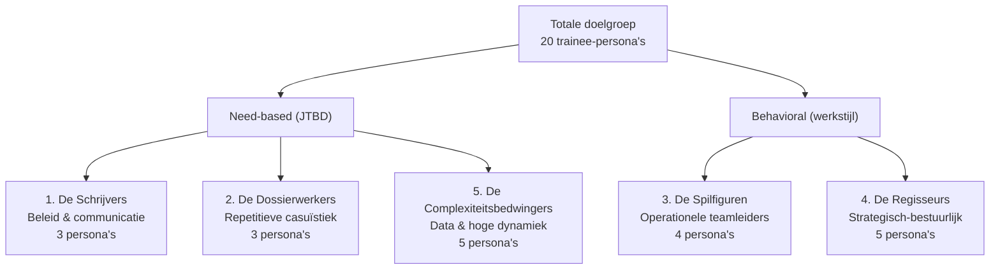
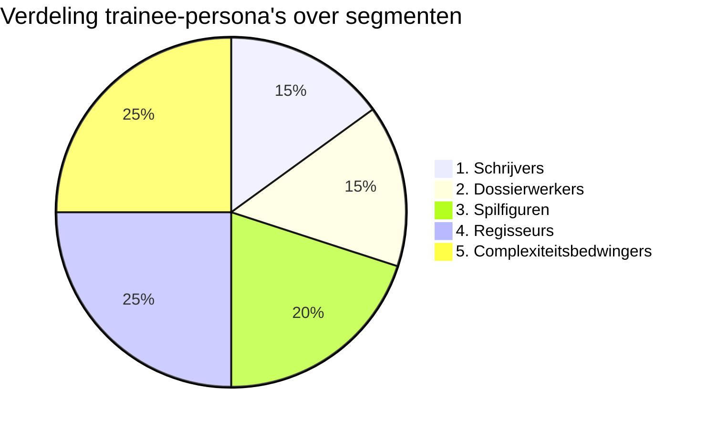
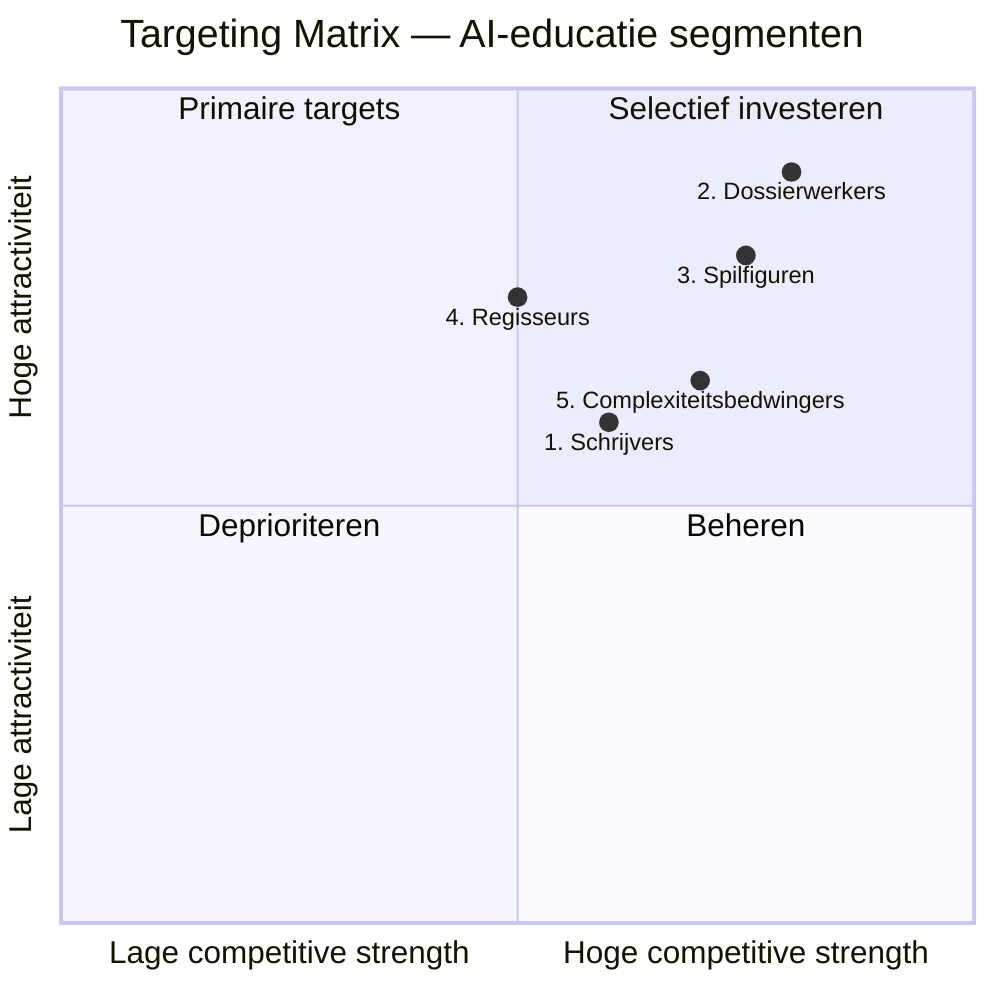

# Customer Segmentation: AI-educatie voor Nederlandse gemeenten

**Datum**: 2026-04-19
**Branche**: Publieke sector — Nederlandse gemeenten (342 organisaties)
**Context**: B2B (verkoop aan gemeente als organisatie; trainees zijn ambtenaren binnen de gemeente)
**Geografische scope**: Nederland
**Aantal segmenten**: 5
**Bronmateriaal**: 20 trainee-persona's (`/documentatie/business/personas/trainees/`) + business case lean canvas

## Executive summary

De 20 trainee-persona's clusteren we tot **5 segmenten** op basis van gedeelde "jobs-to-be-done", werkstijl en dominante AI-use-case-familie. Elk segment omvat 3-5 persona's die een gemeenschappelijk leerpad kunnen volgen. De segmenten zijn benoemd vanuit hun karakteristieke werkpatroon: **De Schrijvers**, **De Dossierwerkers**, **De Spilfiguren**, **De Regisseurs** en **De Complexiteitsbedwingers**.

Primaire MVP-kandidaten op basis van attractiviteit en pasvorm: **Segment 2 (Dossierwerkers)** en **Segment 3 (Spilfiguren)**. Beide hebben hoge populatie per gemeente, expliciete administratieve pijn, en meetbare ROI (doorlooptijden, caseload, KPI's). **Segment 4 (Regisseurs)** is secundair prioritair vanuit commerciële positionering (zij zijn vaak de inkopers), maar niet als eerste content-investering.

Belangrijkste strategische inzicht: onze 5 segmenten overlappen natuurlijk met de sterktes van onze 3 trainers — Marieke's gemeentelijke ervaring past bij Regisseurs en Spilfiguren, Ravi's technische diepgang bij Complexiteitsbedwingers en innovatie-gedreven Regisseurs, en Mike als generalist dekt de rest, met name Schrijvers en Dossierwerkers.

## Segmentatie-aanpak

### Geselecteerde dimensies

Voor deze B2B-context binnen de publieke sector hebben we 4 dimensies gecombineerd:

| Dimensie | Waarom gekozen |
|---|---|
| **Needs-based (Jobs-to-be-Done)** | Primaire as: welke taak moet AI ondersteunen? Dit bepaalt curriculum-bouwblokken. |
| **Behavioral** | Werkstijl (documentintensief vs. casus-repetitief vs. sturing vs. bestuurlijk vs. data-complex) bepaalt didactische werkvormen |
| **Firmographic (organisatierol)** | Hiërarchische positie binnen gemeente (uitvoerend, leidinggevend, bestuurlijk) beïnvloedt inkoopbesluit, budgetbeschikbaarheid, leertijd |
| **Value-based (AI-impactpotentieel)** | Welk ROI-scenario is realistisch: tijdbesparing, kwaliteitswinst, risicoreductie, strategische versnelling |

Demografische dimensies (leeftijd, gender) zijn expressief in de persona's maar zwak segmenterend voor deze B2B-context. Psychografische dimensies (waarden, houding) zijn geïntegreerd in needs-based: de persona's tonen al attitude (early adopter, sceptic, pragmatist).

### Groepering op hoofdlijn



## Segmentprofielen

### Segment 1 — De Schrijvers

**Beschrijving**: Beleids- en communicatieadviseurs wiens dagelijks werk bestaat uit lange teksten schrijven, documenten analyseren, en complexe informatie vertalen naar bestuurlijk- of burger-passende taal. Hun "job" is betekenisvolle, juridisch-zuivere, bestuurlijk-passende output produceren — vaak onder tijdsdruk en bij politieke gevoeligheid.

**Omvatte persona's (3)**:
- Beleidsadviseur Sociaal Domein (Fatima El Amrani)
- Beleidsadviseur Ruimtelijke Ordening (Tom Bosman)
- Communicatieadviseur (Daan Smits)

**Firmografie / organisatorisch**:
- Vakinhoudelijk adviseur-niveau, WO-opgeleid
- Werkt in beleidsafdelingen of communicatieteam
- Heeft eigen dossiers en portefeuilles

**Behavioral kenmerken**:
- Hoge leesvolume (100-500 pagina's per dossier)
- Schrijft dagelijks verschillende teksttypes (nota, brief, persbericht, social)
- Werkt in cycli rond deadlines (raadsvergadering, collegebesluit, persmoment)
- Experimenteert privé met ChatGPT / Copilot — bovengemiddelde AI-affiniteit
- Individueel diepwerk, minder teamdynamisch aangestuurd

**Needs (Jobs-to-be-Done)**:
- **Primaire job**: "Help me betekenisvolle documenten produceren in minder tijd en met behoud van kwaliteit en nuance"
- **Secundaire jobs**: samenvatten, consistent schrijven, B1-vertaling, zienswijzen verwerken, feitcheck
- **Pain points**: deadline-druk, honderden pagina's input, consistentie bij veel dossiers, hallucinatie-risico in juridisch-gevoelige teksten

**Value profile**:
- **Geschatte omvang**: 5-15 vergelijkbare rollen per gemeente × 342 gemeenten = **[Aanname] ±2.000-5.000 ambtenaren in Nederland**
- **Revenue potential per gemeente**: middel-hoog (€3.000-€8.000 per programma, meerdere deelnemers per gemeente denkbaar)
- **Prijssensitiviteit**: gemiddeld — waarde bewijsbaar door tijdsbesparing
- **Cost-to-serve**: laag-middel — groepstraining van 8-12 mogelijk, generieke casussen delen goed

**MASDA-validatie**:

| Criterium | Beoordeling |
|---|---|
| **Measurable** | ✅ Duidelijk afgebakende rol, aantallen per gemeente te schatten via functieboeken |
| **Accessible** | ✅ Bereikbaar via VNG-netwerken, vakbladen (Binnenlands Bestuur, Communicatie Online), LinkedIn |
| **Substantial** | ✅ 2-5k professionals met reële AI-behoefte en budget via vakafdelingen |
| **Differentiable** | ✅ Reageert anders dan operationele teamleiders — wil diepgang in schrijf-vaardigheid, niet workflow-tooling |
| **Actionable** | ✅ Concrete curriculum-bouwblokken mogelijk (promptbibliotheek, redactie-workflows) |

---

### Segment 2 — De Dossierwerkers

**Beschrijving**: Uitvoerende professionals wiens werk voor 40-70% bestaat uit repetitieve dossiercasuïstiek: toetsen, beoordelen, indiceren, verantwoorden. Zij hebben grote aantallen vergelijkbare zaken, met een "lange tail" van complexe gevallen die meer aandacht verdienen. Hun "job" is kwalitatief goede besluiten afgeven binnen strakke doorlooptijden.

**Omvatte persona's (3)**:
- Controller (Eva Mulder)
- Consulent / Casemanager (Kim Peters)
- Vergunningverlener (Naomi Jansen)

**Firmografie / organisatorisch**:
- Uitvoerend HBO/WO-niveau
- Werkt in systemen: financieel, zaaksysteem, VTH
- Hoge productievraag; KPI's op doorlooptijd en kwaliteit

**Behavioral kenmerken**:
- Veel schakelen tussen dossiers per dag (10-40)
- Gebruikt vaste systemen intensief (veel klikken, soms lomp)
- Werkwijze hyper-procesmatig, audit-trail belangrijk
- Herkent snel patroonherhaling in het werk
- Administratieve frustratie dominant in hun pijn

**Needs (Jobs-to-be-Done)**:
- **Primaire job**: "Help me repetitief werk sneller en kwalitatief gelijkwaardig doen, zodat ik tijd overhoud voor complexe gevallen"
- **Secundaire jobs**: verslaglegging automatiseren, conceptteksten genereren, regelgeving opvragen, kwaliteitstoets
- **Pain points**: 40-70% tijd naar administratie, wachtlijsten/achterstanden, juridisch foutrisico, systemen zijn log

**Value profile**:
- **Geschatte omvang**: 10-50 vergelijkbare rollen per gemeente × 342 gemeenten = **[Aanname] ±5.000-15.000 ambtenaren in Nederland** — grootste segment
- **Revenue potential per gemeente**: hoog (€5.000-€20.000 per programma, cohortgrootte tot 25 deelnemers)
- **Prijssensitiviteit**: laag-middel — ROI in uren zeer direct aantoonbaar
- **Cost-to-serve**: laag — uniforme curriculum-modules per rolcluster mogelijk

**MASDA-validatie**:

| Criterium | Beoordeling |
|---|---|
| **Measurable** | ✅ Meetbare KPI's: aantal dossiers, doorlooptijd, administratieve uren |
| **Accessible** | ✅ Bereikbaar via teamleiders (inkopers), VBWTN, Divosa, VERA |
| **Substantial** | ✅ Grootste populatie, sterkste directe ROI — ideaal MVP-segment |
| **Differentiable** | ✅ Reageert op procesgedreven trainingen met tool-demonstraties, niet op strategische workshops |
| **Actionable** | ✅ Zeer concrete AI-use-cases (conceptbesluit, verslaglegging, variantieanalyse) |

---

### Segment 3 — De Spilfiguren

**Beschrijving**: Operationele teamleiders die tussen uitvoerend personeel en strategisch management in staan. Zij hebben 10-25 medewerkers onder zich en zijn verantwoordelijk voor zowel dagelijkse kwaliteit als doorlooptijden en KPI's. Hun "job" is team én proces tegelijk gezond houden, terwijl zij zelf weinig tijd hebben voor diepgang.

**Omvatte persona's (4)**:
- Teamleider Klantcontact / Burgerzaken (Linda van der Berg)
- Teamleider Beheer Openbare Ruimte (Hans de Jong)
- Teamleider Wmo / Jeugd (Carla Verhoeven)
- Teamleider Vergunningen (Erik van den Broek)

**Firmografie / organisatorisch**:
- Leidinggevend HBO-niveau (typisch), soms WO
- Eerste managementlaag; rapporteert aan afdelingsmanager
- Eigen budget voor opleidingen en tooling (vaak beperkt)
- Vaak decision-maker of decisive influencer voor AI-training

**Behavioral kenmerken**:
- Veel mensoverleg en bilats
- Moet snel schakelen (incident → overleg → rapportage)
- Weinig tijd voor eigen verdieping — leert graag in compacte peer-sessies
- Mix van techbewust en sceptisch; praktisch pragmatist

**Needs (Jobs-to-be-Done)**:
- **Primaire job**: "Help mij sneller grip houden op werkvoorraad, kwaliteit en mijn team, zonder zelf technisch expert te hoeven worden"
- **Secundaire jobs**: werkverdeling, prioritering, teamadoptie van AI, rapportages voor MT, risicosignalering
- **Pain points**: caseload van team te hoog, administratieve last van team, personele instabiliteit, concurrerende prioriteiten van bovenaf

**Value profile**:
- **Geschatte omvang**: 4-10 vergelijkbare rollen per gemeente × 342 gemeenten = **[Aanname] ±1.500-3.500 ambtenaren in Nederland**
- **Revenue potential per gemeente**: middel (€3.000-€10.000 per programma, kleinere groepen 6-10)
- **Prijssensitiviteit**: middel — moet ROI voor heel team kunnen tonen
- **Cost-to-serve**: middel — training moet aansluiten op uitvoerend team (afstemming noodzakelijk)

**MASDA-validatie**:

| Criterium | Beoordeling |
|---|---|
| **Measurable** | ✅ Rol-omvang en verantwoordelijkheidsgebied duidelijk te kwantificeren |
| **Accessible** | ✅ Bereikbaar via VNG-teamleiders-netwerken, LinkedIn, directe prospectie |
| **Substantial** | ✅ Hoge strategische waarde als inkopende gatekeeper + adoptie-aanjager |
| **Differentiable** | ✅ Reageert op train-the-leader aanpak, niet op technische diepgang |
| **Actionable** | ✅ Specifieke leerpaden mogelijk (AI-adoptie leiden, werkverdeling, MT-rapportage) |

---

### Segment 4 — De Regisseurs

**Beschrijving**: Strategisch-bestuurlijke laag: managers, directeuren en programmamanagers die richting geven, besluitvorming voorbereiden en bestuurlijke verantwoording afleggen. Hun "job" is een organisatie gezond, toekomstbestendig en bestuurlijk uitlegbaar AI inzetten (of inzetbaar maken) — en zelf als gesprekspartner mee kunnen praten.

**Omvatte persona's (5)**:
- Manager Dienstverlening (Peter Janssen)
- Financieel Manager (Rob Dekker)
- IT Manager / CIO (Maarten Bakker)
- HR Manager (Sandra Hendriks)
- Programmamanager (Bas Hofman)

**Firmografie / organisatorisch**:
- Senior management, WO-opgeleid, hiërarchisch hoog
- Zit in MT of directe staf gemeentesecretaris
- Beheert budgetten en formaties
- Besluitvormend of directief invloedrijk voor AI-investeringen

**Behavioral kenmerken**:
- Veel vergaderen, weinig diepwerk
- Leest veel korte notities (max 1-2 A4 per stuk)
- Neemt beslissingen onder politieke druk
- Gevoelig voor reputatieschade én voor marktverlies tov. buurgemeenten
- Vaak pragmatisch maar voorzichtig; duidelijk voorkeur voor bewezen resultaten

**Needs (Jobs-to-be-Done)**:
- **Primaire job**: "Help me als bestuurlijk gesprekspartner AI begrijpen, governance sturen en strategische keuzes onderbouwen zonder zelf techneut te worden"
- **Secundaire jobs**: bestuurlijke notitie opstellen, leveranciersgesprekken, AI-beleid formuleren, benchmark tov. andere gemeenten
- **Pain points**: "doe iets met AI" zonder budget, onzekerheid over wet- en regelgeving (AI-Act, BIO, AVG), spanning tussen innovatie en rechtmatigheid

**Value profile**:
- **Geschatte omvang**: 5-15 vergelijkbare rollen per gemeente × 342 gemeenten = **[Aanname] ±2.000-5.000 ambtenaren in Nederland**
- **Revenue potential per gemeente**: hoog per head, laag volume (€4.000-€15.000 voor executive-track, 4-8 deelnemers)
- **Prijssensitiviteit**: laag — bestuurlijke investering, hoge impact
- **Cost-to-serve**: hoog — maatwerk, hoogwaardige trainers (Marieke + externe experts), weinig hergebruik content

**MASDA-validatie**:

| Criterium | Beoordeling |
|---|---|
| **Measurable** | ✅ Rollen goed identificeerbaar (MT-samenstelling publiek beschikbaar) |
| **Accessible** | ⚠️ Beperkt bereikbaar — hoge rank, weinig tijd; toegang via netwerk of gemeentesecretaris |
| **Substantial** | ✅ Commercieel zeer substantieel ondanks lage volume: zij zijn de kopers |
| **Differentiable** | ✅ Reageert op executive-sessies, PR/FAQ, peer-benchmarking — niet op tool-demo's |
| **Actionable** | ✅ Executive briefings, AI-governance-workshops, 1-op-1 coaching mogelijk |

---

### Segment 5 — De Complexiteitsbedwingers

**Beschrijving**: Data-, dossier- en crisis-gedreven professionals die werken in domeinen met hoge complexiteit, versnipperde informatie en soms tijdsdruk. Hun "job" is uit veel bronnen snel een coherent, betrouwbaar beeld produceren dat als basis dient voor (bestuurlijke) besluiten.

**Omvatte persona's (5)**:
- Asset Manager / Beheerder (Wouter Visser)
- Projectleider Gebiedsontwikkeling (Mariska Kuipers)
- Innovatiemanager / Adviseur Digitalisering (Anouk de Vries)
- Adviseur Openbare Orde & Veiligheid (Jeroen van Dijk)
- Crisiscoördinator (Suzan Koster)

**Firmografie / organisatorisch**:
- Vakspecialistisch HBO/WO-niveau
- Werkt vaak over disciplines en externe partners heen (veiligheidsregio, omgevingsdienst, aannemers, ontwikkelaars, RIEC)
- Heeft eigen budget en autonomie binnen domein

**Behavioral kenmerken**:
- Omgaan met grote hoeveelheden gefragmenteerde data
- Snel moeten schakelen tussen registers (technisch, bestuurlijk, juridisch)
- Gebruikt al specialistische tools (GIS, LCMS, beheersystemen)
- AI-affiniteit bovengemiddeld door technisch-analytische achtergrond

**Needs (Jobs-to-be-Done)**:
- **Primaire job**: "Help me gefragmenteerde informatie combineren tot snelle, betrouwbare besluitinformatie"
- **Secundaire jobs**: scenarioverkenning, predictieve modellen, documentintegratie, sitrap-generatie, bias-herkenning
- **Pain points**: data versnipperd over 5+ systemen, juridische waarborgen bij data-gebruik, verantwoording bij black-box-modellen, schaarste aan peers op kruisvlak van hun domein × AI

**Value profile**:
- **Geschatte omvang**: 5-15 vergelijkbare rollen per gemeente × 342 gemeenten = **[Aanname] ±2.000-5.000 ambtenaren in Nederland**
- **Revenue potential per gemeente**: middel-hoog (€5.000-€15.000 per programma, kleinere groepen 6-10)
- **Prijssensitiviteit**: laag-middel — deze rollen hebben budget en zien directe meerwaarde
- **Cost-to-serve**: middel-hoog — diepere technische content (Ravi), minder standaardiseerbaar

**MASDA-validatie**:

| Criterium | Beoordeling |
|---|---|
| **Measurable** | ✅ Rol-omvang deducibel uit gemeentelijke structuur |
| **Accessible** | ✅ Bereikbaar via vakcommunities (CCV, RIEC, VIAG, Stadswerk, CROW) |
| **Substantial** | ✅ Kleine populatie per gemeente, maar hoge waarde per deelnemer |
| **Differentiable** | ✅ Reageert op technisch-diepgaande inhoud en peer-casuïstiek |
| **Actionable** | ✅ Advanced tracks met casuïstiek (RAG, signalenintegratie, scenario's) mogelijk |

---

## Segment-sizing-overzicht



| Segment | % van 20 persona's | [Aanname] Populatie NL | Revenue per klant-gemeente | CLV-tier |
|---|---|---|---|---|
| 1. Schrijvers | 15% | 2.000-5.000 | €3-8k | Middel |
| 2. Dossierwerkers | 15% | 5.000-15.000 | €5-20k | **Hoog** |
| 3. Spilfiguren | 20% | 1.500-3.500 | €3-10k | Middel-Hoog |
| 4. Regisseurs | 25% | 2.000-5.000 | €4-15k | **Hoog** (premium) |
| 5. Complexiteitsbedwingers | 25% | 2.000-5.000 | €5-15k | Middel-Hoog |

Totaal **[Aanname]** directe doelgroep-populatie: **±12.500-33.500 ambtenaren** verspreid over 342 gemeenten.

## Segment-vergelijking

```mermaid
xychart-beta
    title "Segment-vergelijking op kernattributen (score 1-5)"
    x-axis ["Populatie", "Revenue-potentie", "Urgentie/pijn", "AI-geschiktheid", "Bereikbaarheid"]
    y-axis "Score" 0 --> 5
    bar [3, 3, 4, 4, 4]
    bar [5, 5, 5, 5, 4]
    bar [3, 4, 4, 3, 4]
    bar [3, 5, 4, 3, 3]
    bar [3, 4, 4, 5, 4]
```



Legenda (balken in volgorde): 1 Schrijvers · 2 Dossierwerkers · 3 Spilfiguren · 4 Regisseurs · 5 Complexiteitsbedwingers

## Targeting-analyse



| Segment | Attractiviteit (1-5) | Competitive strength (1-5) | Aanbeveling |
|---|---|---|---|
| 1. Schrijvers | 3 | 3 | Secundair (fase 2) — goed opschaalbaar, maar minder urgent |
| 2. Dossierwerkers | 5 | 4 | **Primair MVP** — grootste populatie × sterkste ROI-verhaal |
| 3. Spilfiguren | 4 | 4 | **Primair MVP** — gatekeepers + adoptie-aanjagers |
| 4. Regisseurs | 4 | 3 | Secundair strategisch — cruciaal voor dealsluiting, minder als content-investering |
| 5. Complexiteitsbedwingers | 4 | 3 | Tertiair — premium track later, vereist Ravi intensief |

### Aanbevolen MVP-targeting

Start met **Segment 2 (Dossierwerkers)** als primair content-MVP en **Segment 3 (Spilfiguren)** als primair kanaal-MVP. De combinatie werkt zo: de Spilfiguur koopt, de Dossierwerker ondergaat. Een korte executive briefing voor **Segment 4 (Regisseurs)** is de toegangsdeur voor gemeentelijke inkoop.

## Positioning

### Positioning map

```mermaid
quadrantChart
    title Positioning — AI-educatie aanbod per segment
    x-axis Tool-gericht --> Transformationeel
    y-axis Individueel leren --> Organisatieverandering
    quadrant-1 Change programma's
    quadrant-2 Executive/strategisch
    quadrant-3 Tool-training (commodity)
    quadrant-4 Vaardigheidstraining
    "1. Schrijvers": [0.4, 0.25]
    "2. Dossierwerkers": [0.35, 0.3]
    "3. Spilfiguren": [0.65, 0.75]
    "4. Regisseurs": [0.85, 0.85]
    "5. Complexiteitsbedwingers": [0.55, 0.5]
```

### Value proposition per segment

| Segment | Waardepropositie (kern) | Differentiator | Messaging-thema |
|---|---|---|---|
| 1. Schrijvers | "Schrijf sneller met behoud van nuance en juridische zuiverheid — AI als co-redacteur, jij als eindredacteur" | Gemeentelijke casuïstiek (nota, raadsvraag, bewonersbrief) met feitcheck-discipline | "Meer tijd voor de inhoud, minder aan de tekstfabriek" |
| 2. Dossierwerkers | "Verwerk repetitief werk in de helft van de tijd — met een auditbare paper trail" | Directe koppeling aan jouw zaaksysteem, plus kwaliteitsborging | "Automatisch wat kan, zelf wat moet" |
| 3. Spilfiguren | "Leid je team door de AI-adoptiecurve — zonder zelf developer te worden" | Train-the-leader aanpak: jij leert sturen, je team leert doen | "AI-geletterd management voor een AI-geletterd team" |
| 4. Regisseurs | "Maak AI-beleid dat raad en accountant overtuigt" | Bestuurlijk register, AI-Act + BIO + AVG geïntegreerd | "Van 'doe iets met AI' naar een getoetst kader" |
| 5. Complexiteitsbedwingers | "Bouw zelf AI-gedreven werkwijzes voor jouw domein — met Ravi aan je zijde" | Advanced track met domeinspecifieke casuïstiek | "Je kent je domein. Wij leren je de tools." |

## Activatie-roadmap

| Segment | Marketing | Product | Pricing | Kanalen |
|---|---|---|---|---|
| 1. Schrijvers | Gastartikels in Binnenlands Bestuur/Communicatie Online, LinkedIn-content met voorbeelden | Promptbibliotheek + 2-daagse workshop + 4 weken coaching | €3-6k per gemeente (cohort 6-12) | VNG-netwerken, vakredacties |
| 2. Dossierwerkers | Casestudies met harde uren-cijfers, ROI-calculator | Rol-specifieke modules (controller, consulent, vergunning) + praktijkopdrachten | €5-15k per gemeente (cohort 10-20) | Teamleiders als prospectingskanaal, VBWTN/Divosa/VERA |
| 3. Spilfiguren | Peer-testimonials van andere teamleiders, cluster-bijeenkomsten | Train-the-leader 3-daags + teamsessies | €3-8k per gemeente (cohort 6-10) | Directe prospectie + LinkedIn + VNG teamleider-bijeenkomsten |
| 4. Regisseurs | Executive briefings, PR/FAQ, strategische discussiepapers | 1-daagse executive workshop + 3 uur 1-op-1 coaching | €4-12k per gemeente (cohort 4-8) | Via Marieke's netwerk, gemeentesecretarissen-bijeenkomsten |
| 5. Complexiteitsbedwingers | Technische diepgaande content (blog, webinar), samenwerking met vakorganisaties | Advanced track 4-5 dagen + projectbegeleiding | €6-15k per gemeente (cohort 6-10) | Vakgemeenschappen (CCV, RIEC, Stadswerk), Ravi's netwerk |

### Trainer-alignment per segment

| Segment | Lead trainer | Co-trainer | Waarom deze match |
|---|---|---|---|
| 1. Schrijvers | Mike | Marieke (voor gemeentelijke taal) | Generalist + domeintaal |
| 2. Dossierwerkers | Mike | Marieke (voor gemeentelijke casussen) | Generalist, grote groepen, standaardiseerbaar |
| 3. Spilfiguren | Marieke | Mike (didactische borging) | Marieke's ervaring als teamleider is relationeel sterk hier |
| 4. Regisseurs | Marieke | Ravi (voor tech-inkijk) + Mike (didactiek) | Bestuurlijke geloofwaardigheid essentieel |
| 5. Complexiteitsbedwingers | Ravi | Mike (didactische ondersteuning) | Technische diepte vereist |

## Bronnen

Deze segmentatie is primair gebaseerd op in-house persona-onderzoek:

1. `/home/sven/Projects/ai-educatie/documentatie/business/personas/trainees/*.md` (20 trainee-persona's, opgesteld april 2026)
2. `/home/sven/Projects/ai-educatie/documentatie/business/personas/trainers/*.md` (3 trainer-persona's)
3. `/home/sven/Projects/ai-educatie/business-case-lean-canvas.md` (business case lean canvas)
4. `/home/sven/Projects/ai-educatie/target-personas.md` (bronmatrix met pijn/wens/haak)

Externe context (gebruikt voor sizing-aannames, niet voor persona-inhoud):

5. **[Aanname]** Aantal Nederlandse gemeenten: 342 (status 2025-2026, CBS)
6. **[Aanname]** Gemeentelijke ambtenaren-totaal: ±180.000 FTE verspreid over 342 gemeenten (VNG/A+O fonds-publicaties)
7. **[Aanname]** Gemeentelijke AI-adoptie-maturiteit: varieert sterk; grote G4-gemeenten verder dan landelijk-gemiddelde kleinere gemeenten (VNG-onderzoek 2024-2025)

## Aannames & beperkingen

### Aannames (expliciet gelabeld `[Aanname]` in rapport)
- Rol-populaties per gemeente zijn geschat op basis van typische gemeentelijke organisatieschema's, niet op een landelijke functieboek-scan
- Revenue-potentie per gemeente is gebaseerd op vergelijkbare opleidings- en consultancy-tarieven (€500-€1500 per deelnemerdag) zonder marktvalidatie
- Totale populatie-aannames zijn orde-van-grootte schattingen (wide range aangegeven)
- AI-adoptiebereidheid per segment is afgeleid van persona-patronen, niet van empirisch gemeentelijk veldonderzoek

### Beperkingen
- **Geen empirische marktvalidatie**: deze segmentatie is een hypothese die in spoor 2.4 (problem-solution-fit interviews) getoetst moet worden
- **Persona-based, niet customer-based**: de 20 persona's zijn archetypen van rollen, niet enquête-respondenten. De segmentatie is daardoor een *a priori* clustering die kan afwijken van empirisch gedrag
- **Geen gegevens over wederinkoop of retention**: CLV-schattingen zijn gebaseerd op logica, niet op historische data
- **Geografische variatie niet meegenomen**: G4-gemeenten vs. kleine plattelandsgemeenten zullen significant verschillen in budget, volwassenheid en behoefte. Toekomstige iteratie zou een sub-segmentatie op gemeente-grootte kunnen toevoegen
- **Trainer-capaciteit niet in sizing verwerkt**: we hebben 3 trainers — productieschalen hiermee rekening houden in prioritering (spoor 3.1)
- **AI-Act en compliance kunnen segmentatie kantelen**: als EU-regelgeving significante impact heeft, schuiven Regisseurs en Complexiteitsbedwingers naar voren

## Volgende stappen in de flow

Na deze segmentatie zijn de logische vervolgstappen:

1. **Spoor 1.2 — JTBD-analyse** per top-3 segment (Dossierwerkers, Spilfiguren, Regisseurs)
2. **Spoor 1.3 — Value Proposition Canvas** per top-3 segment
3. **Spoor 2.3 — Stakeholder-mapping** — specifiek voor Regisseurs als inkopers
4. **Spoor 2.4 — Validatie-interviews** — deze segmenten én MVP-keuze toetsen bij 5-8 gemeentelijke beslissers
5. **Spoor 3.1 — Prioritering** — definitieve keuze MVP-segmenten op basis van validatie
