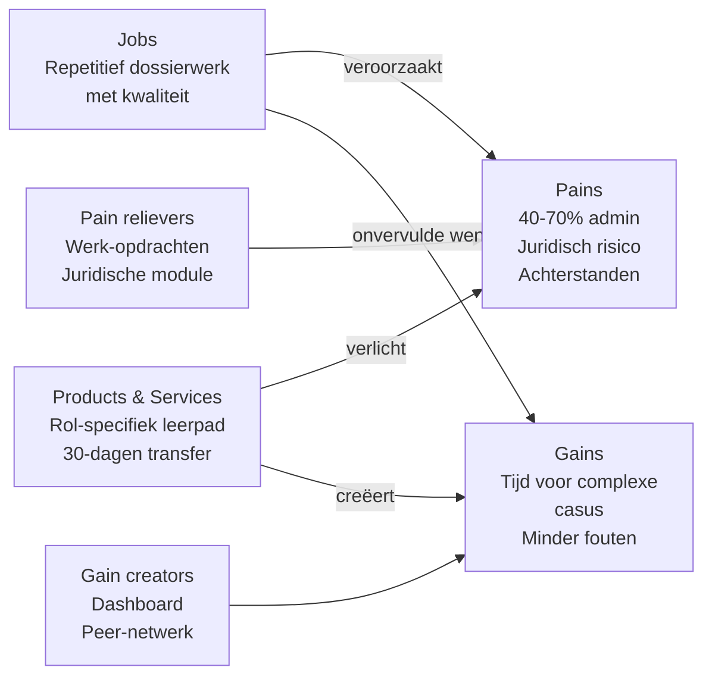

# Value Proposition Canvas — Dossierwerkers

**Datum**: 2026-04-19
**Segment**: De Dossierwerkers (Controller · Consulent/Casemanager · Vergunningverlener)
**Bron**: [jtbd/dossierwerkers.md](../jtbd/dossierwerkers.md) + [segmentation.md](../segmentation.md)
**Framework**: Strategyzer VPC — Customer Profile (jobs, pains, gains) × Value Map (products & services, pain relievers, gain creators)

## Customer Profile

### Customer Jobs (hiërarchie)

| Job | Type | Belang (1-5) |
|---|---|---|
| Repetitief dossierwerk met gelijkblijvende kwaliteit sneller doorzetten | Functioneel (main) | **5** |
| Verslag of motivering opstellen uit gesprek of casus | Functioneel | 5 |
| Regelgeving en beleid raadplegen tijdens werk | Functioneel | 4 |
| Dossier samenvatten bij overdracht of bezwaar | Functioneel | 4 |
| Anomalieën en fouten in data of zaak detecteren | Functioneel | 4 |
| Trots voelen op vakmanschap ondanks volumedruk | Emotioneel | 5 |
| Zekerheid dat juridisch niets gemist is | Emotioneel | 5 |
| Werk-privé balans houden | Emotioneel | 4 |
| Mens blijven voor cliënten/aanvragers | Emotioneel | 4 |
| Gezien worden als vakprofessional, niet als formulier-invuller | Sociaal | 4 |
| Toekomstbestendig zijn op arbeidsmarkt | Sociaal | 3 |

### Pains (gerangschikt op ernst)

| # | Pain | Severity (1-5) |
|---|---|---|
| P1 | 40-70% van de werktijd gaat naar administratie en verslaglegging | **5** |
| P2 | Handmatige copy-paste-fouten in kritische rapportages / besluiten | 4 |
| P3 | Onder tijdsdruk tijdens gesprekken notuleren — kwaliteit van contact lijdt eronder | 5 |
| P4 | Bronsystemen leveren inconsistente data; veel harmonisatie-werk | 4 |
| P5 | Bij bezwaar/controle een dossier van jaren terug moeten reconstrueren | 4 |
| P6 | Dezelfde regels in verschillende kennisbanken verschillend vindbaar | 3 |
| P7 | Achterstanden groeien sneller dan ik kan wegwerken | 5 |
| P8 | Juridisch foutrisico — elke slip kan bezwaar, beroep of accountantsbevinding triggeren | 5 |
| P9 | Emotionele vermoeidheid van repetitief werk zonder erkenning | 4 |
| P10 | Veel klikken en systeemstappen in VTH/Suite/Financieel | 3 |

### Gains (gerangschikt op wenselijkheid)

| # | Gain | Desirability (1-5) |
|---|---|---|
| G1 | Meer tijd voor complexe gevallen die mijn vakmanschap écht vragen | **5** |
| G2 | Automatisch conceptwerk (verslagen, motiveringen) dat ik alleen nog hoef te redigeren | 5 |
| G3 | Realtime inzicht in eigen werkvoorraad en dossier-status | 4 |
| G4 | Kennis-assistent die me tijdens werk op relevante regelgeving wijst | 4 |
| G5 | Audit-trail automatisch bijgehouden — zorgen om herleidbaarheid verdwijnen | 4 |
| G6 | Minder fouten → minder bezwaren, minder accountantsbevindingen, betere nachten | 5 |
| G7 | Weer trots op het werk dat ik aflever | 4 |
| G8 | Toekomstbestendig profiel op arbeidsmarkt | 3 |
| G9 | Gewoon weer in het weekend vrij zijn | 5 |

## Value Map

### Products & Services (wat leveren we concreet?)

| Product / dienst | Vorm | Segmentfocus |
|---|---|---|
| **Dossierwerker-leerpad (5-daagse + 4 weken begeleiding)** | Hybride: 2 klassikaal + 3 praktijk + 4 weken coaching | Alle drie rol-varianten |
| **Rol-specifieke modules** | Per rol: financieel, consulent, vergunning | Elk apart |
| **Promptbibliotheek per rol** | Schriftelijk, interactief bruikbaar | Naomi + Kim — inclusief juridische disclaimers |
| **Werk-opdrachten op eigen dossiers** | Under-supervision werken met echte anonieme casus | Alle |
| **30-dagen transfer-coaching** | 1-op-1 per deelnemer + teamsessie | Alle |
| **Adoptie-dashboard** | Tool voor teamleider om transfer te monitoren | Voor Spilfiguur (besteller) |
| **Juridische waarborgen-module** | Halve dag met AVG, uitlegbaarheid, audit-trail | Kern van programma |

### Pain Relievers (hoe verlichten we elke pain?)

| Pain | Pain Reliever | Bewijsvoering / mechanisme |
|---|---|---|
| P1 — 40-70% admin | **Werk-opdrachten op eigen dossiers** met AI-ondersteuning | Deelnemer ervaart directe tijdwinst op eigen casus; we meten pre/post |
| P2 — Copy-paste-fouten | **Conceptgenerator met bronverwijzing** + vier-ogen-principe met AI-review | Leren om AI als reviewer te gebruiken, niet alleen als producer |
| P3 — Notuleren onder druk | **Spraak-naar-tekst-module** + verslagtemplate voor keukentafelgesprekken | Demo in training; juridische framing (toestemming) ingebouwd |
| P4 — Inconsistente data | Buiten scope training — wel **prompt-ontwerp voor heterogene input** | Erkennen als out-of-scope; waar mogelijk AI-pre-processing leren |
| P5 — Dossierreconstructie | **Samenvat-workflows** + juridische check | Specifieke module rond bezwaar-voorbereiding |
| P6 — Kennisbank-fragmentatie | **Kennis-assistent-ontwerp** — leren opbouwen van RAG over eigen beleid | Deelnemers bouwen samen een prototype |
| P7 — Groeiende achterstand | **Werkverdeling-technieken voor teamleider** (deels ook Segment 3) | Gekoppeld aan dashboards en meetstructuur |
| P8 — Juridisch foutrisico | **Juridische waarborgen-module** als integraal onderdeel + werkwijze-checklist | Marieke (domein) + Ravi (tech) samen; toonaangevend voor sector |
| P9 — Emotionele vermoeidheid | **Peer-leerkring** — met andere Dossierwerkers uit andere gemeenten | Sociaal bewijs + gevoel niet alleen te zijn + erkenning |
| P10 — Veel klikken | Deels out-of-scope (systeem), wel **Copilot/M365 quick-win module** | Low-hanging fruit voor directe tevredenheid |

### Gain Creators (hoe creëren we elke gain?)

| Gain | Gain Creator | Mechanisme |
|---|---|---|
| G1 — Tijd voor complexe gevallen | **Vrijgespeelde tijd via 30-dagen-transfermeetmethodiek** kwantificeerbaar maken | Persoonlijke dashboard: "jij hebt 12 uur vrijgespeeld deze maand" |
| G2 — Concept-werk automatisch | **Werkvlow-integratie**: templates, prompts, redactie-discipline | Specifieke workflow per rol: wat eerst, wat laatst, wat écht zelf |
| G3 — Inzicht werkvoorraad | **Dashboard-setup-module** — deelnemers leren eenvoudige dashboards te bouwen voor zichzelf | Power BI, simpele scripting, integratie met zaaksysteem |
| G4 — Kennis-assistent | **RAG-bouwblok-training**: samen een klein kennis-assistent opzetten voor eigen beleidsdomein | Team-opdracht tijdens training |
| G5 — Audit-trail automatisch | **Auditable-prompting**: werkwijze waarbij elke AI-interactie reproducer- en herleidbaar is | Methodiek + tool-ondersteuning |
| G6 — Minder fouten | **Vier-ogen-principe met AI** als discipline — niet alleen productie, ook review | Wordt uitgebreid geoefend |
| G7 — Trots op werk | **Persoonlijke before/after casus-analyse** | Deelnemer presenteert aan het eind van programma eigen transformatie |
| G8 — Toekomstbestendigheid | **Certificaat + LinkedIn-badge + alumni-netwerk** | Waarde buiten de gemeente ook |
| G9 — Weekend vrij | **Wordt als bijeffect zichtbaar** in 30-dagen meting; niet expliciet geclaimd tot bewezen | Low-ball-claim: "je ziet het zelf in je agenda" |

## Fit-analyse

### Problem-Solution Fit

| Customer pain/gain | Onze oplossing | Fit? |
|---|---|---|
| P1 (admin) + G1 (tijd voor complex) | Werk-opdrachten + 30-dagen transfer | **Sterke fit** |
| P3 (notuleren) | Spraak-naar-tekst module | **Sterke fit** |
| P8 (juridisch risico) | Juridische waarborgen-module | **Sterke fit** |
| P2 (copy-paste-fouten) | Vier-ogen-AI + bronverwijzing | **Sterke fit** |
| P4 (inconsistente bronsystemen) | Beperkte directe fit — indirect via prompting | Gedeeltelijke fit |
| P10 (veel klikken) | Copilot-module | Gedeeltelijke fit (symptoombestrijding) |
| G2 (concept-werk) | Promptbibliotheek + workflow | **Sterke fit** |
| G3 (werkvoorraadinzicht) | Dashboard-setup-module | Gedeeltelijke fit (niveau-afhankelijk) |
| G4 (kennis-assistent) | RAG-bouwblok | **Sterke fit** — hoge ambitie |

**Conclusie**: 7 van 12 pains/gains hebben sterke fit, 3 gedeeltelijk, 2 out-of-scope (bronsysteem-integratie behoort niet tot training-scope). Dit is een sterk profiel voor MVP.

### Product-Market Fit-indicatoren

Hiermee te toetsen in Spoor 2.4 (validatie):

- [ ] Zouden 5+ gemeentelijke teamleiders / MT-leden herkennen dat dit de kernpijn raakt?
- [ ] Zou 1 organisatie het serieus overwegen als pilot?
- [ ] Is de prijsindicatie (€5-15k per gemeente voor dit segment) realistisch?

## Waarde-mechanische samenvatting

## Belofte-formule

> **Voor** gemeentelijke Dossierwerkers (controllers, consulenten, vergunningverleners)
> **die** 40-70% van hun tijd verliezen aan repetitief werk en juridisch foutrisico dragen
> **bieden wij** een rol-specifiek 5-daags AI-leerpad met 30 dagen transfer-coaching
> **zodat** zij binnen een maand tijd vrijspelen voor complexe casuïstiek én minder fouten produceren
> **in tegenstelling tot** generieke AI-cursussen of losse Copilot-workshops
> **omdat** wij werken met hun eigen dossiers, hun regels, en met juridische waarborgen als kernonderdeel.

## Prijs-waarde-verhouding (indicatief)

| Investering | Basis | Per deelnemer |
|---|---|---|
| Prijs (indicatief) | €5.000-€15.000 per gemeente | €500-€1.200 per deelnemer |
| Waarde (claimed) | 10-20 uur/maand bespaard per deelnemer = 120-240 uur/jaar | Dagtarief gemeentelijk werk ±€75/uur [Aanname] = €9.000-18.000 jaarwaarde per deelnemer |
| ROI | 10× tot 30× terugverdientijd <3 maanden | Beste segment voor directe ROI-argumentatie |

## Volgende stap

Voeden naar **Spoor 1.4 (user-story-generator)** — deze VPC vertalen in leer-user-stories per persona (Eva, Kim, Naomi).
