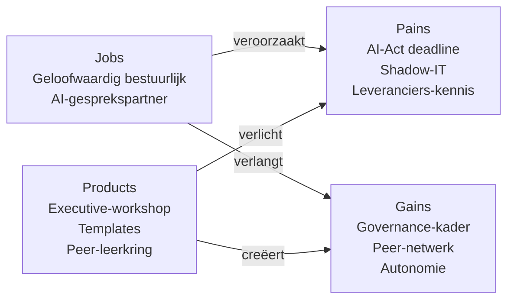

# Value Proposition Canvas — Regisseurs

**Datum**: 2026-04-19
**Segment**: De Regisseurs (Manager Dienstverlening · Financieel Manager · CIO · HR Manager · Programmamanager)
**Bron**: [jtbd/regisseurs.md](../jtbd/regisseurs.md)
**Framework**: Strategyzer VPC

## Customer Profile

### Customer Jobs

| Job | Type | Belang |
|---|---|---|
| Geloofwaardige AI-gesprekspartner zijn in bestuurlijke setting | Functioneel (main) | **5** |
| Bestuurlijke AI-notitie opstellen | Functioneel | 5 |
| AI-leverancier kritisch beoordelen | Functioneel | 5 |
| Governance en compliance-beleid borgen (AI-Act, AVG, BIO) | Functioneel | 5 |
| Strategische AI-keuzes onderbouwen | Functioneel | 4 |
| Personeelsontwikkeling AI organisatiebreed | Functioneel | 4 (HR-specifiek) |
| AI-portfolio prioriteren en monitoren | Functioneel | 4 (Programmamanager-specifiek) |
| Rust en controle in AI-dossiers | Emotioneel | **5** |
| Zelfvertrouwen in bestuurlijke arena | Emotioneel | 5 |
| Peer-respect (gemeentesecretarissen-netwerk, CIO-board) | Sociaal | 5 |
| Modern MT-lid imago | Sociaal | 4 |

### Pains

| # | Pain | Severity |
|---|---|---|
| P1 | AI-Act-deadline zonder helder intern beleid | **5** |
| P2 | Aanbestedingsmoment zonder voldoende technische kennis om te challengen | 5 |
| P3 | Onzekerheid over vendor lock-in risico's | 4 |
| P4 | "Doe iets met AI" van college zonder budget of mandaat | 4 |
| P5 | Reputatieschade-risico bij fout in zichtbaar dossier | 5 |
| P6 | Discrepantie tussen snelheid van AI en zorgvuldigheid P&C-cyclus | 4 |
| P7 | Shadow-IT — medewerkers gebruiken al AI-tools zonder beleid | **5** |
| P8 | Eigen technische onzekerheid (niet voor schut staan in MT) | 4 |
| P9 | Accountability-vragen: wie is verantwoordelijk bij AI-fout? | 5 |
| P10 | Afhankelijkheid van staf die AI al wel begrijpt | 3 |
| P11 | Verlies aan talent dat naar AI-volwassen organisaties vertrekt | 3 |

### Gains

| # | Gain | Desirability |
|---|---|---|
| G1 | AI-beleid en governance-kader dat raad en accountant overtuigt | **5** |
| G2 | Toolkit om leveranciers kritisch te beoordelen | **5** |
| G3 | AI-Act-compliance aantoonbaar en documenteerbaar | 5 |
| G4 | Autonomie in AI-gesprekken — minder afhankelijkheid van staf | 4 |
| G5 | Peer-netwerk met andere gemeentelijke MT-leden | 4 |
| G6 | Strategisch raamwerk voor AI-investeringsbeslissingen | 5 |
| G7 | Zelfvertrouwen in college-sessies en raadsdebatten | 5 |
| G8 | Organisatiebreed AI-geletterdheidsplan | 4 (HR/CIO-specifiek) |
| G9 | Handige templates (business case, notitie, Q&A, PR/FAQ) | 4 |
| G10 | Zichtbaarheid als vooruitstrevend bestuurder | 4 |

## Value Map

### Products & Services

| Product / dienst | Vorm | Eigenaarschap |
|---|---|---|
| **Executive AI-Academie** — 1-daagse intensieve workshop | Max 8 deelnemers per sessie, peer-groep | Kern-product |
| **2 uur 1-op-1 coaching** | Per deelnemer, 2-3 weken na workshop | Inbegrepen |
| **Governance-kader templates** | AI-beleid, AI-Act-compliance-checklist, vendor-evaluatie-matrix | Directe toepassing |
| **Bestuurlijke Q&A + PR/FAQ** | Vraag-antwoord set voor raad, college, accountant | Herbruikbaar |
| **Peer-leerkring (G4/G50)** | 4 bijeenkomsten met andere gemeentelijke MT-leden | 12 maanden |
| **Governance-advies-sessie** | Technische inkijk (Ravi 1-2 uur) specifiek rond AI-Act/BIO | Halve dag verdieping |
| **Policy-templates** | AI-beleid gemeente, acceptable use policy, shadow-IT-respons | Aanpasbaar per gemeente |
| **Toegang tot meet-materiaal eigen organisatie** | Metrics voor AI-adoptie organisatiebreed | Integratie met L&D-afdeling |

### Pain Relievers

| Pain | Pain Reliever |
|---|---|
| P1 (AI-Act-deadline) | **Compliance-checklist + beleidstemplate** direct bruikbaar |
| P2 (aanbesteding-kennis) | **Vendor-evaluatie-matrix** + technische inkijk Ravi — concrete vragen om te stellen |
| P3 (vendor lock-in) | **Architectuurlessen** in executive-format — open-source alternatieven, switchbaarheid |
| P4 (mandaat zonder budget) | **Business case template** die MT/college kan overtuigen + ROI-framing |
| P5 (reputatieschade) | **Governance-kader** borgt zorgvuldigheid + audit trail in beleid |
| P6 (snelheid vs zorgvuldigheid) | **Adaptief beleid** voor AI in P&C: experimenteerruimte + productiekaders apart |
| P7 (shadow-IT) | **Acceptable use policy** + communicatie-aanpak + centraal platform-strategie |
| P8 (eigen onzekerheid) | **Veilige peer-learning** met andere gemeentelijke MT'ers — geen beschaming |
| P9 (accountability) | **RACI-model voor AI-beslissingen** expliciet maken in beleid |
| P10 (afhankelijkheid staf) | Na programma kan Regisseur zelf meer leiden — emancipatoire insteek |
| P11 (talent-uitstroom) | **Werving-narratief + ontwikkelpad**-template voor HR |

### Gain Creators

| Gain | Gain Creator |
|---|---|
| G1 — Beleid dat raad/accountant overtuigt | **Policy-templates + PR/FAQ**, afgestemd op gemeentelijke cultuur |
| G2 — Leveranciers challengen | **Vendor-evaluatie-matrix** + 10 vragen die leveranciers echt zweten |
| G3 — AI-Act-compliance | **Checklist + audit-voorbereiding** |
| G4 — Autonomie in AI-gesprekken | Zelf de taal leren (executive level, niet techneut) — meetbaar in post-training interview-confidence |
| G5 — Peer-netwerk | **Peer-leerkring** formeel, 12 maanden na programma |
| G6 — Investerings-raamwerk | **Investeringscriteria-framework** voor AI-projecten |
| G7 — Zelfvertrouwen | Oefensessies + simulaties (raadsgesprek, college-presentatie) |
| G8 — Organisatiebreed plan | **L&D-roadmap-template** (specifiek Sandra) — gelinkt aan persona-segmentatie |
| G9 — Templates | Alle templates in persoonlijke portal beschikbaar |
| G10 — Zichtbaarheid | Positionering als voorloper — mogelijke spreekplek op VNG-bijeenkomst |

## Fit-analyse

| Pain/Gain | Fit |
|---|---|
| AI-Act compliance (P1+G3) | **Sterke fit** |
| Vendor-evaluatie (P2+G2) | **Sterke fit** |
| Shadow-IT (P7) | **Sterke fit** |
| Governance-kader (G1+G6) | **Sterke fit** |
| Peer-netwerk (G5) | **Sterke fit** |
| Eigen zelfvertrouwen (P8+G7) | **Sterke fit** |
| Talent-uitstroom (P11) | Gedeeltelijke fit (we helpen HR, maken de uitstroom niet direct klein) |
| Organisatiebrede L&D-roadmap (G8) | Sterke fit (via Sandra specifiek) |

**Conclusie**: sterke fit op bestuurlijke pains. Dit is het commerciële hefboom-segment: zij kopen.

## Waarde-mechanische samenvatting

## Belofte-formule

> **Voor** gemeentelijke MT-leden (CIO, CHRO, Financieel Manager, Manager Dienstverlening, Programmamanager)
> **die** AI-verantwoordelijkheid dragen in een complexe bestuurlijke context
> **bieden wij** een executive AI-Academie: 1-daagse intensieve workshop + 1-op-1 coaching + peer-leerkring + directe templates
> **zodat** u binnen 3 weken een AI-beleid kunt presenteren dat raad en accountant overtuigt, leveranciers kunt challengen én shadow-IT kunt sturen
> **in tegenstelling tot** generieke MBA-achtige AI-workshops of tijdrovend extern adviestraject
> **omdat** wij persona-gebaseerd werken met een trainer-team dat bestuurlijke gemeentelijke ervaring én AI-engineering-diepte combineert.

## Prijs-waarde-verhouding

| Investering | Basis | Vergelijking |
|---|---|---|
| Prijs (indicatief) | €4.000-€15.000 per gemeente | 4-8 deelnemers; premium tier |
| Waarde (claimed) | Vermijding compliance-incidenten × vermijding vendor-missers × interne efficiency-winst | Kwalitatief zeer hoog, moeilijk lineair te kwantificeren |
| Strategische waarde | Deze deal opent deur tot segment 2 + 3 trajecten in dezelfde gemeente | LTV 3-5× deal size |

## Differentiatie tov. concurrenten

| Aanbieder | Hun aanbod voor dit segment | Ons onderscheid |
|---|---|---|
| **Bestuursacademie / SBO** | Generieke "AI voor overheid" | Geen governance-templates, geen peer-leerkring |
| **Xomnia / Deloitte** | Consultancy-aanpak, adviseur-relatie | Zij "werken voor" ipv "maken u autonoom"; Xomnia prijsniveau hoger |
| **RADIO executive** | Rijks-gericht, niet gemeente | Wij zijn specifiek gemeente, met Marieke |
| **VNG / CIO-board** | Bijeenkomsten, geen vaardigheidsopbouw | Wij bouwen vaardigheden, niet alleen inspiratie |
| **Externe adviseurs freelance** | Persoonlijk, variabele kwaliteit | Wij hebben getest team-model |

## Commerciële mechaniek

**Regisseurs zijn niet alleen eindgebruiker, maar vooral koper**. Een goede executive-sessie leidt in 60-70% gevallen tot opschaling naar segment 2/3 trajecten binnen dezelfde gemeente. Daarom:

- Executive-programma kan verlies-leader zijn (break-even of licht onder kostprijs)
- Revenue komt uit follow-up contracten voor team-uitrol
- Netwerkeffect: 1 tevreden Regisseur = 2-3 verwijzingen naar peer-gemeenten

## Volgende stap

- Voeden naar **Spoor 1.4 (user-stories)** — user stories voor Peter, Rob, Maarten, Sandra, Bas
- Input voor **Spoor 4.2 (go-to-market)**: executive-briefings-opzet, peer-leerkring als acquisitie-motor
- Input voor **Spoor 3.4 (pricing/ROI)**: dit segment als lead-in, opschaling als winstcenter
