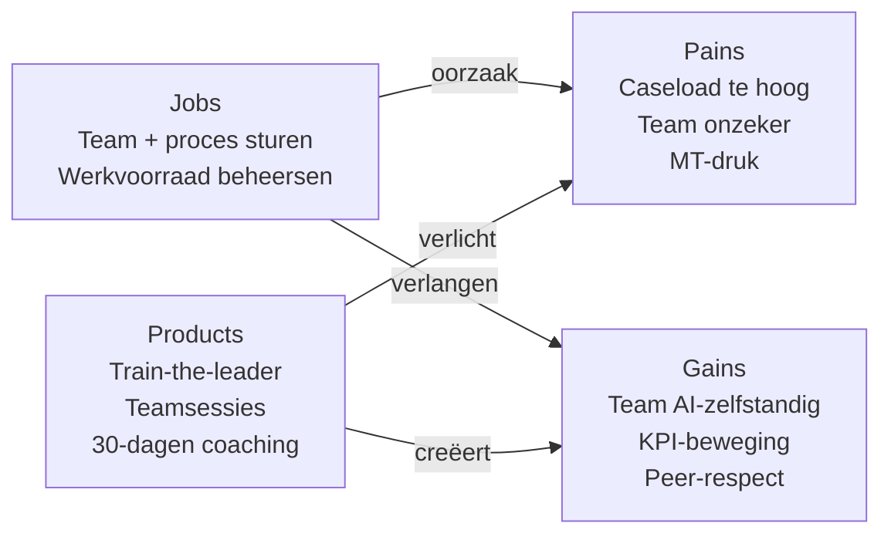

# Value Proposition Canvas — Spilfiguren

**Datum**: 2026-04-19
**Segment**: De Spilfiguren (Teamleider KCC · Beheer OR · Wmo/Jeugd · Vergunningen)
**Bron**: [jtbd/spilfiguren.md](../jtbd/spilfiguren.md) + [segmentation.md](../segmentation.md)
**Framework**: Strategyzer VPC

## Customer Profile

### Customer Jobs

| Job | Type | Belang (1-5) |
|---|---|---|
| Team én proces gezond houden onder bestuurlijke druk | Functioneel (main) | **5** |
| Meldingen/cases prioriteren en toewijzen | Functioneel | 5 |
| Werkvoorraad verdelen over team | Functioneel | 5 |
| KPI's monitoren en bespreken | Functioneel | 4 |
| Teamleden inwerken en ontwikkelen | Functioneel | 4 |
| Rapportages voor manager/MT | Functioneel | 3 |
| Kwaliteitstoets op besluiten | Functioneel | 4 |
| Team-adoptie van nieuwe werkwijzes sturen | Functioneel | 5 |
| Grip en regie houden zonder overbelasting | Emotioneel | 5 |
| Niet achter de muziek aanhollen | Emotioneel | 4 |
| Modern leider zijn (peer-respect) | Sociaal | 4 |
| Bestuurlijk geloofwaardig in MT-rapportages | Sociaal | 4 |
| Team dat blijft en groeit (retentie) | Sociaal | 4 |

### Pains

| # | Pain | Severity |
|---|---|---|
| P1 | Caseload van team te hoog — burn-out risico | **5** |
| P2 | Wachtlijsten/achterstanden groeien | **5** |
| P3 | Handmatig prioriteren 300+ meldingen/week kost 2 uur/dag | 4 |
| P4 | Nieuwe medewerker 3-6 maanden tot zelfstandigheid | 4 |
| P5 | Personele uitstroom moeilijk compenseren | 4 |
| P6 | Constante peer-druk (andere gemeenten "doen al AI") | 3 |
| P7 | "Doe iets met AI" zonder budget of duidelijk mandaat | 4 |
| P8 | Teamleden zelf onzeker over AI — tweedeling in team | 4 |
| P9 | MT-rapportages slurpen tijd | 3 |
| P10 | Risico dat nieuwe tool/training faalt — "weer een implementatie" | 4 |
| P11 | Eigen technische onzekerheid — niet voor schut willen staan | 3 |
| P12 | Werk-privé balans wankel | 4 |

### Gains

| # | Gain | Desirability |
|---|---|---|
| G1 | Zichtbare verlaging werkvoorraad / achterstand | **5** |
| G2 | Team dat AI zelfstandig gebruikt | **5** |
| G3 | Inwerktijd nieuwe medewerkers halveren | 4 |
| G4 | Heldere KPI-beweging om aan MT te tonen | 5 |
| G5 | Minder administratieve last bij team (meer tijd voor burger/cliënt) | **5** |
| G6 | Peer-erkenning als vooroplopende teamleider | 4 |
| G7 | Eigen AI-geletterdheid voldoende om gesprek te voeren, niet om code te schrijven | 4 |
| G8 | Rust en regie in eigen agenda | 5 |
| G9 | Duidelijk verhaal voor OR/medewerkers over AI-veiligheid | 4 |
| G10 | Team dat tevredener én productiever is | 5 |

## Value Map

### Products & Services

| Product / dienst | Vorm | Eigenaarschap |
|---|---|---|
| **Train-the-leader-track** — 3-daagse | Teamleider + max 2 senior teamleden | Kern-product |
| **Teamsessies voor onderliggend team** | 2-3 halve dagen binnen 4 weken na leader-track | Onderdeel van pakket |
| **Change management playbook** | Stap-voor-stap gids: adoptie, weerstand, communicatie | Meegeleverd + leefbaar document |
| **KPI-dashboard-setup** | Power BI / Excel-template voor team-KPI's | Inbegrepen |
| **Peer-leerkring** | 4 bijeenkomsten met teamleiders uit andere gemeenten | 12 maanden |
| **OR/medewerker-communicatiekit** | Slide deck, Q&A, narratief voor teamsettings | Herbruikbaar |
| **30-dagen teamadoptie-coaching** | 1 teamsessie + 2 individuele gesprekken met teamleider | Kern-onderdeel |
| **Executive-summary voor MT** | 1-pager om voor/na aan manager te laten zien | Eindproduct |

### Pain Relievers

| Pain | Pain Reliever |
|---|---|
| P1 + P2 (caseload + wachtlijsten) | **Werkvoorraad-automatiseringsmodule**: AI-sortering, dubbelingendetectie, prioritering-logica — toegepast op team-werkvoorraad |
| P3 (handmatig prioriteren) | **Prioritering-workflow** met AI-ondersteuning als casusoefening tijdens training |
| P4 (inwerktijd) | **AI-onboarding-assistent**: kennis-assistent voor nieuwe medewerkers + onboarding-checklist geautomatiseerd |
| P5 (uitstroom) | **Retentie via betere werkbeleving** — gekoppeld aan P1 (minder werkdruk) |
| P7 (mandaat-vaagheid) | **MT-ready business case template** voor teamleider — legt mandaat formeel vast |
| P8 (onzekerheid team) | **Teamsessies met gedifferentieerde aanpak**: early adopters vs. voorzichtigen verschillend benaderen |
| P9 (MT-rapportages) | **Rapportage-templates met AI-assisted data-synthese** |
| P10 (implementatie-moeheid) | **Klein beginnen**: 1 use case bewijzen voordat breder uitgerold |
| P11 (eigen onzekerheid) | **Veilige leer-omgeving** + Marieke's "als ik het kan, kun jij het ook"-vibe |
| P12 (werk-privé) | **Tijdwinst-bewijs** + adoptie-coaching neemt druk van teamleider af |

### Gain Creators

| Gain | Gain Creator |
|---|---|
| G1 — Zichtbare werkvoorraad-daling | **KPI-dashboard setup** + 30-dagen meetprotocol |
| G2 — Team zelfstandig AI-gebruik | **Teamsessies + micro-learning** met werk-opdrachten van team zelf |
| G3 — Inwerktijd halveren | **AI-onboarding-assistent** voor nieuwe medewerkers in team |
| G4 — Heldere KPI-beweging | **Meet-before-after protocol** + presentable rapportage |
| G5 — Minder admin last team | Gekoppeld aan team-adoptie (G2) |
| G6 — Peer-erkenning | **Peer-leerkring** + positionering in VNG-bijeenkomsten |
| G7 — AI-geletterdheid op leader-niveau | **Train-the-leader curriculum** — begrijpen, aansturen, beoordelen (geen coderen) |
| G8 — Rust en regie | Door werkvoorraad-automatisering + team-zelfstandigheid |
| G9 — OR/medewerker-verhaal | **Communicatiekit** voor gesprekken met OR en medewerkers |
| G10 — Team productiever én tevreden | Door G1+G2+G5 samen — gemeten in post-training MTO |

## Fit-analyse

| Pain/Gain | Fit |
|---|---|
| Werkvoorraad (P1+P2+G1) | **Sterke fit** |
| Team-adoptie (P8+G2+G7) | **Sterke fit** |
| Onboarding (P4+G3) | **Sterke fit** |
| MT-geloofwaardigheid (P9+G4) | **Sterke fit** |
| Eigen onzekerheid (P11) | **Sterke fit** (veilige leer + Marieke-vibe) |
| Bestuurlijk mandaat (P7) | Gedeeltelijke fit (business case template helpt, lost niet alles op) |
| OR-communicatie (G9) | **Sterke fit** |
| Werkdruk eigen (P12) | Indirecte fit (via team-effect) |

**Conclusie**: heel sterke fit — dit segment is leermechanisch én commercieel ideaal voor een samenhangend pakket.

## Waarde-mechanische samenvatting

## Belofte-formule

> **Voor** gemeentelijke teamleiders van uitvoerende teams (KCC, beheer, Wmo, vergunningen)
> **die** te maken hebben met groeiende werkvoorraad, personele krapte en druk om "iets met AI" te doen
> **bieden wij** een train-the-leader-programma met teamsessies en 30 dagen adoptie-coaching
> **zodat** hun team binnen een maand zichtbaar AI-zelfstandig werkt én wachtlijsten krimpen
> **in tegenstelling tot** individuele AI-cursussen of generieke change-trainingen
> **omdat** wij teamleider én team tegelijk meenemen, met meetbare KPI-beweging.

## Prijs-waarde-verhouding

| Investering | Basis | Vergelijking |
|---|---|---|
| Prijs (indicatief) | €3.000-€10.000 per gemeente | Cohort 6-10 (teamleider + 2 senioren + 6-10 team) |
| Waarde (claimed) | Teamleider: 5 uur/week terug; Team: 15-30% admin-reductie = ±300 uur/maand in team van 15 | Jaarwaarde [Aanname] €270.000+ bij gemiddeld team |
| ROI | 25-90× terugverdientijd <1 maand | Beste segment voor KPI-gedreven verkoopverhaal |

## Differentiatie tov. concurrenten

| Aanbieder | Hun aanbod voor dit segment | Ons onderscheid |
|---|---|---|
| **RADIO** | Generieke AI-literacy e-learning | Geen team-adoptie-aanpak |
| **VNG-bijeenkomsten** | Inspiratie + peers | Geen vaardigheidsopbouw, geen meting |
| **Dutch-AI 3-daagse** | Klassikaal generiek gemeente | Geen team-embedding, geen 30-dagen coaching |
| **AI Personeelstraining / De AI Workshop** | Losse workshops | Geen change-management-playbook |
| **Interne HR-aanpak** | Vaak ad-hoc, zonder sectorkennis | Geen Marieke-equivalent beschikbaar |

Dit is **het meest defensible segment** voor ons: train-the-leader met team-embedding bedient niemand anders goed.

## Volgende stap

- Voeden naar **Spoor 1.4 (user-stories)** — 3-4 leer-user-stories per teamleider-persona (Linda, Hans, Carla, Erik)
- Input voor **Spoor 4.2 (go-to-market)**: deze VPC is de kern van het verkoopverhaal richting segment 3
