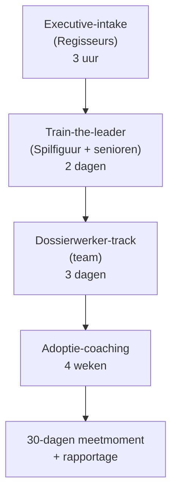

# Functional Specifications — MVP-curriculum

**Datum**: 2026-04-19
**Scope**: MVP-curriculum voor Dossierwerkers + Spilfiguren + Regisseurs (executive-track)
**Bron**: segmentation + JTBD + VPC + user-stories
**Formaat**: Module-catalogus met leerdoelen, werkvormen, voorwaarden, assessment

## Programma-architectuur

## Modulair ontwerp

Curriculum bestaat uit **bouwblokken** die per gemeente anders samengesteld kunnen worden, zonder maatwerk-kosten te laten exploderen.

### Bouwblok-taxonomie

| Code | Categorie | Voorbeelden |
|---|---|---|
| **K** | Kern-modules | Altijd in ieder pakket |
| **R** | Rol-specifieke modules | Per persona-sub-groep |
| **O** | Optioneel / maatwerk | Afhankelijk van gemeente-behoefte |
| **T** | Trainer-materiaal | Niet-deelbare interne guides |

## Kern-modules (K)

### K-01 — AI-basis & mentale modellen (0.5 dag)
**Voor**: Alle deelnemers
**Doel**: Snappen wat LLM's wel/niet kunnen, welke mentale modellen nuttig zijn
**Werkvormen**: Presentatie + live-demo + reflectie-oefening
**Leermiddelen**: Claude + ChatGPT + Copilot live (geen slides-only)
**Beoordeling**: Zelfreflectie-vraag: "Welke gedachte over AI heb ik nu anders dan gisteren?"
**Trainer**: Mike

### K-02 — Prompting als ambacht (0.5 dag)
**Voor**: Alle deelnemers
**Doel**: Structuur leren in prompts; 5 patronen (role, context, task, format, check)
**Werkvormen**: Korte theorie + paarsgewijze prompt-oefeningen + gezamenlijke evaluatie
**Beoordeling**: Deelnemers brengen 3 eigen prompts aan; peer-feedback
**Trainer**: Mike (+ Ravi voor advanced)

### K-03 — Juridische waarborgen, AVG en AI-Act essentials (0.75 dag)
**Voor**: Alle deelnemers (met verdieping voor Regisseurs)
**Doel**: Weten wat je wel/niet mag, hoe audit-trail werkt, verantwoordelijkheid
**Werkvormen**: Casus-analyse (3 gemeentelijke dilemma's) + checklist invullen
**Leermiddelen**: AI-Act art. 4 + BIO + AVG in gemeentelijke context
**Beoordeling**: Casus-opdracht: "Mag dit wel?" — onderbouwd antwoord
**Trainer**: Marieke (+ Ravi 1 uur tech-diepte bij Regisseurs)

### K-04 — Bron, feitcheck en hallucinaties (0.5 dag)
**Voor**: Alle deelnemers
**Doel**: Herkennen wanneer AI niet-betrouwbare output levert; feitcheck als discipline
**Werkvormen**: Voorbeelden van hallucinaties uit gemeentelijke praktijk; verifieer-oefening
**Beoordeling**: Eindopdracht: deelnemer presenteert 1 hallucinatie die hij detecteerde
**Trainer**: Ravi (asynchrone videobijdrage) + Mike (live)

### K-05 — Adoptie en transfer (0.5 dag)
**Voor**: Alle deelnemers
**Doel**: Methoden om geleerde vaardigheden in eigen werk te incorporeren
**Werkvormen**: Persoonlijk adoptieplan opstellen, buddy-assignment, 30-dagen commitment
**Beoordeling**: Opgesteld adoptieplan + bevestiging door leidinggevende
**Trainer**: Mike

## Rol-specifieke modules (R) — Dossierwerkers

### R-DW-C — Controllers (1 dag)

#### R-DW-C-01 — Financiële data-consolidatie met AI (0.5 dag)
- **Doel**: Variantieanalyse en consolidatie automatiseren
- **Werkvorm**: Eigen (geanonimiseerde) financiële data meenemen + live workflow bouwen
- **Praktijk**: Eva-casus (Controller) + check op uitlegbaarheid
- **Output**: Werkende template die deelnemer meeneemt

#### R-DW-C-02 — Auditable prompting voor rapportages (0.5 dag)
- **Doel**: Bronverwijzing + audit-trail integreren in workflow
- **Werkvorm**: Template bouwen, samen met Marieke accountant-check
- **Output**: Rapportage-template met built-in traceability

### R-DW-K — Consulenten / Casemanagers (1 dag)

#### R-DW-K-01 — Gesprek-naar-plan workflow (0.5 dag)
- **Doel**: Keukentafelgesprek → concept-ondersteuningsplan
- **Werkvorm**: Rollenspel gesprek, transcribering, conceptgeneratie
- **Leermiddelen**: Spraak-naar-tekst-tool + template
- **AVG-module**: standaardonderdeel (toestemming, dataretentie)

#### R-DW-K-02 — Kennis-assistent tijdens cliëntwerk (0.5 dag)
- **Doel**: Regelgeving snel oproepen met AI-assistent
- **Werkvorm**: Mini-RAG opzetten op eigen beleidsregels
- **Praktijk**: Toepassen op real-life casus

### R-DW-N — Vergunningverleners (1 dag)

#### R-DW-N-01 — Ontvankelijkheidstoets en conceptmotivering (0.5 dag)
- **Doel**: Standaard-aanvragen efficiënter toetsen
- **Werkvorm**: Samen met echte dossiers (anoniem) werken
- **Output**: Werkende toets-workflow voor eigen type aanvraag

#### R-DW-N-02 — Complex dossier: bijlagen integreren (0.5 dag)
- **Doel**: Document-analyse op meerdere bijlagen tegelijk
- **Werkvorm**: Case met 10+ bijlagen, samen uitpluizen
- **Output**: Integrale samenvatting + tegenstrijdighedenlijst

## Rol-specifieke modules (R) — Spilfiguren

### R-SP-01 — Change management voor AI-adoptie (0.75 dag)
- **Doel**: Hoe leid ik mijn team door adoptiecurve
- **Werkvormen**: Persoonlijke teamscan, rolverdeling (early adopters / voorzichtigen), 4-weekse fasering
- **Output**: Persoonlijk change-management-plan voor eigen team

### R-SP-02 — KPI-dashboard en 30-dagen-meting (0.5 dag)
- **Doel**: Meetbaarheid inregelen voor team-AI-adoptie
- **Werkvormen**: Power BI-template aanpassen op eigen team; meetprotocol
- **Output**: Werkend dashboard

### R-SP-03 — Werkvoorraad-automatisering (0.5 dag)
- **Doel**: Meldingen/cases/dossiers AI-ondersteund prioriteren
- **Werkvormen**: Analyseer eigen inkomstroom, bouw prioriteringslogica
- **Output**: Werkende prioritering-workflow

### R-SP-04 — OR en medewerker-communicatie (0.25 dag)
- **Doel**: Narratief voor OR + team rond AI-inzet
- **Werkvormen**: Communicatiekit samenstellen; rollenspel OR-gesprek
- **Output**: Eigen communicatie-deck + Q&A

## Rol-specifieke modules (R) — Regisseurs (Executive)

### R-RG-01 — Governance-kader opstellen (1.5 uur)
- **Doel**: AI-beleid voor de gemeente opstellen
- **Werkvormen**: Template + groepswerk + presentatie
- **Output**: Concept-AI-beleid voor eigen gemeente

### R-RG-02 — Vendor-evaluatie-matrix (1 uur)
- **Doel**: Leveranciers challengen
- **Werkvormen**: Case: 3 leveranciers vergelijken; top-10 kritische vragen
- **Output**: Evaluatie-template + vragenkit

### R-RG-03 — Raadsdebat-simulatie (1 uur)
- **Doel**: Executive-communicatie oefenen
- **Werkvormen**: Rollenspel raadsdebat; feedback; tweede run
- **Output**: Eigen 10-minuten-briefing voor bestuurlijk moment

### R-RG-04 — Peer-leerkring (12 maanden, 4 sessies)
- **Doel**: Blijvend netwerk en continue leren
- **Werkvormen**: Intervisie, casusbespreking, gastsprekers
- **Output**: Peer-netwerk + alumni-status

## Optionele modules (O)

### O-01 — RAG bouwen voor eigen beleid (0.5 dag)
- **Voor**: Dossierwerkers in ambitieuze gemeenten; Complexiteitsbedwingers als preview
- **Leermiddelen**: Technische diepte door Ravi
- **Output**: Werkend minimaal RAG-prototype

### O-02 — GPT-NL en lokale modellen (0.5 dag)
- **Voor**: Regisseurs + CIO-scope + technische Dossierwerkers
- **Leermiddelen**: Ravi-sessie over open-source Nederlandse modellen
- **Output**: Begrip van data-soevereiniteit-opties

### O-03 — Prompt-engineering verdieping (0.5 dag)
- **Voor**: Deelnemers die K-02 als te basic ervaren
- **Leermiddelen**: Chain-of-thought, few-shot, guardrails, evaluation
- **Output**: Eigen prompt-library

### O-04 — AI-adoptie-metriek en impact (0.5 dag)
- **Voor**: Programmamanagers + Regisseurs + geavanceerde Spilfiguren
- **Leermiddelen**: Metriek-definitie, pre/post-meting, bias-herkenning
- **Output**: Organisatiebreed meetplan

## Trainer-materiaal (T) — niet-deelbaar

- **T-01**: Trainer-script per module (master-versie, laatste versie)
- **T-02**: Casuïstiek-bibliotheek met 50+ gemeentelijke cases (geanonimiseerd, gecategoriseerd per persona)
- **T-03**: FAQ en bezwaar-handling voor bestuurlijke gesprekken (Marieke-domein)
- **T-04**: Demo-back-upplan per module (wat doen we als API crasht, uitgewerkt)
- **T-05**: Adoption-coaching playbook (3 archetypen van deelnemer-gedrag en respons)
- **T-06**: Evaluatie-rubric per module (hoe meten we begrip, transfer?)

## Leerpad-compositie per MVP-pakket

### Pakket A — Dossierwerker-team (10-15 deelnemers)

| Dag | Duur | Modules |
|---|---|---|
| Dag 1 | 6 uur | K-01, K-02, K-03 (start) |
| Dag 2 | 6 uur | K-03 (vervolg), K-04, R-DW-C/K/N (track-specifiek, 1e helft) |
| Dag 3 | 6 uur | R-DW (track-specifiek vervolg), K-05, persoonlijk adoptieplan |
| Coaching week 1-4 | 4 × 2 uur teamsessie + 1 × 1 uur per deelnemer | Adoptie, obstakels, tool-integratie |
| Meetmoment week 5 | 2 uur | Resultaten, vervolg, rapport |

### Pakket B — Spilfiguren (1 teamleider + 2 senioren)

| Dag | Duur | Modules |
|---|---|---|
| Dag 1 | 6 uur | K-01, K-02, K-03 + R-SP-01 |
| Dag 2 | 6 uur | R-SP-02, R-SP-03, R-SP-04, K-05 |
| Kick-off met team | Wordt onderdeel van Pakket A | — |

### Pakket C — Executive (Regisseurs, 4-8 deelnemers)

| Slot | Duur | Modules |
|---|---|---|
| Workshop-dag | 6 uur | K-01, K-03 (diepte), R-RG-01, R-RG-02, R-RG-03 |
| 1-op-1 coaching | 2 uur/persoon | Persoonlijk governance-plan scherpstellen |
| Peer-leerkring | 4 × 3 uur | R-RG-04 |

## Assessment en certificaat

### Deelnemers
- **Formatieve assessment**: tijdens training per module (reflectie, opdracht)
- **Summative assessment**: 30-dagen meetmoment (adoptie in werk)
- **Certificaat**: Alleen bij aantoonbare adoptie (niet bij enkel aanwezigheid)

### Organisatie
- **30-dagen rapport**: per gemeente, adoptie, KPI-beweging, aanbevelingen vervolg
- **Vervolgopties**: upsell naar ander segment of verdiepingsmodule

## Content-ontwikkeling — effort-schatting

| Item | Effort (dagen) | Door |
|---|---|---|
| K-modules (5) | 25 | Mike + Marieke |
| R-Dossierwerker-modules (6) | 20 | Mike + Marieke |
| R-Spilfiguur-modules (4) | 12 | Marieke + Mike |
| R-Regisseur-modules (4) | 10 | Marieke + Ravi |
| Optionele modules (4) | 12 | Mike + Ravi |
| Trainer-materiaal (6 T's) | 15 | Mike |
| Casuïstiek-bibliotheek | 10 | Marieke |
| **Totaal initieel** | **104** | **3 trainers — 35 dagen elk** |

Bij 150 beschikbare content-ontwikkel-dagen per jaar (50 per trainer): content klaar in ±8 maanden parallel aan eerste pilots.

## Versie-management

- **v0.1**: Basiscurriculum voor eerste 2-3 pilotgemeenten
- **v0.2**: Bijgewerkt op basis van pilot-feedback (na maand 4-6)
- **v1.0**: Productie-versie na eerste 10 klantgemeenten
- **v2.0**: Uitgebreid met Schrijvers + Complexiteitsbedwingers (jaar 2)

## Tooling-stack

### Training-delivery
- Zoom / Teams (hybride mogelijkheid)
- Miro (co-creatie, casusanalyse)
- Notion / LMS (leerplatform, materiaal)

### Tijdens training (model-toegang)
- Claude (primair voor schrijven, analyse)
- ChatGPT (secundair, alternatieve UI)
- Copilot in M365 (voor integraties met Excel, Word, Teams)
- Azure OpenAI (gemeente-tenant indien beschikbaar)
- Ollama + lokaal model (GPT-NL preview, privacy-demo)

### Assessment
- Typeform / Qualtrics (pre/post-metingen)
- Power BI (adoptiedashboard-template)

## Volgende stap

- **Spoor 3.3 — Metric-definition** (exact wat we meten per module en bij 30-dagen)
- **Spoor 3.4 — Pricing & ROI** (kostenmodel op basis van content-effort + trainer-dagen)
- **Spoor 3.5 — Pilot-plan** (hoe rollen we eerste 2-3 gemeenten)
