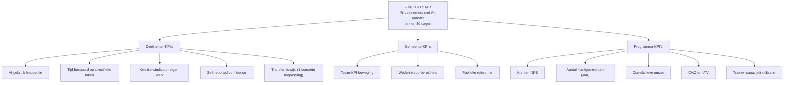

# Metric Definition — Succes-meetplan AI-educatieprogramma

**Datum**: 2026-04-19
**Doel**: Complete metric tree voor deelnemer, klantorganisatie (gemeente), en programma als geheel
**Framework**: North Star Metric + input/output drivers + guardrails + counter-metrics

## Executive summary

Onze **North Star Metric**: **% deelnemers dat binnen 30 dagen na training aantoonbaar AI toepast in hun eigen werk**. Deze metric verbindt alles — pedagogisch succes, waarde voor klant-gemeente, commerciële positionering, en is de basis voor onze 30-dagen-belofte.

**Doelwaarde**: ≥ 75% in MVP-jaar; ≥ 85% vanaf jaar 2.

## Metric tree



## Deelnemer-KPI's

### D-01 — AI-gebruik-frequentie
**Operationele definitie**: Aantal dagen per week waarop deelnemer AI-tool gebruikt voor werk (zelf-rapportage + tool-log-check waar mogelijk).

| Baseline (pre) | Target (post 30 dagen) | Meetmethode |
|---|---|---|
| 0-1 dag/week (gemiddeld) | ≥ 3 dagen/week | Survey + Copilot-dashboard (indien M365 Copilot) |

### D-02 — Tijd bespaard op specifieke taken
**Operationele definitie**: Self-reported tijdwinst op vóór training gedefinieerde kern-taak (per persona).

| Persona | Taak | Baseline | Target |
|---|---|---|---|
| Controller | Variantie-analyse maandsluiting | 6 uur | ≤ 3 uur |
| Consulent | Keukentafelgesprek naar concept-plan | 90 min | ≤ 30 min |
| Vergunningverlener | Standaard dakkapel-toets | 3 uur | ≤ 90 min |
| Teamleider KCC | Meldingen prioriteren dagelijks | 2 uur | ≤ 45 min |
| Teamleider Wmo | Dossier-overzicht voor casuïstiekoverleg | 3 uur | ≤ 1 uur |

### D-03 — Kwaliteitsindicator eigen werk
**Operationele definitie**: Zelf-rapportage + teamleider-rapportage van output-kwaliteit (1-5 schaal, voor/na).

| Baseline | Target | Meetmethode |
|---|---|---|
| Subjectief; vaak zorgen | Gelijke of hogere score én verminderde zorgen | Pre/post-survey |

### D-04 — Self-reported confidence
**Operationele definitie**: "Hoe zelfverzekerd voel je je in het gebruik van AI in je eigen werk?" (1-10 Likert).

| Baseline | Target |
|---|---|
| ≤ 4 | ≥ 7 |

### D-05 — Transfer-bewijs
**Operationele definitie**: Deelnemer beschrijft en toont (anoniem) 1 concrete AI-toepassing in eigen werk na 30 dagen.

| Target |
|---|
| 100% van deelnemers produceert tenminste 1 transfer-voorbeeld |

## Gemeente-KPI's (klantorganisatie)

### G-01 — Team-KPI-beweging
**Operationele definitie**: Relevante team-KPI's vóór en na training (per segment anders gedefinieerd).

| Persona-segment | KPI | Target verandering |
|---|---|---|
| KCC (Linda) | Wachttijd onder 30 sec (SLA) | +10-20% binnen SLA |
| Beheer OR (Hans) | Doorlooptijd melding → actie | -15-30% |
| Wmo (Carla) | Wachtlijst dossiers | -10-20% |
| Vergunningen (Erik) | Aantal aanvullingsrondes | -30-50% |
| Controllers (team) | Tijd marap-productie | -20-40% |

### G-02 — Wederinkoop-bereidheid
**Operationele definitie**: Beslisser van gemeente geeft aan vervolgprogramma te willen afnemen (upsell naar ander segment of verdieping).

| Target (na eerste programma) |
|---|
| ≥ 50% wederinkoop-bereidheid; ≥ 30% concrete vervolg-contracten |

### G-03 — Publieke referentie
**Operationele definitie**: Gemeente geeft toestemming voor case study of spreekt publiek over onze samenwerking.

| Target |
|---|
| ≥ 30% van eerste 10 klantgemeenten geeft toestemming |

## Programma-KPI's (ons bedrijf)

### P-01 — Klanten-NPS
**Operationele definitie**: Net Promoter Score van de beslisser bij de klant-gemeente, gemeten na 30-dagen rapport.

| Target MVP-jaar | Target jaar 2+ |
|---|---|
| ≥ 40 | ≥ 60 |

### P-02 — Aantal klantgemeenten
**Operationele definitie**: Gemeenten met ≥ 1 afgerond programma.

| Jaar 1 | Jaar 2 | Jaar 3 |
|---|---|---|
| 8-15 | 20-25 | 30-40 |

### P-03 — Cumulatieve omzet
| Jaar 1 | Jaar 2 | Jaar 3 |
|---|---|---|
| €250-600k | €600-1100k (run-rate) | €1050-2000k |

### P-04 — CAC (Customer Acquisition Cost) en LTV (Lifetime Value)
| Metric | Target |
|---|---|
| CAC | ≤ €5.000 per klantgemeente |
| LTV (3-jaar) | ≥ €25.000 per klantgemeente |
| LTV/CAC | ≥ 5× |

### P-05 — Trainer-capaciteit-utilisatie
**Operationele definitie**: % van beschikbare trainer-dagen dat besteed wordt aan betaalde levering.

| Target jaar 1 | Target jaar 2+ |
|---|---|
| 50-60% (ramp-up) | ≥ 70% |

## Input / output / outcome-piramide

```
Outcomes (lang-termijn)
├─ Meer burgerservice door ambtenaren met AI-regie
├─ Veilig AI-gebruik in publieke sector
└─ Competitive advantage van onze organisatie

Outputs (korte-termijn)
├─ % transfer-adoptie (north star)
├─ Deelnemer-confidence stijging
├─ Team-KPI-beweging
└─ Deelnemer-NPS

Inputs (directe sturingspunten)
├─ Aantal trainer-dagen per klant
├─ Aantal coaching-contactmomenten
├─ Aantal praktijk-opdrachten per deelnemer
├─ Casuïstiek-relevantie voor specifieke gemeente
└─ Kwaliteit van pre-survey / context-inleidingen
```

## Guardrail-metrics

Metrics die we bewaken om te voorkomen dat we de north star najagen ten koste van iets anders:

| Guardrail | Waarde | Grens |
|---|---|---|
| **Deelnemer-tevredenheid tijdens training** | 1-10 | Mag niet dalen onder 7.5 |
| **Juridische incidenten** bij deelnemers (AVG/AI-Act) | Aantal gemeld | = 0 |
| **Trainer-burn-out indicatie** (zelfreport) | 1-10 | Mag niet dalen onder 7 |
| **Content-qualiteit-drift** | Peer-review score | ≥ 4/5 per module |
| **Kosten per deelnemer** | € | ≤ 50% van prijs (marge ≥ 50%) |

## Counter-metrics

Wat moet NIET bewegen:

| Counter-metric | Waarom |
|---|---|
| **Adoptie-definitie versoepelen** om target te halen | Dan wordt north star betekenisloos |
| **Selectie van "makkelijke" deelnemers** om gemiddelde op te krikken | Bias in evidence |
| **Gemeenten vroegtijdig afschrijven** die niet snel adopten | Verliest langetermijn-relaties |

## Meet-infrastructuur

### Tools
- **Survey-tool**: Typeform of Qualtrics (pre, tussentijds, post, 30-dagen)
- **Dashboards**: Power BI + Excel (klant-dashboard) + Notion (intern overzicht)
- **Log-data**: Copilot-admin-dashboards, Claude/ChatGPT token-logs (waar beschikbaar)
- **Interview-tool**: Kort gesprek bij 30-dagen-moment (15 min per deelnemer, opgenomen)

### Cadans

| Meetmoment | Wat | Wie |
|---|---|---|
| Pre-training (t-7 dagen) | Baseline-survey | Alle deelnemers |
| Training-dag 1 opening | Verwachtings-checkin | Alle deelnemers |
| Training-dag laatste | Directe evaluatie (1-10) | Alle deelnemers |
| Week 1 na training | Quick pulse (5 min) | Alle deelnemers |
| Week 2 na training | Adoptie-check | Alle deelnemers |
| Week 4 na training | 30-dagen-meting (interview of survey) | Alle deelnemers |
| Week 5 na training | Rapportage aan gemeente | Teamleider + beslisser |
| Week 13 na training | Vervolgmeting (upsell / stabiliteit) | Beslisser |

### Pre/post vragenlijst (kern-items)

Pre-training:
1. Hoe vaak gebruik je nu AI in je werk? (0-7 dagen/week)
2. Voor welke taken gebruik je AI op dit moment?
3. Welke taak kost je de meeste tijd waarvan je zou willen dat AI helpt?
4. Self-reported AI-confidence (1-10)
5. Wat zou je willen kunnen na deze training? (open)

Post-training (30 dagen):
1. Hoe vaak gebruik je nu AI in je werk? (vergelijken met baseline)
2. Voor welke concrete werktaak gebruik je AI sinds de training?
3. Hoeveel tijd bespaar je per week?
4. Self-reported confidence (1-10; vergelijken)
5. Wat doe je anders dan voor de training?
6. NPS: zou je deze training aanbevelen? (0-10)
7. Wat miste je of zou je willen meer van?

## Rapportage-formats

### Per deelnemer (intern gebruik)
1-pager: pre/post metrics, 1 transfer-voorbeeld, NPS, suggesties.

### Per gemeente (extern rapport, 30-dagen)
- Executive summary (2 alinea's)
- Deelnemer-aggregaten (tijd bespaard, adoptie%, NPS)
- Team-KPI-beweging (1-2 grafieken)
- 3 anonieme transfer-cases
- Aanbevolen vervolgstappen

### Per kwartaal (intern + mogelijk publiek)
- Gemeenten deze periode
- NPS-trend
- Adoptie-trend (north star)
- Lessons learned
- Case studies (geanonimiseerd of gepubliceerd)

## Ethische aspecten

- **Anonimiteit in data**: individuele deelnemer-scores niet gedeeld met teamleider zonder toestemming
- **Proportionaliteit**: metingen minimaal, niet-invasief; geen continue monitoring van werkprestaties
- **Informed consent**: vooraf uitleggen welke data we verzamelen en waarom
- **AVG-compliance**: data-verwerkingsovereenkomst met elke klant-gemeente

## Volgende stap

- Voeden naar **Spoor 3.5 (pilot-plan)**: meetstructuur voor eerste pilots
- Voeden naar **Spoor 3.4 (pricing-ROI)**: bewezen adoptie als harde hefboom in ROI-model
- Voeden naar **Spoor 4.1 / 4.2 (marketing)**: metrics als bewijsvoering van de 30-dagen-belofte
