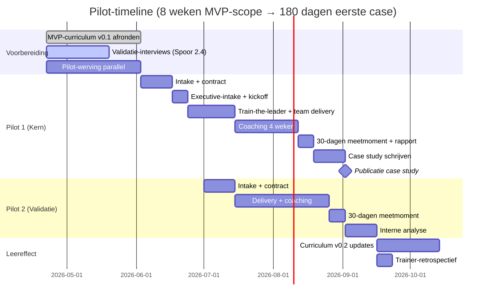

# Pilot-plan — Eerste klantgemeenten

**Datum**: 2026-04-19
**Frameworks**: Rapid prototyping + A/B hypothesis framing + Lean startup "build-measure-learn"
**Doelstelling**: Binnen 90 dagen na MVP-keuze 1-2 pilotgemeenten aan boord, binnen 180 dagen eerste publieke case study

## Executive summary

We rollen **2-3 pilotgemeenten** uit in de eerste 4-6 maanden, met één "kern-pilot" en één "validatie-pilot". Kern-pilot krijgt volledig pakket (Dossierwerker + Spilfiguur + Regisseur-executive) met 30% korting in ruil voor case-study-toestemming. Validatie-pilot krijgt een lichter pakket (alleen Dossierwerker-team + Spilfiguur) om te toetsen of kernpropositie ook zonder executive-laag werkt.

**Primair testbare hypothesen** (falsifieerbaar):
- **H1**: ≥75% van Dossierwerkers heeft binnen 30 dagen aantoonbare AI-transfer in hun werk
- **H2**: Team-KPI-beweging meetbaar zichtbaar binnen 60 dagen (bijv. doorlooptijd -15%)
- **H3**: Spilfiguur-NPS ≥40; Regisseur-NPS ≥50

**Kill criteria**: <60% transfer OR negatieve NPS → herziening propositie vóór schaalopbouw.

## Pilot-doelstellingen

1. **Bewijsbaarheid** — meetresultaten die onze 30-dagen-adoptie-belofte valideren
2. **Leereffect** — curriculum, werkvormen, coaching-methodiek iteratief verbeteren
3. **Casuïstiek** — echte gemeente-context opnemen in content-bibliotheek
4. **Referentiewaarde** — publiceerbare case studies voor sales
5. **Trainer-ritme** — drie trainers vinden werkritme en rolverdeling in real engagement

## Hypothesen (ab-hypothesis framing)

Elke hypothese heeft de vorm: *We geloven dat [doelgroep] door [interventie] [meetbaar resultaat] zal bereiken. We weten het als [observatie]. We zijn fout als [contrast].*

### H1 — Transfer-adoptie binnen 30 dagen

**We geloven dat** Dossierwerkers (controllers, consulenten, vergunningverleners) na ons 3-daagse rol-specifieke programma plus 4 weken coaching **binnen 30 dagen minimaal 75% transfer-adoptie** bereiken.

**We weten het als** in het 30-dagen-meetmoment:
- ≥75% deelnemers rapporteert ≥3 dagen/week AI-gebruik (vs. baseline 0-1)
- ≥75% deelnemers toont 1+ concrete transfer-case
- Self-reported confidence gestegen van ≤4 naar ≥7

**We zijn fout als** adoptie <60%, transfer-cases ontbreken, of confidence niet meetbaar stijgt. **Actie bij fout**: coaching-methodiek herzien; mogelijk programma-lengte uitbreiden.

### H2 — Team-KPI-beweging

**We geloven dat** een team waarin ≥75% van de Dossierwerkers AI adopteert **een meetbare team-KPI-beweging van 10-20%** laat zien binnen 60 dagen.

**We weten het als** relevante team-KPI (bv. wachtlijst Wmo, doorlooptijd vergunning, marap-productietijd) met ≥10% verbeterd.

**We zijn fout als** geen KPI-beweging zichtbaar. **Actie bij fout**: individuele adoptie vertaalt kennelijk niet naar team-niveau; onderzoek change-management-pakket herinrichten.

### H3 — Klant-NPS

**We geloven dat** gemeentelijke beslissers die het MVP-pakket afnemen **een NPS geven van ≥40**.

**We weten het als** bij de 30-dagen-rapportage de beslisser (Spilfiguur of Regisseur) een "hoe waarschijnlijk aanbevelen" score van ≥9 geeft.

**We zijn fout als** NPS <20 of overwegend passives. **Actie**: diepte-interview om te begrijpen waar verwachting niet matchte.

### H4 — Prijsbereidheid

**We geloven dat** gemeenten in de SAM-doelgroep **de standaard-prijs (€18-25k) als realistisch** ervaren, ook na programma-einde.

**We weten het als** 2/3 pilot-gemeenten ongevraagd "dit is een redelijke prijs" uiten en/of bereid zijn tot normale prijs bij vervolg (niet alleen bij korting).

**We zijn fout als** gemeenten alleen willen inkopen op basis van korting, of prijs als te hoog markeren. **Actie**: prijsmodel of pakket herzien.

### H5 — Verkoop-hefboom Regisseur → team

**We geloven dat** een succesvolle executive-sessie (Regisseur) binnen 90 dagen **leidt tot opschaling naar team-trajecten** in dezelfde gemeente.

**We weten het als** ≥1 van 2 pilot-gemeenten met executive-component binnen 90 dagen een vervolg-contract voor team-traject tekent of concreet onderhandelt.

**We zijn fout als** geen enkel vervolg ontstaat. **Actie**: onderzoek of executive-sessie als lead-in effectief is, of dat het stand-alone product moet blijven.

## Pilot-selectiecriteria

### Ideale pilot-gemeente-kenmerken

| Criterium | Pilot 1 (kern) | Pilot 2 (validatie) | Pilot 3 (optioneel) |
|---|---|---|---|
| Grootte | Middelgroot (50-100k inw) | Middelgroot of middelklein | Groot (100k+) |
| AI-volwassenheid | Middel (startend maar gemotiveerd) | Licht achter (geen AI-strategie) | Volwassen (heeft al pilots) |
| Regio | West-NL | Oost of Noord | Zuid of West |
| Politiek klimaat | Stabiel | Stabiel | Stabiel |
| Pilot-bereidheid | Hoog; willen referentiecase | Middel; willen zeker weten dat het werkt | Hoog; willen voorloper zijn |
| Beslisser-profiel | Gemeentesecretaris + CIO samen | CHRO + Programmamanager | CIO + Innovatiemanager |

### Werving-kanalen voor pilot-gemeenten
- Marieke's gemeentelijk netwerk (primair)
- VNG-bijeenkomsten en CIO-board
- Innovatiemanagers-netwerk
- Warme intro's via bestaande trainer-contacten

## Pilot-pakket per type

### Pilot 1 — Kern-pilot (volledig MVP-pakket)

- Executive-intake met MT (2-3 uur)
- Train-the-leader-track (2 dagen)
- Dossierwerker-track (3 dagen, 10-12 deelnemers)
- 4 weken adoptie-coaching
- 30-dagen rapport + publieke case study
- **Prijs**: €15.000-€18.000 (30% korting)
- **Voorwaarden**: Case study publicatie, testimonial, feedback-participatie

### Pilot 2 — Validatie-pilot (lichter pakket)

- Spilfiguur + team (geen executive-laag)
- 2 dagen train-the-leader + 2.5 dagen team
- 3 weken coaching
- 30-dagen rapport (anoniem OK)
- **Prijs**: €12.000-€14.000 (30% korting)
- **Voorwaarden**: Meetdata delen voor interne analyse (geanonimiseerd OK)

### Pilot 3 (optioneel) — Executive-only pilot

- Peer-leerkring-format met 3-4 gemeenten MT-leden samen
- 1-daagse intensieve workshop + 2u per deelnemer
- 4 peer-sessies over 12 maanden
- **Prijs**: €1.500-€2.500 per deelnemer bij deelnemersgroep 8-12
- **Voorwaarden**: Deelname-bereidheid, mogelijke ambassador-rol

## Timeline (indicatief)

Let op: Gantt is ruwe planning; 2026-04-19 = vandaag.

## Dataverzameling tijdens pilots

### Kwalitatief
- **Trainer-logboek** per sessie (wat werkte, wat niet, wat aanpassen)
- **Deelnemer-observatie** door co-trainer tijdens sessies
- **Stakeholder-interviews** bij Spilfiguur/Regisseur: start, halverwege, eind
- **Focus-groep** bij afsluiting van pilot met deelnemers

### Kwantitatief
- **Pre/post-surveys** (verplicht)
- **Adoptiemeting-interviews** (30 dagen)
- **Team-KPI's** van gemeente (toegang vooraf afgesproken)
- **NPS op verschillende momenten** (dag 0, dag 30, dag 90)

### Contextueel
- **Gemeente-factor-logging**: externe factoren (personele uitval, reorganisatie, politieke druk) die resultaat beïnvloeden — voor juiste duiding

## Leereffect-protocol

Na elke pilot-fase:

| Moment | Output |
|---|---|
| Na elke trainingsdag | 30-min trainer-debrief met actionable updates voor volgende dag |
| Na afronding training | Trainer-retrospectief (1 dagdeel): wat houden, wat wijzigen, wat stoppen |
| Na 30-dagen meting | Resultaten-sessie met deelnemer-feedback + quantitative analyse |
| Na afronding pilot | Herziening curriculum v0.1 → v0.2 |

### Beslispunten na Pilot 1

- **Continue** — resultaten ≥ H1 targets; schaal op naar pilot 2/3
- **Iterate** — gedeeltelijke targets gehaald; specifieke modules herzien
- **Pivot** — kern-propositie werkt niet; fundamenteel herzien
- **Stop** — onderbouwd signaal dat deze propositie niet werkt (onwaarschijnlijk maar mogelijk)

## Pilot-risico's en mitigaties

| Risico | Waarschijnlijkheid | Mitigant |
|---|---|---|
| Geen gemeenten willen pilot | Laag (Marieke's netwerk sterk) | Backup: open-inschrijving executive-track als entry |
| Pilot-gemeente gebruikt korting als leverage ("wat krijgen we ervoor terug?") | Hoog | Voorwaarden duidelijk in contract (case study, feedback) |
| Deelnemers trekken terug wegens werkdruk tijdens pilot | Middel | Cohort-grootte ruim opzetten (15 i.p.v. 12) + make-up-sessies |
| AI-tool veranderd tijdens pilot | Hoog | Back-up-workflows per module + buffer-dag |
| IT/privacy blokkeert tool-toegang laat | Middel | Pre-check 3 weken vooraf + lokaal model als backup |
| Meetresultaten zijn teleurstellend | Middel | Adaptief leerplan, meer coaching toevoegen, verwachting bij klant bijstellen |
| Klant doet niet mee aan case study na akkoord | Laag | Contractueel + anonymization-optie |

## Pilot-output

Na complete pilotfase (≤ 180 dagen):

1. **Curriculum v0.2** — bijgewerkt op basis van real-life ervaring
2. **1-2 publiceerbare case studies** — met reële cijfers, quotes, lessons
3. **Trainer-playbook v2** — concrete werkritme, sjablonen, back-up-plannen
4. **Commercieel dossier** — referenties, testimonials, pricing-bevestiging
5. **Interne retrospectief-nota** — wat hebben we geleerd, wat doen we anders
6. **Beslissing richting Spoor 4.2** — GTM-plan valideren of heroverwegen

## Hypothese-tracker

Levend document tijdens pilot:

| # | Hypothese | Testmoment | Result | Beslissing |
|---|---|---|---|---|
| H1 | Transfer-adoptie ≥75% | 30-dagen meting | ☐ | |
| H2 | Team-KPI +10-20% | 60-dagen | ☐ | |
| H3 | NPS ≥40 | 30-dagen | ☐ | |
| H4 | Prijs €18-25k realistisch | Per interview | ☐ | |
| H5 | Executive → team opschaling | 90-dagen | ☐ | |

## Volgende stap

- Na pilot-werving: contracten voorbereiden met juridische review
- **Spoor 3.6 (pre-mortem)** voorbereiden vlak voor start pilot
- **Spoor 4.2 (GTM)** moet afgerond zijn voordat pilot-publiek-case gelanceerd wordt
