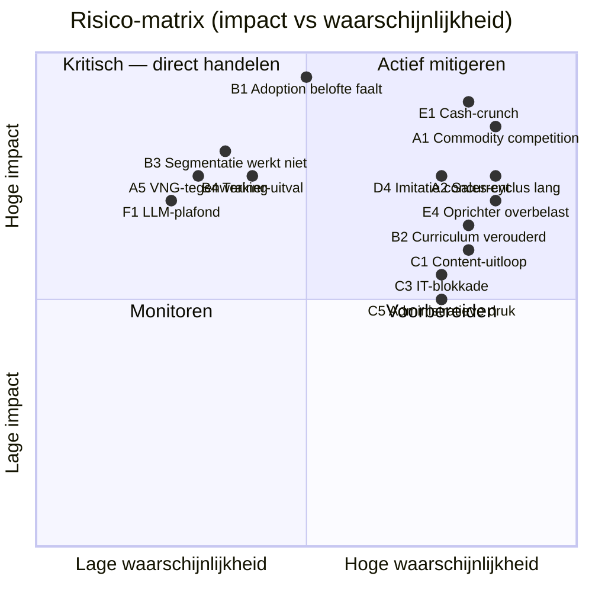

# Pre-Mortem — Risico-inventarisatie AI-educatieprogramma

**Datum**: 2026-04-19
**Framework**: Gary Klein Pre-mortem (verbeeld dat het project is gefaald, werk terug naar oorzaken)
**Scope**: De 18 maanden na MVP-start — van eerste pilot tot 25 klantgemeenten

## Opdracht van de pre-mortem-sessie

"**Stel dat het vandaag oktober 2027 is. Onze MVP voor AI-educatie is mislukt. We hebben ons target van 25 klantgemeenten niet gehaald, omzet is ver onder target, team valt uit elkaar. Schrijf terug: wat ging er mis? Identificeer zoveel mogelijk faalmodes.**"

## Faalmodes — 30 scenarios

Gegroepeerd in 6 categorieën. Elk met mogelijke oorzaak, waarschijnlijkheid en preventieve maatregel.

### Categorie A — Commercieel falen

#### A1. Gemeenten kiezen structureel voor goedkopere / gratis alternatieven
- **Oorzaak**: AI-Act zette iedereen in beweging; ODI-Basismodule is "goed genoeg"; budgetdruk gemeenten
- **Waarschijnlijkheid**: **Hoog**
- **Preventie**: Positioneren boven commodity-laag; bewijs blijven leveren via 30-dagen meting; niet in prijs concurreren

#### A2. Sales-cyclus blijkt veel langer dan 3-6 maanden
- **Oorzaak**: Gemeentelijke inkoop is complex; beslisketen breed
- **Waarschijnlijkheid**: **Hoog**
- **Preventie**: Cashflow-buffer van 9-12 maanden; meerdere leads in pipeline simultaan; deel van omzet via snellere executive-tracks

#### A3. Pilot-gemeenten komen niet tot akkoord over case-study-publicatie
- **Oorzaak**: Politieke gevoeligheid; beslisser wisselt
- **Waarschijnlijkheid**: Middel
- **Preventie**: Case-study-toestemming contractueel vooraf; anonimisering optie; meerdere pilots

#### A4. Prijsmodel past niet bij gemeentelijke inkoop-jaarritme
- **Oorzaak**: Budget voor trainingen komt vaak in Q4-Q1; timing matcht niet
- **Waarschijnlijkheid**: Middel
- **Preventie**: Pipeline-management op jaarritme; aanbieden modulair zodat split-levering mogelijk is

#### A5. VNG / CIO-board steunt concurrent / partner expliciet
- **Oorzaak**: Publieke aanbieder krijgt voorrang als "veilige keuze"
- **Waarschijnlijkheid**: Laag-middel
- **Preventie**: Partnerschap met VNG onderzoeken in plaats van concurreren; publiek verstandhouding opbouwen

### Categorie B — Product/inhoudelijk falen

#### B1. 30-dagen adoptiebelofte wordt structureel niet gehaald
- **Oorzaak**: Onderschatting van adoptie-complexiteit; programma-lengte ontoereikend; deelnemer-werkdruk te hoog
- **Waarschijnlijkheid**: Middel
- **Preventie**: Ruimhartige pilot-meting met leergaranties; coaching-laag voldoende dimensioneren; fallback naar 60-90-dagen-meting als alternatief

#### B2. Curriculum verouderd tegen snelheid van AI-tool-verandering
- **Oorzaak**: LLM's updaten sneller dan content-cyclus; demos falen
- **Waarschijnlijkheid**: **Hoog**
- **Preventie**: Modulair ontwerp; focus op denkwijzen i.p.v. tools; update-ritme van 1 dag/maand; back-up-plannen per module

#### B3. Persona-segmentatie werkt niet in praktijk
- **Oorzaak**: Gemeenten werken niet conform onze indeling; trainees voelen zich niet herkend
- **Waarschijnlijkheid**: Laag-middel
- **Preventie**: Segmentatie toetsen in validatie-interviews (Spoor 2.4); flexibiliteit in curriculum-samenstelling

#### B4. Trainer-ziektegeval / uitval op cruciaal moment
- **Oorzaak**: 3-persoons team kwetsbaar; geen back-up voor Marieke's domein-kennis
- **Waarschijnlijkheid**: Middel
- **Preventie**: Vroeg een 4e (part-time) trainer identificeren; materiaal documenteren zodat overdracht mogelijk is

#### B5. Executive-track niet commercieel zelfstandig (lead-in die niet opschaalt)
- **Oorzaak**: Executive-sessies worden gezien als certificeringsvinkje; geen vervolg
- **Waarschijnlijkheid**: Middel
- **Preventie**: Executive-track strak koppelen aan follow-up-gesprekken; team-track vroeg in gesprek bij MT

### Categorie C — Operationeel/organisatorisch falen

#### C1. Content-ontwikkeling loopt uit de hand
- **Oorzaak**: Onderschatting scope; ambitieuze modulaire opzet; maatwerk-opdrachten
- **Waarschijnlijkheid**: **Hoog**
- **Preventie**: Gefaseerde release (v0.1 basis, v0.2 uitbreiding); modulair ontwerp; MVP-mentaliteit

#### C2. Trainer-team valt uit elkaar door rollen-ontwaarding
- **Oorzaak**: Marieke voelt zich niet au sérieux genomen door techneuten; Ravi verveelt zich bij basis-trainingen; Mike loopt vast in operationele druk
- **Waarschijnlijkheid**: Middel
- **Preventie**: Duidelijke rolverdeling in elk project; trainer-retrospectives elke 4 weken; gedeeld belang via winst- of equity-model overwegen

#### C3. IT / security-problemen bij klantgemeenten blokkeren tool-gebruik
- **Oorzaak**: Shadow-IT-beleid; Azure OpenAI niet beschikbaar; geen Copilot-licenties
- **Waarschijnlijkheid**: **Hoog** (voorspelde recurring issue)
- **Preventie**: Pre-sales IT-check standaard in proces; back-up met lokale modellen; "bring your own model" opties

#### C4. Meet-infrastructuur levert onbetrouwbare data
- **Oorzaak**: Surveys niet ingevuld; pre/post-vragen niet aligned; self-report bias
- **Waarschijnlijkheid**: Middel
- **Preventie**: Meetprotocol in pilot herzien; combineer self-report met observatie; keep it simple

#### C5. Administratieve rompslomp vertraagt schaalopbouw
- **Oorzaak**: Facturatie, contracten, DPIA's, VAR-kwesties nemen tijd
- **Waarschijnlijkheid**: **Hoog**
- **Preventie**: Vroeg backoffice inrichten (boekhouding, juridisch kader, templates); partnership met administrative service mogelijk

### Categorie D — Reputatie / extern

#### D1. Een deelnemer gebruikt geleerde AI-skills voor iets dat publiek misloopt
- **Oorzaak**: Ambtenaar doet AVG-incident; wij worden als trainer genoemd
- **Waarschijnlijkheid**: Middel (meer deelnemers = meer kans)
- **Preventie**: Juridische waarborgen-module sterk benadrukken; disclaimers in communicatie; crisisprotocol

#### D2. Publicatie negatieve review of case
- **Oorzaak**: Onvrede bij gemeente; interne politieke dynamiek; misverwachting
- **Waarschijnlijkheid**: Laag-middel
- **Preventie**: NPS-monitoring; snel reageren op ontevredenheid; expectation management vooraf

#### D3. AI-Act-discussie verschuift negatief in publiek debat
- **Oorzaak**: AI-incident groot in media; weerstand tegen verplichte geletterdheid
- **Waarschijnlijkheid**: Middel (politiek volatiel)
- **Preventie**: Narratief voorbereiden dat aansluit op publieke bezorgdheden; niet meeliften op hype

#### D4. Grote concurrent lanceert vergelijkbaar aanbod
- **Oorzaak**: Commerciële speler imiteert ons persona-model; lage toetredingsdrempel
- **Waarschijnlijkheid**: **Hoog** (18-24 maanden horizon)
- **Preventie**: Eerste markt-mover-positie claimen; content snel diep maken; partner met instituut dat vertrouwen heeft

#### D5. Gemeente publiek niet-positief over AI (politieke lijn)
- **Oorzaak**: Verkiezingen; AI-kritiek als profileringsthema
- **Waarschijnlijkheid**: Middel
- **Preventie**: Framing waarmee AI óók werknemersvriendelijk is; OR-samenwerking

### Categorie E — Financieel / persoonlijk

#### E1. Cash-crunch in maand 9-12
- **Oorzaak**: Vaste kosten lopen door; omzet vertraagt; sales-cyclus langer dan verwacht
- **Waarschijnlijkheid**: **Hoog** (klassieke startup-realiteit)
- **Preventie**: 12-maanden cashflow buffer; lijn met investeerder vooraf; minimum viable team-structuur

#### E2. Marieke kiest terug voor gemeente-rol
- **Oorzaak**: Onzekerheid startup; verleiding van interessante functie
- **Waarschijnlijkheid**: Laag-middel
- **Preventie**: Partnership / equity bespreken; werk dat inhoudelijk vervult; maandelijkse check-in welzijn

#### E3. Ravi start eigen concurrerende praktijk
- **Oorzaak**: Verzelfstandigings-drang; ziet ondernemersrichting
- **Waarschijnlijkheid**: Middel (hij heeft al eigen bedrijf)
- **Preventie**: Heldere afspraken in contract; winst-deling bij gezamenlijk geleverde trajecten; exclusiviteit per segment afspreken

#### E4. Oprichter (Sven) overbelast
- **Oorzaak**: Te veel petten op; alleen opbouwen
- **Waarschijnlijkheid**: **Hoog**
- **Preventie**: Vroeg administratieve kracht; niet alles zelf willen doen; partner / equity-investeerder

#### E5. Juridische complicatie (bv. concurrentiebeding, auteursrecht curriculum)
- **Oorzaak**: Onvoldoende juridisch voorbereid
- **Waarschijnlijkheid**: Middel
- **Preventie**: Juridische check op contracten, IP, gebruikersvoorwaarden vroeg regelen

### Categorie F — Technologisch

#### F1. LLM's bereiken plafond in gemeentelijke use cases (niet goed genoeg)
- **Oorzaak**: Specifieke juridische nuance, gevoelige data, kleine talen — AI valt tegen
- **Waarschijnlijkheid**: Laag
- **Preventie**: Adaptief maken: training leert ook wanneer níet AI te gebruiken

#### F2. Nederlandse LLM's (GPT-NL) blijven achter op internationale
- **Oorzaak**: Resource-beperking; technische schaal
- **Waarschijnlijkheid**: Middel
- **Preventie**: Niet commitment aan alleen Nederlandse modellen; "hybride" aanpak in curriculum

#### F3. Prijsdump door grote tech-aanbieders maakt AI-toegang "triviaal"
- **Oorzaak**: Microsoft, Google, Anthropic gaan in massale commoditization
- **Waarschijnlijkheid**: Middel
- **Preventie**: Training-waarde zit niet in tool-toegang maar in toepassing, juridisch kader, adoptie

#### F4. Privacy-incident bij een AI-tool raakt vertrouwen breed
- **Oorzaak**: Lek, datamisbruik, buitenlandse jurisdictie
- **Waarschijnlijkheid**: Middel
- **Preventie**: Meerdere tool-opties; lokale-model-track prominenter maken; snel kunnen schakelen naar alternatief

## Risico-kaart

## Top-10 kritische risico's (uit kwadrant 2 en aangrenzend)

1. **B1** — Adoptie-belofte faalt (impact critical, waarschijnlijkheid middel)
2. **E1** — Cash-crunch maand 9-12
3. **A1** — Commodity-prijsdruk
4. **A2** — Sales-cyclus langer dan verwacht
5. **D4** — Grote concurrent imiteert
6. **E4** — Oprichter overbelast
7. **B2** — Curriculum verouderd door tool-change
8. **C1** — Content-ontwikkeling loopt uit
9. **C3** — IT-blokkade bij klant
10. **C5** — Administratieve rompslomp

## Mitigatie-roadmap

| Risico | Actie | Verantwoordelijk | Wanneer |
|---|---|---|---|
| B1 | Adaptief coaching-ontwerp; fallback-meetperiode 60-90 dagen | Mike | Pilot-fase |
| E1 | 12-maanden cashflow buffer borgen; lijn investeerder / lening | Sven | Voor start pilot 1 |
| A1 | Premium-positionering vasthouden; 30-dagen-adoptie bewijs publiceren | Sven | Continue |
| A2 | Pipeline-diversiteit; executive-track als cashflow-accelerator | Sven + Marieke | Continue |
| D4 | Continu monitoring concurrenten; content-diepte blijven uitbouwen | Mike | Doorlopend |
| E4 | Administratieve kracht (VA of part-time) binnen 6 maanden | Sven | Maand 3-6 |
| B2 | Update-cyclus inbakken in trainer-ritme; modulair ontwerp | Mike | Vanaf v0.2 |
| C1 | MVP-curriculum scope-bewaking; v0.1 minimaal | Mike | Vanaf nu |
| C3 | Pre-sales IT-check als standaardstap; back-up-plannen | Ravi + Mike | Verkoopproces |
| C5 | Backoffice-templates, boekhouding automatiseren | Sven | Maand 1-3 |

## Leer-rituelen (ingebakken mitigatie)

- **Wekelijkse cashflow-check** — eerste 12 maanden
- **Maandelijkse trainer-retrospectief** — rollen, gezondheid, ontwikkeling
- **Kwartaal-risico-review** — deze pre-mortem actualiseren
- **Pilot-debrief**: altijd binnen 14 dagen na afronding
- **Halfjaar-pauze**: team reflecteert op richting, eerlijke go/stop-momenten

## "Wat zouden we willen dat we eerder hadden gedaan?"

Gebaseerd op ervaring met vergelijkbare startups:

1. **Administratie vroeger structureren** — boekhouding, contracttemplates, DPIA-flow
2. **Vroege referentiecase** prioriteit geven boven volume
3. **Cash-reserve 3 maanden dieper** dan initieel begroot
4. **Trainer-retrospectief vanaf week 1**, niet wachten tot eerste irritatie
5. **Partnerstrategie (VNG/Sdu) onderzoeken vóór 6 maanden**, niet erna
6. **Duidelijk nee zeggen** tegen maatwerk dat niet binnen MVP-scope past
7. **Crisiscommunicatie-plan** klaar hebben vóór eerste incident

## Volgende stap

- Deze pre-mortem is een levend document — update na elke pilot-debrief
- Mitigatie-roadmap inbakken in planning
- Specifieke risk-registers ontwikkelen voor pilots (Spoor 3.5)
