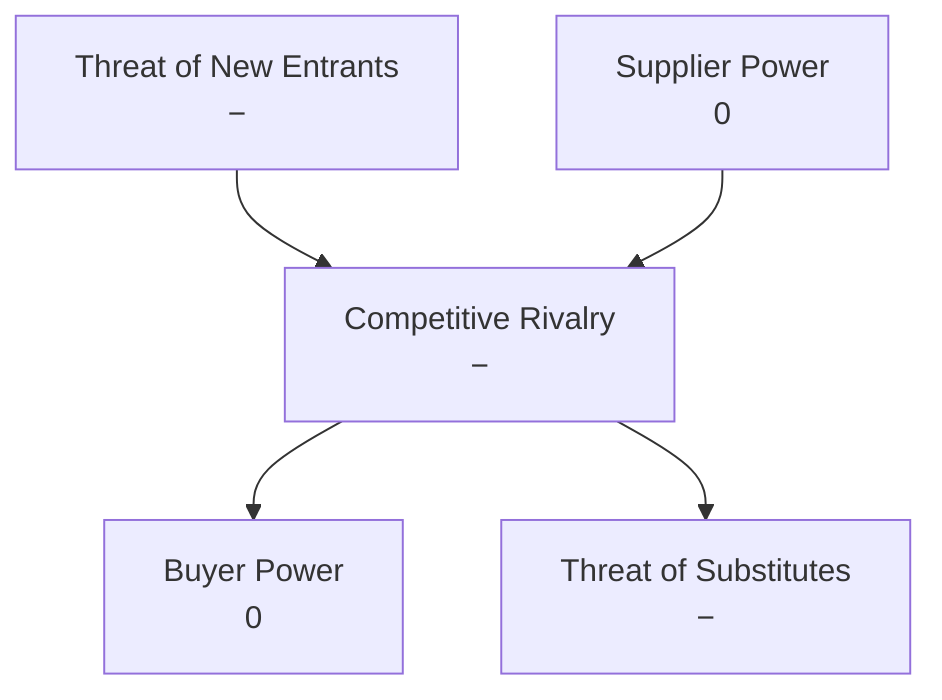
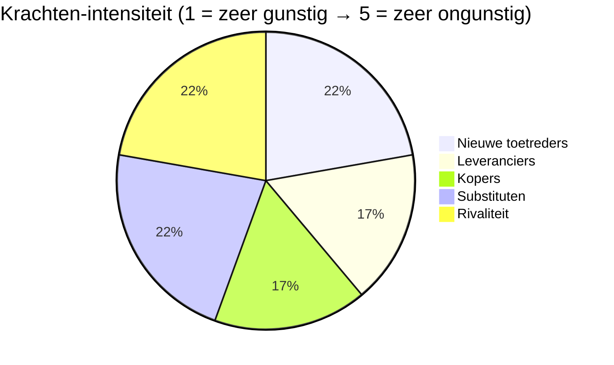
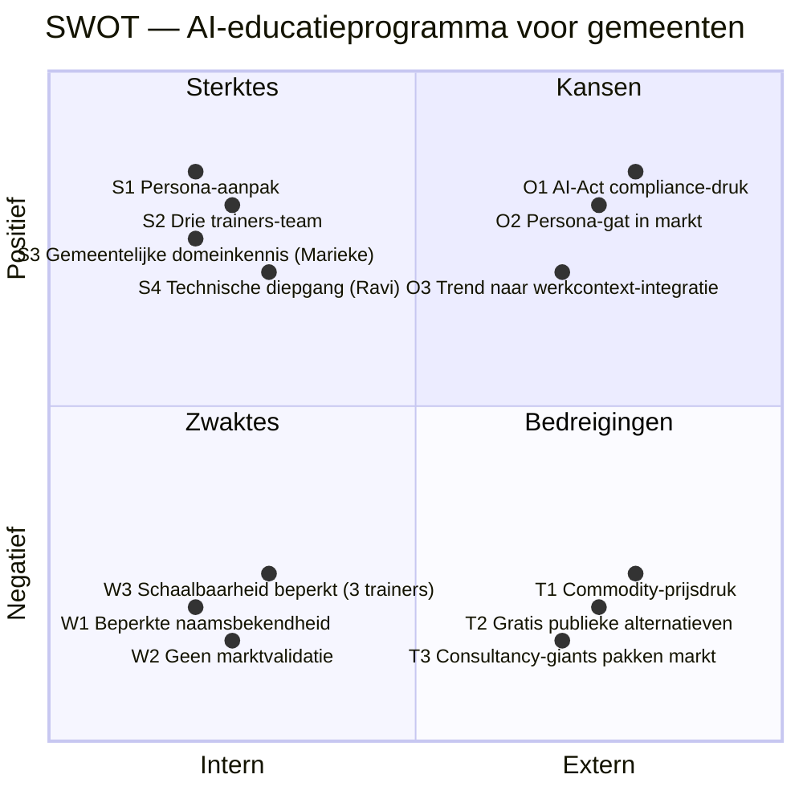

# Competitive Analysis: AI-educatieprogramma voor Nederlandse gemeenten

**Datum**: 2026-04-19
**Branche**: AI- en digitaliseringstrainingen voor de Nederlandse publieke sector, met specifieke focus op gemeenten
**Geografische scope**: Nederland (342 gemeenten)
**Onderwerp**: AI-educatieprogramma op basis van 5 gemeentelijke persona-segmenten (Schrijvers, Dossierwerkers, Spilfiguren, Regisseurs, Complexiteitsbedwingers) met drie complementaire trainers (Mike, Marieke, Ravi)

## Executive summary

De markt voor AI-training voor Nederlandse overheden is **sinds begin 2025 sterk in beweging** door de verplichting uit de EU AI-Act dat organisaties AI-geletterdheid moeten borgen bij medewerkers die met AI werken. Dit leidt tot een drukbezette markt waarin minimaal **drie categorieën aanbieders** actief zijn: (1) publieke aanbieders (RADIO, VNG/VNG Realisatie, I-Partnerschap) met generieke basisopleidingen, (2) gespecialiseerde trainers (Dutch-AI, Advies en Training.ai, De AI Workshop, AI Personeelstraining) met gemeentegerichte maar vaak korte workshops, en (3) grote consultancies en data-gedreven bureaus (Xomnia, Bestuursacademie, SBO) met meer generieke of enterprise-trainingen.

**Dominante krachten**: lage toetredingsdrempels en hoge imitatierisico's vanuit commerciële aanbieders drukken marges; de verplichting uit de AI-Act zorgt voor **hoge koperdruk** maar ook voor commoditization van basis-AI-geletterdheid. De witte ruimte ligt in **diepgaande, persona-specifieke programma's met adoptiebegeleiding** — niet in basisliteratuur of ad-hoc workshops.

**Topaanbeveling**: positioneer scherp als **het persona-gebaseerde, werkcontext-geïntegreerde AI-traject** voor gemeenten, níet als "zoveelste AI-cursus". Laat de executive-laag (RADIO, VNG) het basislezen doen en claim zelf de laag daarboven: echte vaardigheidsopbouw en adoptie binnen 30 dagen. Primaire concurrenten om van te onderscheiden: Dutch-AI (3-daagse) en Advies en Training.ai (beleidspraktijk) — beide zijn het dichtst bij onze propositie.

## PESTEL-context

| Categorie | Factor | Implicatie |
|---|---|---|
| **Politiek** | EU AI-Act (deels sinds feb 2025 actief), rijksbrede AI-strategie, regeerakkoord op digitalisering | Compliance-driver: gemeenten moeten aantoonbaar AI-geletterdheid borgen |
| **Economisch** | Gemeentefinanciën onder druk (jeugdzorgtekort, opschalingskorting), opleidingsbudgetten variabel | Prijsgevoeligheid, maar ruimte voor investeringen met aantoonbare ROI |
| **Sociaal** | Arbeidsmarktkrapte, vergrijzing ambtelijk apparaat, digitale kloof tussen junioren en senioren | Opleidingsnoodzaak ter behoud + instroom talent, diverse leerbehoeftes |
| **Technologisch** | LLM-landschap verandert snel (Claude, GPT, Gemini, Mistral, Llama), opkomst lokale modellen (GPT-NL begin 2026, ODI) | Leerstof verandert continu; trainers moeten bijblijven |
| **Milieu** | Energiezorg rond grote cloud-modellen (data centers), EU focus op groene digitalisering | Marginaal relevant voor trainingsmarkt; positief framing mogelijk voor lokale modellen |
| **Juridisch** | AI-Act, AVG, BIO, rechtmatigheidskader gemeenten | Privacy- en compliance-component in training is non-negotiable |

**Kernpunt uit PESTEL**: de AI-Act creëert **urgent koperverkeer** (verplichting = deadline), én commodificeert de onderkant van de markt (basisliteratuur wordt een checkbox). Ons programma moet bovenop de checkbox gaan zitten, niet eronder concurreren.

## Porter's Five Forces

### Krachten-diagram



### Assessment

| Kracht | Rating | Factoren | Onderbouwing |
|---|---|---|---|
| **Dreiging nieuwe toetreders** | `−` (ongunstig) | Lage toetredingsdrempel · veel ZZP-trainers en kleine bureaus actief · AI-kennis is breed beschikbaar | Zoekresultaten tonen 10+ kleine aanbieders (AI Personeelstraining, De AI Workshop, Dutchtrain, Advies en Training.ai etc.) die allemaal AI-trainingen voor overheid aanbieden; veel zonder sector-expertise |
| **Macht leveranciers** | `0` (neutraal) | AI-modellen commoditeren (meerdere leveranciers) · LMS-platforms toegankelijk · trainers zijn schaars maar niet uniek | ChatGPT/Claude/Copilot/Gemini allen beschikbaar; prijzen convergeren; alternatieven als Mistral en Llama lokaal. Eigen trainers zijn voor ons geen "supplier" maar "core asset" |
| **Macht afnemers (gemeenten)** | `0` (neutraal) | AI-Act dwingt tot inkoop (vermindert uitstel-macht) · gemeenten vergelijken elkaars inkoop (VNG-netwerk) · budgetten zijn strikt | AI-Act literacy-verplichting sinds feb 2025 verhoogt urgentie bij inkoop; gemeenten communiceren via VNG-netwerken over wat ze inkopen, wat prijsdruk geeft maar ook sociale bewijsvorming |
| **Dreiging substituten** | `−` (ongunstig) | Gratis publieke alternatieven (RADIO e-learning, ODI Basismodule) · peer-learning binnen VNG-communities · ChatGPT "zelf ontdekken" | Rijksorganisatie ODI lanceerde in februari 2026 een gratis e-learning "Basismodule Digitaal vakmanschap" voor alle ambtenaren; RADIO biedt gratis en maatwerk workshops; VNG organiseert 4 regionale bijeenkomsten 2026 |
| **Concurrentie-intensiteit** | `−` (ongunstig) | Veel aanbieders, weinig differentiatie op basisaanbod · prijsdumping door consultancies die training als funnel gebruiken · AI-Act boost zet iedereen in actie | Actieve aanbieders: RADIO, VNG, Dutch-AI, SBO, Bestuursacademie, Xomnia, De AI Workshop, Advies en Training.ai, Dutchtrain, AI Personeelstraining + losse freelancers |

**Industrie-aantrekkelijkheid: Matig aantrekkelijk**. De vraag is sterk en groeiend (AI-Act drijft verplichte inkoop), maar concurrentie-intensiteit en substitutie drukken marges op basis-aanbod. Winstgevendheid komt van gespecialiseerde, hoogwaardige aanbiedingen die zich onderscheiden van commodity-trainingen.

## Industrie-aantrekkelijkheid radar



De drie hoogste bars (Rivaliteit, Substituten, Nieuwe toetreders) zijn allemaal factoren aan de aanbodkant. Dit bevestigt: strategische actie zit in differentiatie en positionering, níet in marktexpansie.

## SWOT — Ons programma (AI-educatie persona-gebaseerd)

### SWOT-diagram



### SWOT-tabel

| Sterktes (S) | Zwaktes (W) |
|---|---|
| **S1.** Persona-gebaseerde aanpak (20 trainees + 3 trainers uitgewerkt tot op werk-niveau) — uniek detailniveau in markt | **W1.** Beperkte naamsbekendheid — geen bestaand klantportfolio of testimonials |
| **S2.** Drie complementaire trainers (didactiek, gemeentelijke ervaring, technische diepgang) — breder dekkingsgebied dan solo-trainers | **W2.** Geen empirische marktvalidatie — propositie is in prototype-fase |
| **S3.** Gemeentelijke lived experience via Marieke (22 jaar ambtenaar) — geloofwaardigheid die externe trainers missen | **W3.** Schaalbaarheid beperkt — 3 trainers aan capaciteit; kan niet snel 50 gemeenten tegelijk bedienen |
| **S4.** Technische AI-engineering diepgang via Ravi — concurreert met data-consultancies op senior niveau | **W4.** Ontbrekende commerciële infrastructuur — geen website, referenties, verkoopproces |
| **S5.** Werkcontext-integratie filosofie (30-dagen-adoptie) — meetbaar succesbelof | |

| Kansen (O) | Bedreigingen (T) |
|---|---|
| **O1.** AI-Act art. 4 dwingt aantoonbare AI-geletterdheid sinds feb 2025 — iedere gemeente moet dit oplossen | **T1.** Commodity-prijsdruk: basis-AI-trainingen zakken naar €500-€1500 per deelnemer |
| **O2.** Persona-gat in markt — bestaande aanbieders bieden óf generiek óf klassiek 3-daags cursusmodel | **T2.** Gratis publieke alternatieven (RADIO "Basismodule Digitaal vakmanschap" sinds feb 2026, ODI) vullen de basis-laag in |
| **O3.** Trend naar werkcontext-integratie en adoption coaching — gemeenten willen meer dan certificaatjes | **T3.** Consultancy-giants (Deloitte, KPMG, Xomnia) kunnen groot budget inzetten en gemeentelijke lock-in creëren via adviesrelaties |
| **O4.** VNG-communities en CIO-board organiseren 4 regionale AI-bijeenkomsten in 2026 — kanaal-mogelijkheid | **T4.** Verzadiging bij gemeenten: "we hebben al een AI-training gehad" wordt defensieve reflex |
| **O5.** GPT-NL (Nederlands open-source LLM) wordt begin 2026 door VNG ondersteund — mogelijke niche in lokale-model-curriculum | **T5.** Tempo van AI-tool-verandering maakt curriculum snel verouderd — vereist continue investering |

## Concurrenten-SWOT — kernspelers

### 1. RADIO (RijksAcademie voor Digitalisering en Informatisering Overheid / Rijksorganisatie ODI)

**Positie**: Publieke aanbieder, onderdeel van Rijksorganisatie ODI, sinds feb 2026 ook gratis e-learning "Basismodule Digitaal vakmanschap" voor alle ambtenaren. Biedt AI- en Generatieve AI-opleidingen, maatwerk workshops.

| Sterktes | Zwaktes |
|---|---|
| Landelijke autoriteit en legitimiteit (Rijksoverheid) | Focus sterker op Rijk dan op gemeenten |
| Gratis en maatwerk combinatie — brede funnel | Generieke content, minder rol-specifiek |
| Directe verbinding met beleidskader AI-Act | Traagheid van publieke organisatie in curriculum-updates |

| Kansen | Bedreigingen |
|---|---|
| AI-Act creëert vraag waar zij de defaultkeuze voor zijn | Commerciële aanbieders onderscheiden zich op diepte en snelheid |
| Kunnen nieuwe modules snel uitrollen met ministeriele backing | Gemeenten melden via VNG afstand tot RADIO-aanbod (te rijkerig) |

### 2. VNG / VNG Realisatie

**Positie**: Brancheorganisatie, ledenorganisatie, faciliteert AI Governancekader, community voor AI en algoritmes, trendanalyses. In 2026 vier regionale AI-bijeenkomsten samen met CIO Board, IMG en VDP. Geen zware trainer, wel convener.

| Sterktes | Zwaktes |
|---|---|
| Ongeëvenaarde toegang tot 342 gemeenten — lidmaatschap dwingt betrokkenheid | Beperkte training-capaciteit, voornamelijk bijeenkomsten en kaders |
| Vertrouwde rol als "de stem van gemeenten" | Vergader-cultuur, geen vaardigheidsopbouw |
| Governancekader, trendanalyse en GPT-NL-ondersteuning als content | Geen diepe didactiek en eigen trainer-team |

| Kansen | Bedreigingen |
|---|---|
| Kunnen partnerschappen sluiten met commerciële trainers die zij endorsen | Sterke afhankelijkheid van subsidies en leden-budgetten |
| GPT-NL als flagship — potentieel klantenkanaal | Gemeenten trekken zelf naar commerciële opties voor operationele opleidingen |

### 3. Dutch-AI.nl (samen met Sdu)

**Positie**: Commerciële aanbieder met de meest expliciete gemeente-positionering: "Opleiding AI & Gemeente", 3-daags, samen met Sdu. Claimt AI-kennis "toegepast op processen, beleidsontwikkelingen en juridische kaders die de dagelijkse praktijk in gemeenten vormen".

| Sterktes | Zwaktes |
|---|---|
| Expliciete gemeente-focus (zeldzaam) | Klassiek 3-daags cursusmodel — beperkte personalisatie |
| Partnerschap met Sdu (juridisch-uitgevers-netwerk) | Geen expliciete persona- of adoption-benadering |
| Certificaat-achtige positionering spreekt AI-Act-naleving aan | Onduidelijk of er trainer-team is met gemeentelijke achtergrond |

| Kansen | Bedreigingen |
|---|---|
| AI-Act als growth-driver | Wordt geflankeerd door generieke aanbieders met lagere prijs |
| Kan opschalen via Sdu-abonnees-netwerk | Mist adoption- en transfer-layer die gemeenten gaan eisen |

### 4. Advies en Training.ai

**Positie**: Zelfbenoemde specialist voor AI en Beleidspraktijk/Publieke Sector. Trainingen en adviesdiensten, sterk beleids-georiënteerd.

| Sterktes | Zwaktes |
|---|---|
| Gespecialiseerd in beleidspraktijk — raakvlak met Segment 1 "Schrijvers" | Klein bureau, beperkte schaal |
| Combineert advies en training — funnel-potentieel | Minder zichtbare positionering op uitvoerende lagen (Dossierwerkers, Spilfiguren) |
| Pragmatische werkwijze | Geen expliciet trainer-team zichtbaar |

| Kansen | Bedreigingen |
|---|---|
| Beleidsadviseurs krijgen AI-Act-druk via portefeuillehouders | Concurrentie van RADIO en SBO op beleidsthema |
| Kan zich profileren als go-to voor beleidsmakers | Beperkte capacity bij grote orders |

### 5. SBO (Studiecentrum voor Bedrijf en Overheid) / Bestuursacademie

**Positie**: Langdurig actieve opleidingsinstituten voor overheidspersoneel, met open-inschrijvingscursussen. "Cursus AI voor de overheid". Generieke dekking, veel onderwerpen, mass-appeal.

| Sterktes | Zwaktes |
|---|---|
| Grote naamsbekendheid in overheidsland | Generieke, weinig gedifferentieerde AI-cursussen |
| Compleet opleidingsaanbod (CV-compatibiliteit, netwerkwaarde) | Weinig integratie met werkcontext |
| Sterke commerciële infrastructuur en inschrijvingskanalen | Formaat (klassikaal, 1-3 dagen) mismatcht met transfer-ambities |

| Kansen | Bedreigingen |
|---|---|
| Kunnen elk nieuw AI-onderwerp snel in hun catalogus zetten | Gespecialiseerde aanbieders pakken diepte-segmenten |
| AI-Act verhoogt volumes in hun open-inschrijving | Geen unieke AI-trainer-differentiatie |

### 6. Xomnia (representatief voor data/AI-consultancies: ook GoDataDriven, KPMG, Deloitte)

**Positie**: High-end data science en AI consultancy. Publiceert thought leadership over AI in publieke sector; levert maatwerk en capaciteitsprojecten, trainingen vaak als bijvangst.

| Sterktes | Zwaktes |
|---|---|
| Diepgaande technische expertise | Prijsniveau te hoog voor kleinere gemeenten |
| Enterprise-reputatie en zware referenties | Gemeenten zijn niet kern-markt |
| Kunnen end-to-end implementaties leveren (consulting + training) | Gemeentelijke taal en processen minder vanzelfsprekend |

| Kansen | Bedreigingen |
|---|---|
| Grote gemeenten (G4) zijn eerste doelgroep | Inzet van eigen senioren bij training is duur |
| Kunnen partnerschap met Rijk sluiten | Disruption van onderaf door gespecialiseerde trainers |

## Concurrent-vergelijking (side-by-side)

| Dimensie | **Ons programma** | RADIO | VNG Realisatie | Dutch-AI.nl | Advies en Training.ai | SBO / Bestuursacademie | Xomnia (consultancy) |
|---|---|---|---|---|---|---|---|
| **Top sterkte** | Persona-gebaseerd × 3 trainers | Publieke legitimiteit, gratis | Toegang 342 gemeenten | Gemeente-specifiek + Sdu | Beleidspraktijk specialisme | Naamsbekendheid + infra | Technische diepgang enterprise |
| **Top zwakte** | Geen naamsbekendheid, klein team | Traag, Rijk-gericht | Geen training-capaciteit | Klassiek model, geen adoption | Klein, geen brede dekking | Generieke inhoud | Te duur/generiek voor gemeenten |
| **Top kans** | AI-Act × persona-gat | AI-Act als default | Platformrol | AI-Act-certificaat vibe | Beleidsmakers-niche | Volumes AI-Act | G4 + Rijk |
| **Top bedreiging** | Commodity druk + grote namen | Commerciële diepte pakt diepte | Versnippering aanbod | Prijs-commodity | Klein schaal-kwetsbaar | Verlies aan specialisten | Disruptie van onderen |

## Competitive Positioning Map

```mermaid
quadrantChart
    title Positionering — AI-trainingsaanbod Nederlandse gemeenten
    x-axis Generiek --> Persona-/rolspecifiek
    y-axis Basis AI-literacy --> Diepgaand vaardighedenopbouw + adoptie
    quadrant-1 Persona-diep (witte ruimte)
    quadrant-2 Gespecialiseerd diep
    quadrant-3 Gespecialiseerd basis
    quadrant-4 Generiek-diep
    "Ons programma": [0.85, 0.85]
    "RADIO": [0.25, 0.30]
    "VNG Realisatie": [0.40, 0.20]
    "Dutch-AI.nl": [0.60, 0.55]
    "Advies en Training.ai": [0.65, 0.50]
    "SBO / Bestuursacademie": [0.30, 0.40]
    "Xomnia (consultancy)": [0.35, 0.80]
```

**As-keuze onderbouwing**: de twee meest differentiërende dimensies zijn (X) **rolspecificiteit** — hoe strak is het aanbod afgestemd op concrete functies — en (Y) **trainingsdiepte + adoptie** — wordt er echt vaardigheid opgebouwd en adoptie begeleid, of alleen kennis overgedragen.

**Strategische implicatie**: de rechterbovenhoek (persona-specifiek × diepgaand) is structureel onderbezet. Dutch-AI en Advies en Training.ai zitten het dichtst bij ons maar missen óf de persona-diepgang óf de adoption-laag. Onze sweet spot is **rechterbovenhoek claimen voordat anderen hem imiteren** (wat binnen 18-24 maanden zal gebeuren gezien de lage toetredingsdrempels).

## TOWS Strategy Matrix

### TOWS-diagram

```mermaid
quadrantChart
    title TOWS Strategy Matrix — AI-educatieprogramma
    x-axis Sterktes --> Zwaktes
    y-axis Bedreigingen --> Kansen
    quadrant-1 WO (zwakheden → kansen)
    quadrant-2 SO (sterktes → kansen)
    quadrant-3 ST (sterktes → bedreigingen)
    quadrant-4 WT (minimaliseren)
    "SO1 Persona-track MVP": [0.2, 0.85]
    "SO2 Marieke als VNG-spreker": [0.25, 0.75]
    "SO3 GPT-NL niche": [0.3, 0.70]
    "WO1 Snel referentiecase bouwen": [0.75, 0.85]
    "WO2 Website + PR/FAQ in 30 dagen": [0.80, 0.75]
    "WO3 Partner met Sdu of VNG": [0.70, 0.70]
    "ST1 Diepte > prijs-concurrentie": [0.2, 0.25]
    "ST2 Adoption-bewijs (30-dagen)": [0.25, 0.15]
    "WT1 Focus segmenten 2+3 eerst": [0.75, 0.25]
    "WT2 Co-delivery met peers": [0.80, 0.15]
```

### TOWS-strategieën

**SO (sterktes × kansen) — benut kracht op kansen**
- **SO1. Persona-track MVP**: zet MVP-traject uit voor Segment 2 (Dossierwerkers) + Segment 3 (Spilfiguren) — kapitaliseer op AI-Act-verplichting én op persona-gat in markt. Leverbaar in Q2 2026.
- **SO2. Marieke als VNG-spreker**: benut Mariekes gemeentelijke lived experience door haar actief te positioneren op VNG-bijeenkomsten en CIO-board events (4 regionale bijeenkomsten 2026).
- **SO3. Ravi + GPT-NL niche**: claim vroeg een positie op het Nederlandse open-source LLM (GPT-NL) met een curriculum rond lokaal draaien + governance — differentiatie tov. big-tech afhankelijke aanbieders.

**WO (zwaktes × kansen) — pak kansen aan door zwaktes te verminderen**
- **WO1. Snel één referentiecase bouwen**: streef naar één pilotklant (middelgrote gemeente) binnen 90 dagen, met publiek deelbare case study. Lost W1 (geen naamsbekendheid) en W2 (geen validatie) tegelijk op.
- **WO2. Website + PR/FAQ in 30 dagen**: bouw minimale commerciële infrastructuur — website, PR/FAQ-document, LinkedIn-aanwezigheid van de 3 trainers — om toegangsdrempel tot inkoop te verlagen.
- **WO3. Partnerstrategie met Sdu of VNG**: onderzoek strategic partnership met een bestaande speler (bv. Sdu of VNG-community-organisatie) om schaalbaarheidsbeperking (W3) te mitigeren zonder inhoudelijk concessies te doen.

**ST (sterktes × bedreigingen) — bescherm kracht tegen bedreigingen**
- **ST1. Diepte > prijs-concurrentie**: vermijd prijsconcurrentie met commodity-aanbieders. Premium prijs met diepte-verhaal, ondersteund door persona-materiaal en 30-dagen-transfer-bewijs.
- **ST2. Adoption-bewijs publiceren**: publiceer kwartaal-dashboards met transfer-KPI's van pilots ("klanten behaalden X% adoptie in 30 dagen"). Maak dit zo expliciet dat commodity-aanbieders het niet kunnen evenaren.

**WT (zwaktes × bedreigingen) — minimaliseer schade**
- **WT1. Focus segmenten 2+3 eerst**: weersta de verleiding om breed te gaan. Focus eerste 12 maanden strikt op Dossierwerkers + Spilfiguren, waar diepte/adoptie hoogste ROI levert en concurrentie nog diffuus is.
- **WT2. Co-delivery met vertrouwde peers**: bij grote orders co-delivery met kleinere gevestigde partijen (bv. AI Personeelstraining of De AI Workshop) om capaciteit te leveren zonder naamsbekendheidsprobleem.

## Strategisch actieplan (prioriteit)

| # | Actie | Bron | Prioriteit | Termijn | Verwachte impact |
|---|---|---|---|---|---|
| 1 | **MVP voor Segment 2 (Dossierwerkers) + Segment 3 (Spilfiguren)** definiëren en pitchen bij 3 gemeenten | SO1 + WT1 | Kritisch | 0-90 dagen | Eerste betalende pilot en referentie-case |
| 2 | **PR/FAQ + website + trainer-bios online** — minimale commerciële presentatie | WO2 | Hoog | 0-30 dagen | Vermindert toegangsdrempel tot inkoop, vertrouwen bouwt |
| 3 | **Mariekes positionering op VNG-bijeenkomsten 2026** — spreekplekken regelen voor 4 regionale evenementen | SO2 + O4 | Hoog | 30-180 dagen | Kanaal tot gemeentelijke beslissers via peer-context |
| 4 | **Adoptie-meetmethodiek** — protocol om 30-dagen-transfer kwantitatief aan te tonen | ST2 | Hoog | 30-60 dagen | Differentiatie onderbouwen met harde cijfers |
| 5 | **Pricing-model met premium tier** bouwen (geen race-to-bottom) | ST1 | Hoog | 30-60 dagen | Positionering boven commodity-laag verdedigen |
| 6 | **Partnerstrategie met VNG of Sdu** — verkennen | WO3 | Middel | 60-180 dagen | Schaalbaarheid zonder positie-verwatering |
| 7 | **GPT-NL curriculum-module ontwikkelen** — vroege positie op NL open-source LLM | SO3 + O5 | Middel | 90-180 dagen | Differentiërende niche, mede-legitimatie via VNG |
| 8 | **Competitive monitoring** — maandelijkse scan van nieuwe aanbieders en prijzen | T1+T4 | Laag-middel | Doorlopend | Zichtbaarheid op marktverschuivingen |

## Witte-ruimte-analyse

Op basis van de positioneringsmatrix en concurrenten-SWOT zien we **drie witte-ruimte-zones**:

1. **Persona-specifiek × diepgaand (rechterboven)** — dit is onze primaire positie. Geen enkele concurrent zit hier volledig. Dichtstbijzijnde (Dutch-AI, Advies en Training.ai) missen ofwel de persona-diepgang ofwel de adoption-laag.

2. **Train-the-leader voor teamleiders** — Segment 3 (Spilfiguren) is onderbedient. De meeste aanbieders richten zich op individuele ambtenaren of op bestuurders; de operationele leidinggevende laag valt tussen wal en schip. Dit is een defensible positie met beperkte concurrentie.

3. **Adoptie-begeleiding na training** — bijna alle aanbieders stoppen na de cursus. 30-dagen-adoptie-traject met meetbare KPI's is een duidelijk hiaat in de markt én een bewijsbare waardepropositie.

## Bronnen

1. VNG — Artificiële Intelligentie overzicht: https://vng.nl/artikelen/artificiele-intelligentie
2. VNG AI Governancekader: https://aigovernance.vng.nl/
3. VNG — Trainingen en opleidingen: https://vng.nl/trainingen
4. VNG — Wetgevingscluster AI-verordening: https://vng.nl/artikelen/wetgevingscluster-ai-verordening
5. RADIO (IT Academie Overheid) — AI en Generatieve AI: https://www.it-academieoverheid.nl/onderwerpen/a/artificiele-intelligentie
6. RADIO — Opleiding AI-geletterdheid: Impact van AI op ons werk: https://www.it-academieoverheid.nl/onderwerpen/o/opleidingen-op-maat/aivoorbeeld
7. Rijksorganisatie ODI — AI-opleiding Basismodule Digitaal vakmanschap (feb 2026): https://www.rijksorganisatieodi.nl/actueel/nieuws/2026/02/02/nu-online-ai-opleiding-basismodule-digitaal-vakmanschap
8. Rijksorganisatie ODI — I-Partnerschap: https://www.rijksorganisatieodi.nl/i-partnerschap
9. Dutch IT Leaders — Nieuwe AI-cursus voor ambtenaren: https://www.dutchitleaders.nl/news/722737/nieuwe-ai-cursus-voor-ambtenaren
10. Dutch-AI.nl — Opleiding AI en gemeente (samen met Sdu): https://www.dutch-ai.nl/diensten/opleiding/ai-voor-gemeenten
11. Gemeente.nu — Driedaagse opleiding AI & Gemeente: https://www.gemeente.nu/agenda/driedaagse-opleiding-ai-en-gemeente/
12. SBO — Cursus AI voor de overheid: https://www.sbo.nl/overheid/cursus-AI-overheid/
13. Bestuursacademie — AI-opleidingen voor Rijksoverheid: https://www.bestuursacademie.nl/opleidingen/ai-rijksoverheid
14. Advies en Training.ai — AI & Beleidspraktijk/Overheid: https://www.adviesentraining.ai/ai-beleidsmakers-publieke-sector
15. Dutchtrain — Artificial Intelligence voor bedrijven en overheid: https://www.dutchtrain.nl/product/artificial-intelligence-ai-voor-bedrijven-en-overheid-incl-examen/
16. AI Personeelstraining — Training digitalisering en AI bij Gemeenten: https://aipersoneelstraining.nl/training-in-digitalisering-en-ai-bij-gemeenten/
17. De AI Workshop — Overheid en gemeenten: https://www.deaiworkshop.nl/ai-workshops/overheid-en-gemeenten
18. Xomnia — AI in de publieke sector: https://www.xomnia.com/post/ai-in-de-publieke-sector-een-stand-van-zaken-aan-de-hand-van-veel-voorkomende-vragen/
19. Cruxdigits — AI bij de overheid / gemeenten: https://www.cruxdigits.nl/nl/blog/how-dutch-municipalities-use-ai-government/
20. Digitale Overheid — AI-trainingen overzicht: https://www.digitaleoverheid.nl/overzicht-van-alle-onderwerpen/artificiele-intelligentie-ai/ai-trainingen/
21. VNG — Digitalisering in gemeentelijke uitvoeringspraktijk (VNG Connect): https://uitvoeringstrajectdigitalisering.vngconnect.nl/
22. Binnenlands Bestuur — Governancekader AI en algoritmen vernieuwd: https://www.binnenlandsbestuur.nl/digitaal/governancekader-ai-en-algoritmen-vernieuwd

## Aannames & beperkingen

### Aannames
- **[Aanname]** Marktaandeelschattingen ontbreken — geen openbare data over aandelen per aanbieder in het specifieke segment "AI-training voor gemeenten"
- **[Aanname]** Prijsranges per aanbieder (€500-€1500 commodity; premium €5-15k) zijn afgeleid uit publieke indicatoren en vergelijkbare training-branches, niet uit directe prijslijsten
- **[Aanname]** Positie-scores in positioneringsmatrix zijn gebaseerd op publiek websitemateriaal — niet op daadwerkelijk curriculum-review
- **[Aanname]** Aannames over "persona-gebaseerd" concurrent-positionering: we hebben geen concurrent gevonden die 20+ persona's uitwerkt — maar het is denkbaar dat individuele aanbieders hier intern mee werken zonder dit publiek te maken

### Beperkingen
- **Snapshot in tijd**: de AI-trainingsmarkt beweegt zeer snel onder druk van de AI-Act; een kwartaalupdate van deze analyse is aan te bevelen
- **Geen concurrent-benchmarking**: we hebben concurrenten niet geïnterviewd of anoniem een offerte aangevraagd; stellingen zijn gebaseerd op public-facing materiaal
- **Bias naar zichtbare spelers**: onafhankelijke trainers en ZZP'ers die via netwerken actief zijn, maar geen website/content hebben, zijn onder-vertegenwoordigd in deze analyse. Vermoedelijk zijn er 20-50+ zulke spelers actief
- **Segment-specifieke concurrentie onbekend**: we weten niet per segment (Schrijvers, Dossierwerkers, etc.) welke concurrenten het sterkst zijn. Verdieping zou nuttig zijn voordat MVP-pricing wordt vastgesteld
- **Inkoopproces niet geanalyseerd**: hoe gemeenten daadwerkelijk AI-trainingen inkopen (aanbesteding, raamcontract, lightweight) verdient eigen onderzoek — vooral voor prijzen > €50k

## Volgende stappen in de flow

Gezien deze analyse:

1. **Spoor 1.2 — JTBD-analyse** per top-3 segment (nu met meer marktcontext mogelijk)
2. **Spoor 1.3 — Value Proposition Canvas** — scherp afzetten tegen RADIO (basis), Dutch-AI (gemeente-3-daagse) en Xomnia (enterprise-consultancy)
3. **Spoor 2.2 — Market sizing** — nu kwantificeren op 342 gemeenten × AI-Act-compliance-budget
4. **Spoor 2.3 — Stakeholder-mapping** — specifiek onderzoeken hoe VNG-netwerk en CIO-Board als kanaal werkt
5. **Spoor 2.4 — Validatie-interviews** — leg concurrentiebeeld voor aan 5-8 gemeentelijke beslissers om onze positionering te toetsen
6. **Quick win**: bouw een 1-pager die onze positionering vs. Dutch-AI en RADIO expliciet maakt (handzaam voor verkoopgesprekken)

Sources:
- [VNG — Artificiële Intelligentie](https://vng.nl/artikelen/artificiele-intelligentie)
- [VNG AI Governancekader](https://aigovernance.vng.nl/)
- [VNG — Trainingen en opleidingen](https://vng.nl/trainingen)
- [RADIO — AI en Generatieve AI](https://www.it-academieoverheid.nl/onderwerpen/a/artificiele-intelligentie)
- [RADIO — Opleiding AI-geletterdheid](https://www.it-academieoverheid.nl/onderwerpen/o/opleidingen-op-maat/aivoorbeeld)
- [Rijksorganisatie ODI — Basismodule Digitaal vakmanschap](https://www.rijksorganisatieodi.nl/actueel/nieuws/2026/02/02/nu-online-ai-opleiding-basismodule-digitaal-vakmanschap)
- [Rijksorganisatie ODI — I-Partnerschap](https://www.rijksorganisatieodi.nl/i-partnerschap)
- [Dutch-AI.nl — Opleiding AI en gemeente](https://www.dutch-ai.nl/diensten/opleiding/ai-voor-gemeenten)
- [SBO — Cursus AI voor de overheid](https://www.sbo.nl/overheid/cursus-AI-overheid/)
- [Bestuursacademie — AI-opleidingen Rijksoverheid](https://www.bestuursacademie.nl/opleidingen/ai-rijksoverheid)
- [Advies en Training.ai — AI & Beleidspraktijk](https://www.adviesentraining.ai/ai-beleidsmakers-publieke-sector)
- [Xomnia — AI in de publieke sector](https://www.xomnia.com/post/ai-in-de-publieke-sector-een-stand-van-zaken-aan-de-hand-van-veel-voorkomende-vragen/)
- [Digitale Overheid — AI-trainingen overzicht](https://www.digitaleoverheid.nl/overzicht-van-alle-onderwerpen/artificiele-intelligentie-ai/ai-trainingen/)
- [Dutch IT Leaders — Nieuwe AI-cursus voor ambtenaren](https://www.dutchitleaders.nl/news/722737/nieuwe-ai-cursus-voor-ambtenaren)
- [Binnenlands Bestuur — Governancekader AI en algoritmen vernieuwd](https://www.binnenlandsbestuur.nl/digitaal/governancekader-ai-en-algoritmen-vernieuwd)
