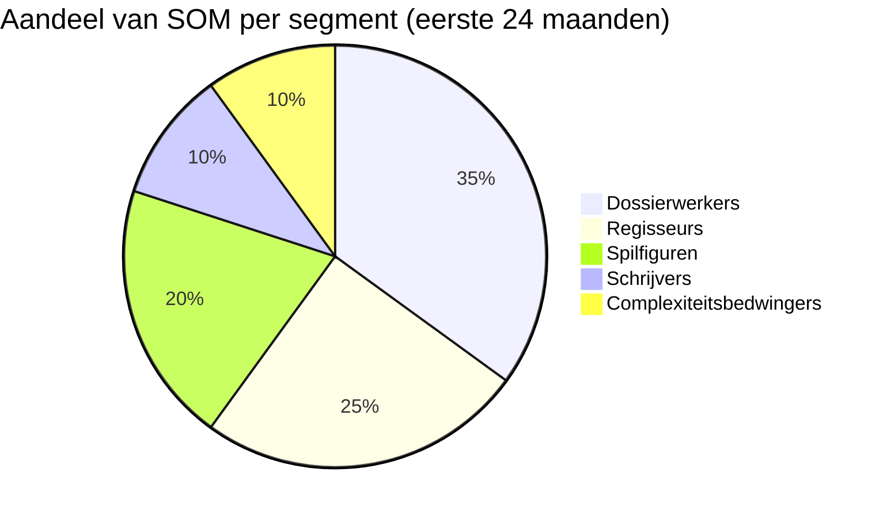
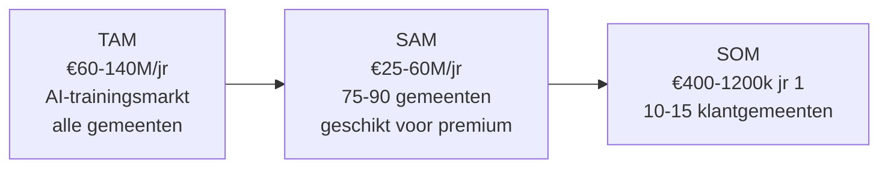

# Market Sizing — AI-educatieprogramma Nederlandse gemeenten

**Datum**: 2026-04-19
**Scope**: Nederland, 342 gemeenten, ±180.000 ambtenaren
**Benadering**: Top-down + bottom-up triangulatie
**Horizon**: 2026 (year 0) → 2030 (year 5)

## Executive summary

De Nederlandse markt voor AI-educatie voor gemeenten heeft een **TAM tussen €60 miljoen en €140 miljoen per jaar** (afhankelijk van aannames over diepte en retentie van trainingen), een **SAM van €25-60 miljoen** (gemeenten >50k inwoners die binnen 2 jaar bereid zijn diepgaand te investeren), en een realistische **SOM voor het eerste 24 maanden van €400k-€1.2 miljoen** (15-30 klant-gemeenten × gemiddeld €25k-€40k per eerste programma).

De markt groeit **sterk** vanwege de AI-Act-verplichting (sinds feb 2025), uitgestelde inhaalvraag en toenemende opleidingsbudgetten bij volwassen gemeenten. Kernrisico: commoditisering van de basislaag door gratis alternatieven (RADIO, ODI Basismodule). Mitigant: onze positie zit boven de commodity-laag, op persona-diepgang en adoptie.

## Definitie van de markt

**Wat telt mee**: betaalde AI-trainingen en leertrajecten voor gemeenteambtenaren (Rijk niet meegeteld) in Nederland. Inclusief kennisontwikkeling, vaardigheden, governance, adoptie-coaching. Exclusief generieke digitale vaardigheden, Office-training, klassieke dataopleidingen zonder AI-focus.

**Wie is de klant**: de gemeente als organisatie (B2B), inkoop via HR, ICT, innovatie, of vakafdeling. Een programma bedient meerdere deelnemers per gemeente.

**Prijsreferenties** (basis voor schattingen):
- Basis AI-literacy (1-daagse workshop): €800-€1.500 per deelnemer [Aanname]
- Middelzware training (2-3 dagen + opdrachten): €2.000-€3.500 per deelnemer [Aanname]
- Persona-specifiek programma (5-8 dagen + coaching): €3.500-€6.000 per deelnemer [Aanname]
- Executive / strategisch (1 dag + 1-op-1s): €1.500-€3.000 per deelnemer [Aanname]

## TAM — Total Addressable Market

De theoretische maximale markt: *alle* gemeentelijke ambtenaren in Nederland die in een AI-affected rol werken, vermenigvuldigd met een gemiddelde training-uitgave per jaar.

### Top-down benadering

```
Totaal gemeentelijke ambtenaren NL:        [Aanname] 180.000 FTE
AI-affected rollen (workload-raakvlak):    [Aanname] 50%     = 90.000 FTE
Training-uitgave per AI-affected FTE/jaar: [Aanname] €800    (gemiddelde)
───────────────────────────────────────────────────────────
TAM top-down per jaar:                     €72.000.000
```

### Bottom-up benadering

Per gemeente, gemiddelde jaarlijkse uitgave aan AI-training [Aanname]:
- Klein (<25k inw, ±180 gemeenten): €5.000 jaarbudget
- Middel (25-100k inw, ±120 gemeenten): €30.000
- Groot (>100k inw, ±42 gemeenten): €100.000

```
180 × €5k   = €900.000
120 × €30k  = €3.600.000
42 × €100k  = €4.200.000
───────────────────────
Subtotaal:    €8.700.000 (bij conservatieve uitgaven)
```

Bij volwassen AI-adoption (2028-2030):
- Klein: €15k (×3), Middel: €70k (×2.3), Groot: €250k (×2.5)
```
180 × €15k  = €2.700.000
120 × €70k  = €8.400.000
42  × €250k = €10.500.000
────────────────────────
Subtotaal:    €21.600.000 in groeifase
```

### Triangulatie

| Benadering | TAM-schatting |
|---|---|
| Top-down (breed) | €72M |
| Bottom-up (conservatief, huidig) | €9M |
| Bottom-up (volwassen, 2030) | €22M |
| Mix/realistisch (2026-2027) | **€60M-€140M / jaar** |

De top-down overschat waarschijnlijk, omdat niet alle AI-affected FTE's elk jaar getraind worden. De bottom-up onderschat, omdat het geen adoption-trajecten en maatwerk meeneemt. **Werkbare TAM-range: €60-140M per jaar**, afhankelijk van definitie-diepte.

## SAM — Serviceable Addressable Market

Het deel van TAM dat wij *redelijkerwijs* kunnen bedienen, gegeven onze positionering (persona-gebaseerd, diepgaand, Nederlandse markt).

### Inperking

| Criterium | Effect | Reductie |
|---|---|---|
| Gemeenten groot genoeg voor gestructureerd programma | Richt op 25k+ inw | ~162 gemeenten van 342 (47%) |
| AI-volwassenheid om diepgaande training te kopen | Alleen gemeenten in adoption-curve fase 2+ | ~60-70% van 162 = 100-110 gemeenten |
| Bereidheid tot premium (niet-commodity) betalen | Exclusief kleinste opleidingsbudgetten | ~70-80% van 100-110 = 75-90 gemeenten |
| Horizon van 24 maanden | Realistische reach in 2026-2027 | geen extra reductie |

```
Serviceable gemeenten:                    75-90 van 342
Gemiddelde training-uitgave [Aanname]:    €40.000-€80.000/jaar voor persona-programma's
────────────────────────────────────────────
SAM per jaar:                             €25M-€60M
```

### SAM-interpretatie

Dit is het deel van de markt waar wij *inhoudelijk en financieel* passen. Het SAM is substantieel genoeg voor een duurzaam bedrijf, maar niet oneindig — disciplinair focus in positionering (Segment 2 + 3) versterkt concurrentiekracht.

## SOM — Serviceable Obtainable Market

Realistische marktvangst gegeven onze huidige capaciteit (3 trainers, 0 bestaande klanten, 0 commerciële infra).

### Capaciteitsberekening

| Jaar | Trainer-dagen beschikbaar [Aanname] | Klantgemeenten bedienbaar | Revenue per klant (gemiddeld) | SOM |
|---|---|---|---|---|
| Jaar 1 (2026) | 3 trainers × 120 dagen = 360 | 10-15 | €25-40k (1e programma) | €250k-€600k |
| Jaar 2 (2027) | 3 trainers × 150 dagen + 1 part-time = 510 | 20-25 | €30-45k (inc. doorontwikkeling) | €600k-€1.1M |
| Jaar 3 (2028) | 5 trainers × 150 dagen = 750 | 30-40 | €35-50k | €1.05M-€2.0M |
| Jaar 4 (2029) | 8 trainers × 150 = 1200 | 50-70 | €40-55k | €2.0M-€3.8M |
| Jaar 5 (2030) | 12 trainers × 150 = 1800 | 80-110 | €45-60k | €3.6M-€6.6M |

**Aannames**:
- Trainer-dagen-per-jaar beschikbaar: 120 in jaar 1 (vanwege ramp-up, content-ontwikkeling), 150 in steady state
- Klant-gemeente = gemiddelde jaaropdracht, exclusief individuele executive-sessies
- Ramp-up van bedrijfsinfrastructuur: eerste 6 maanden zijn primair sales/content, niet levering
- Trainer-team groeit pas vanaf jaar 3 (retention/wervingstijd)

### Realistische SOM eerste 24 maanden

**€850k-€1.7M cumulatief in jaren 1+2**, verspreid over 15-25 klant-gemeenten.

Dit is verkrijgbaar zonder partnerstrategie. Met een Sdu- of VNG-partnerschap kan dit ruim 50% hoger.

## Segment-sizing (volgens onze 5-segment-clustering)

| Segment | Persona's in segment | [Aanname] Populatie NL | Revenue per gemeente-opdracht | Aandeel vroege SOM |
|---|---|---|---|---|
| 1. Schrijvers | 3 | 2.000-5.000 | €3-8k | ~10% |
| **2. Dossierwerkers** | 3 | 5.000-15.000 | €5-20k | **~35% (primair MVP)** |
| **3. Spilfiguren** | 4 | 1.500-3.500 | €3-10k | **~20% (primair MVP)** |
| 4. Regisseurs | 5 | 2.000-5.000 | €4-15k | ~25% (hoge marge, lage volume) |
| 5. Complexiteitsbedwingers | 5 | 2.000-5.000 | €5-15k | ~10% |

Totaal directe doelgroep-populatie: **12.500-33.500 ambtenaren** (zie segmentation.md voor detail).

### Segment → Revenue-driver



## Groeidrivers

Factoren die TAM/SAM naar de bovenkant van de range kunnen duwen:

1. **AI-Act handhavingsintensiteit** — als inspectie-dienst AI-geletterdheid actief gaat toetsen, explodeert vraag (+20-40%)
2. **GPT-NL en open-source ontwikkelingen** — vraag naar lokale-model-training als niche — kleine absolute impact, hoge marge
3. **Vergrijzing en vervanging** — vervangende werving moet onboarded worden; AI-onboarding wordt standaard
4. **Gemeentelijke herindelingen** — fusiegemeenten investeren in modernisering (2-3 fusiegolven verwacht 2026-2030)
5. **Europese subsidies** — Horizon Europe, Digital Europe, NGO-programma's rondom AI-upskilling

## Groei-remmers

Factoren die TAM/SAM naar de onderkant kunnen duwen:

1. **Gemeentelijke financiële problematiek** — jeugdzorgtekorten, opschalingskorting drukken opleidingsbudgetten
2. **Commoditisering basis-AI-trainingen** — gratis ODI-materiaal maakt de onderkant onbetaalbaar om betalend aan te bieden
3. **Interne AI-teams** — grote gemeenten (G4) bouwen eigen training-capaciteit
4. **Verzadiging** — als iedere ambtenaar in 2027 één AI-training heeft gehad, daalt de vraag naar eerste-programma's, stijgt de vraag naar verdiepende programma's (net-positief voor ons)
5. **Ingebouwde leer-modules in tools** — Microsoft Copilot, Google met ingebouwde guidance verlagen training-vraag

## Triangulatie-overzicht

| Dimensie | TAM | SAM | SOM (24 mnd) |
|---|---|---|---|
| Jaarlijks (2026) | €60-140M | €25-60M | €400k-€1.2M jr 1 |
| Jaarlijks (2030) | €80-180M | €40-90M | €3.6-6.6M jr 5 |
| Cumulatief 5 jaar | €350-800M | €160-375M | €7.5-14M |

## Sizing-diagram



## Strategische implicaties

1. **Focus op SAM-segment** — niet proberen alle 342 gemeenten te bedienen, maar de 75-90 "gewillige en passend grote" gemeenten strak targeten
2. **Jaar 1 = land, jaar 2 = expand** — landen per gemeente in segment 2+3, daarna binnen diezelfde gemeente expanderen naar andere segmenten (bestaand account = lagere CAC)
3. **Capaciteitsplanning vanaf jaar 2** — trainer-recruitment moet starten voor capaciteit-tekort remt
4. **Partnerstrategie drukt aan twee kanten**: +50% SOM mogelijk, maar -10-15% marge (partnerfee). Alleen doen als partner échte nieuwe toegang biedt
5. **Concentratierisico** — vermijd dat >25% SOM uit 1 gemeente komt (afhankelijkheid)
6. **Retentie is cruciaal** — als we jaar 1 klanten in jaar 2 behouden + uitbreiden, halveert CAC; als niet, moet jaar 2 SOM volledig uit nieuwe gemeenten komen

## Validatie-punten voor Spoor 2.4

Deze sizing moet aan de volgende aannames worden getoetst in validatie-interviews:

- [ ] Opleidingsbudgetten per gemeentegrootte kloppen met onze schattingen
- [ ] Bereidheid tot premium (vs. gratis alternatieven) kunnen we verifiëren
- [ ] Is 24 maanden een redelijke sales cycle?
- [ ] Zijn de 75-90 "serviceable" gemeenten terecht geïdentificeerd — of is volwassenheidscurve steiler?
- [ ] Validate specifieke prijzen per segment door directe vraag

## Aannames en beperkingen

### Aannames (gelabeld [Aanname])
- Alle FTE-tellingen en training-budgetten zijn indicatief; VNG / A+O fonds publiceert rond 180-200k FTE over gemeenten
- Prijsreferenties zijn afgeleid van vergelijkbare overheidscursussen (SBO, Bestuursacademie)
- 50% AI-affected rollen is een order-of-magnitude-inschatting; kan hoger zijn bij ruime interpretatie (kennisarbeid)
- Gemeentelijke AI-volwassenheidscurve is geschat op basis van publiek commentaar en VNG-rapporten, niet op empirisch onderzoek

### Beperkingen
- **Geen directe marktdata**: er is geen officieel rapport "AI-trainingsmarkt gemeenten NL" met feitelijke omzetcijfers
- **Concurrent-omzet onbekend**: aannames over concurrent-aandeel zouden sizing kunnen kantelen
- **Substitute risico niet volledig meegenomen**: als gemeenten massaal kiezen voor gratis ODI-materiaal aangevuld met 1 dag externe workshop, zakt SAM aanzienlijk
- **Inflatie en kostenstijging niet ingeprijsd**: prijzen zijn in 2026-euro's
- **Geen macro-economische shock-scenario**: recessie zou gemeentelijke opleidingsbudgetten significant drukken

## Volgende stap

1. Voeden naar **Spoor 3.4 (cost-estimation + roi-modeling)** om prijsmodel te verfijnen
2. Voeden naar **Spoor 4.2 (go-to-market)** voor segmentatie van kanalen per gemeentegrootte
3. **Spoor 2.4 (validatie)** — concrete budgetten en bereidheid empirisch toetsen

## Sources

- Eerder onderzoek in `../business/segmentation.md`
- Concurrent-landscape in `./competitive-analysis.md`
- Eigen persona-onderzoek
- **[Aanname]** VNG / A+O fonds — FTE-schattingen gemeentelijk apparaat
- **[Aanname]** CBS — gemeente-totaal 342, inwonerverdeling
- **[Aanname]** Publieke prijsindicaties van SBO, Bestuursacademie, Dutch-AI, Advies en Training.ai
