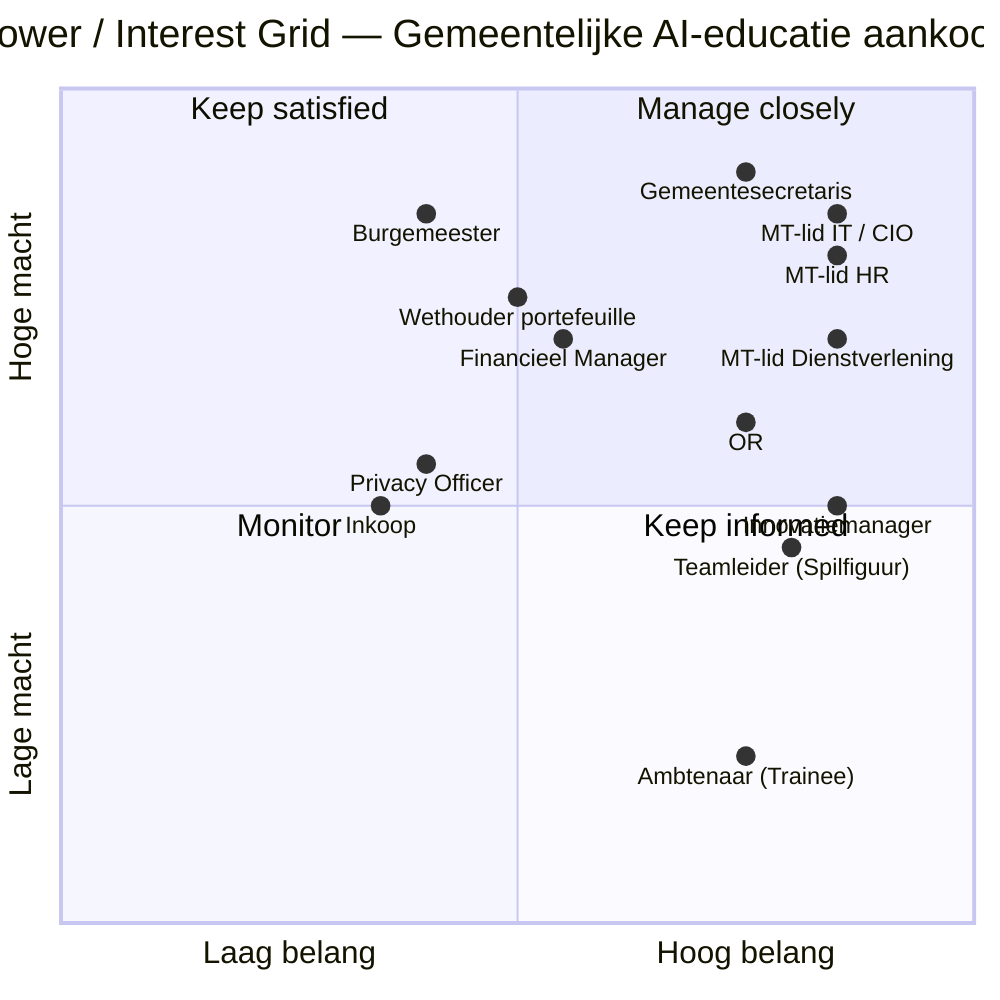
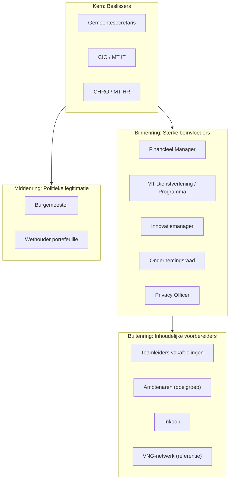
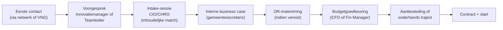
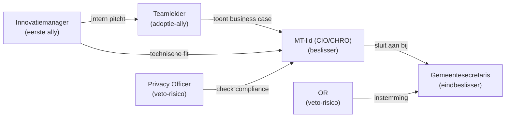

# Stakeholder-mapping — Verkoop-decision-map AI-educatie bij gemeenten

**Datum**: 2026-04-19
**Scope**: Besluitvormings- en beïnvloedingsstructuur binnen een Nederlandse gemeente rond aanschaf van een AI-educatieprogramma
**Benadering**: Power/Interest Grid + Salience Model (Mitchell/Agle/Wood) + Onion Diagram + Engagement Plan

## Executive summary

Bij een gemeentelijke aanschaf van AI-educatie zijn typisch **8-12 stakeholders** actief, met 3-4 **beslissers**, 4-5 **sterke beïnvloeders** en de rest **inhoudelijke of organisatorische betrokkenen**. De dominante beslis-as loopt via **Gemeentesecretaris → MT-lid (IT / HR / Innovatie)** met sterke invloed van de **OR** en eventuele **portefeuillehouder**. De aankoopcyclus bedraagt gemiddeld **3-6 maanden** vanaf eerste contact. Inhoudelijke afnemers (teamleiders, ambtenaren) zijn zelden doorslaggevend in de aankoop, maar hun weerstand kan een deal laten stranden.

**Topaanbeveling**: voer een **dubbelspoor-aanpak** — inhoudelijke gesprekken met beïnvloeders (teamleiders, innovatiemanager) om draagvlak te bouwen, en parallel formele bestuurlijke gesprekken met beslissers (gemeentesecretaris / MT). Marieke is strategisch geplaatst voor het bestuurlijke spoor.

## Stakeholder-inventarisatie

Per rol: beschrijving, belang, invloed op het besluit, houding tov AI-training.

| # | Stakeholder | Rol bij besluit | Belang | Macht | Houding | Moeite tot bereiken |
|---|---|---|---|---|---|---|
| 1 | Gemeentesecretaris | Beslisser | Hoog | **Hoog** | Neutraal-positief (bestuurlijke druk AI-Act) | Hoog |
| 2 | Burgemeester | Beslisser op strategisch niveau | Middel | Hoog | Variabel | Hoog |
| 3 | Wethouder(s) (ICT, HR, Dienstverlening, Innovatie) | Politieke rugdekking | Middel | Middel-hoog | Variabel | Middel |
| 4 | MT-lid IT / CIO (Maarten) | Inhoudelijke beslisser + toets governance | Hoog | **Hoog** | Kritisch-positief | Middel |
| 5 | MT-lid HR / CHRO (Sandra) | Inhoudelijke beslisser + budgethouder opleidingen | Hoog | **Hoog** | Positief (personeels-kant) | Middel |
| 6 | MT-lid Dienstverlening / Programmamanager (Peter / Bas) | Inhoudelijke beslisser bij directe baat | Hoog | Middel-hoog | Positief | Middel |
| 7 | Financieel Manager (Rob) | Budget-goedkeurder | Middel | Middel-hoog | Voorzichtig | Middel |
| 8 | Innovatiemanager (Anouk) | Sterke adviseur + scout | Hoog | Middel | **Zeer positief** | **Laag** |
| 9 | Privacy Officer / FG | Toetsing AVG/BIO | Middel | Middel (veto-macht) | Voorzichtig-kritisch | Middel |
| 10 | OR (Ondernemingsraad) | Instemmingsrecht bij grotere trajecten | Hoog | Middel-hoog | Variabel (zorgen over banen) | Middel |
| 11 | Teamleiders betrokken vakafdelingen (Spilfiguren) | Adoptie-beslissers in team | Hoog | Middel | Vaak positief | **Laag** |
| 12 | Ambtenaren (trainees / Dossierwerkers e.a.) | Doelgroep | Hoog | Laag (per persoon), hoog collectief | Variabel | Laag |
| 13 | Inkoop / aanbestedingen | Procedureel | Middel | Middel (proces-macht) | Neutraal | Middel |
| 14 | Externe stakeholders (VNG, omgevingsdienst, regio) | Referentiepartij | Laag-middel | Laag | Neutraal-positief | Laag |

## Power/Interest Grid

### Interpretatie
- **Manage closely (hoog belang + hoge macht)**: Gemeentesecretaris, CIO, CHRO, MT Dienstverlening — dit zijn je beslissers; hen krijg je alleen via direct contact met gedegen voorbereiding
- **Keep satisfied (hoge macht, lager belang)**: Burgemeester, wethouders, OR — informeer proactief; bij ontbrekende instemming kan deal stranden
- **Keep informed (hoog belang, lager macht)**: Innovatiemanager, teamleiders, ambtenaren — belangrijke voorbereiders en adoptie-aanjagers; investeer in relatie
- **Monitor (laag belang/macht)**: Inkoop, externe referentiepartijen — bijhouden, niet vooraan in gesprekken

## Salience Model (Mitchell/Agle/Wood)

Salience = mate waarin een stakeholder aandacht opeist, gebaseerd op 3 eigenschappen: **Power**, **Legitimacy**, **Urgency**. Hoe meer eigenschappen, hoe salienter.

| Stakeholder | Power | Legitimacy | Urgency | Salience-klasse |
|---|---|---|---|---|
| Gemeentesecretaris | ✅ | ✅ | ✅ (bij AI-Act-deadline) | **Definitive** (alle drie) |
| CIO (Maarten) | ✅ | ✅ | ✅ (bij BIO / shadow-IT) | **Definitive** |
| CHRO (Sandra) | ✅ | ✅ | ✅ (bij AI-Act art. 4) | **Definitive** |
| Burgemeester | ✅ | ✅ | ✗ (politiek, niet operationeel) | **Dominant** |
| Innovatiemanager | ✗ | ✅ | ✅ | **Dependent** |
| OR | ✗ | ✅ | ✗ (tenzij verandertraject raakt) | **Discretionary** |
| Privacy Officer | ✗ | ✅ | ✅ (compliance) | **Dependent** |
| Teamleider | ✗ | ✅ | ✅ (werkvoorraad) | **Dependent** |
| Ambtenaar | ✗ | ✅ | ✗ | **Discretionary** |
| Inkoop | ✗ | ✅ | ✗ | **Discretionary** |
| Wethouder | ✅ | ✅ | ✗ (tenzij publiek dossier) | **Dominant** |

**Inzicht**: de 3 **Definitive**-stakeholders (Gemeentesecretaris, CIO, CHRO) zijn de fiat-gevers. De 4 **Dependent**-stakeholders (Innovatiemanager, Privacy Officer, Teamleider) hebben geen macht zonder allié, maar als jij hen als ally hebt, openen ze deuren.

## Onion Diagram — Besluitvormingslagen

## Verkoop-decision-map per gemeente

Typische sequentie van een succesvolle inkoop:

**Typische duur**: 10-26 weken (2-6 maanden), afhankelijk van:
- Gemeente-omvang (groter = langer)
- Aanbestedingsverplichting (>€50k onderhands, >€250k formeel) — toename duur met 6-10 weken
- Interne organisatie (wel/niet jaarbudget ingepland)
- Politieke gevoeligheid dossier

## Engagement-plan per stakeholder-cluster

| Cluster | Engagement-tactiek | Toon | Kanaal | Frequentie | Lead (wij) |
|---|---|---|---|---|---|
| **Beslissers (Definitive)** | Executive briefing + 1-op-1 gesprek met persona-materiaal | Bestuurlijk, strategisch, governance-nadruk | Fysiek gesprek + PR/FAQ | 2-3 touchpoints/maand tijdens traject | **Marieke** |
| **Sterke beïnvloeders (Dependent + Dominant)** | Werkbezoeken, demo's, co-creatie workshops | Pragmatisch, casus-gedreven | Fysiek + video | Wekelijks tijdens sales-fase | Mike + Marieke |
| **Politieke laag** | Informerende nota's, 1-pager, framing hulp | Neutraal, feitelijk | Schriftelijk via Gemeentesecretaris | 2 keer: start en close | Mike (auteurschap) |
| **OR** | Vroeg informeren, banen-behoud-narratief, pilot met zichtbare voordelen voor werkvloer | Transparant, rechtvaardig | Fysiek OR-overleg | 1-2 sessies | Marieke (ex-ambtenaar) |
| **Privacy Officer** | AI-Act + BIO + AVG-briefing, technische Q&A | Rechtsstatelijk, technisch | Fysiek + schriftelijk | 1-2 sessies | **Ravi** + Mike |
| **Teamleiders (Spilfiguren)** | Inhoudelijk gesprek, tipsjes, peer-testimonials | Vakmatig, collegiaal | Fysiek, indien mogelijk shadow-dag | Wekelijks | Marieke |
| **Ambtenaren** | Vooraf informeren dat het komt, inspraak in use cases | Uitnodigend, niet bedreigend | Intranet + teamoverleg (door teamleider) | 1-2 communicaties | Indirect (via teamleider) |
| **Inkoop** | Standaard-documenten, referenties, tarieventabellen | Zakelijk, procedureel | Schriftelijk | Op aanvraag | Mike (operationele lead) |

## Veto-spelers

Stakeholders die een deal eenzijdig kunnen blokkeren, ook zonder beslismacht:

| Stakeholder | Veto-reden | Mitigant |
|---|---|---|
| Privacy Officer | AVG/BIO-bezwaar tegen AI-gebruik | Vroeg betrekken, dataflow transparant maken, AI-Act-compliance expliciet adresseren |
| OR | Instemmingsverzoek verworpen wegens banen-zorg | Narratief "meer tijd voor burger, minder admin" + banenbehoud-perspectief in beleidslijn |
| CIO | Architectuur-bezwaar (IT-schuld) | Toon hoe programma niet-intrusief is op bestaande architectuur |
| Financieel Manager | Budget-mismatch | Vroege ROI-case, fasering mogelijk maken |

## Coalition building — hoe bouwen we steun?

**Ideale aanvalsvolgorde**:
1. **Land bij Innovatiemanager** (laag-drempelige entry, hoog enthousiasme) of via VNG-netwerk direct bij CIO
2. **Laat Innovatiemanager een Teamleider introduceren** die concrete pijn heeft (Spilfiguur)
3. **Teamleider + Innovatiemanager pitchen intern** naar CIO/CHRO met onze support
4. **Directe executive-briefing met CIO/CHRO** (Marieke lead), met Gemeentesecretaris erbij of geïnformeerd
5. **Privacy Officer en OR vroeg betrekken** — niet achteraf
6. **Business case en contract** afgerond met Financieel Manager + Inkoop

## Risico's en mitigaties

| Risico | Impact | Waarschijnlijkheid | Mitigant |
|---|---|---|---|
| Gemeentesecretaris wisselt tijdens traject | Hoog | Middel (verkiezingen, carrièrewissels) | Relatie opbouwen met minimaal 2 MT-leden, niet afhankelijk van 1 persoon |
| OR blokkeert uitrol | Hoog | Laag-middel | Vroeg betrekken, banen-narratief, pilot-vorm kiezen |
| Privacy/Veto na pilot-afspraak | Middel | Middel | AI-Act + AVG in pre-sales al adresseren, niet pas in contract-fase |
| Aanbestedingsplicht ineens groter | Middel | Middel | Modulair aanbieden zodat pilots onder de €50k onderhands blijven |
| Concurrentieslag met bestaande leverancier | Middel | Hoog | Differentiatie via persona-diepgang (zie competitive-analysis.md) |
| Budgetschuif wegens jeugdzorgtekort | Hoog | Middel | Oriënteren op gemeenten met meer financiële ruimte, programma-subsidies |

## Key insights

1. **Bij gemeenten ligt macht echt in het MT, niet op de werkvloer** — onze materialen moeten bestuurlijk aankomen
2. **Innovatiemanager is de beste "trojan horse"** — meeste enthousiasme én genoeg invloed om deur te openen
3. **Teamleiders zijn de adoptie-verzekering** — zonder hun support faalt implementatie, hoe goed de deal ook is
4. **Marieke is strategisch cruciaal** — haar gemeentelijke lived experience opent bestuurlijke deuren die Mike of Ravi moeilijker hebben
5. **OR betrekking is een onderschatte slagkracht** — een positieve OR-stem bij de eerste pilot is referentie-materiaal voor vervolg-gemeenten
6. **Privacy Officer is geen vijand, maar potentiële ally** — met juiste framing (AI-Act naleving als verkoopargument) kan hij ambassadeur worden

## Volgende stap

- Voeden naar **Spoor 2.4 (validatie-interviews)**: interview-protocol per stakeholder-type
- Voeden naar **Spoor 4.2 (go-to-market)**: kanalen per stakeholder-cluster (VNG-bijeenkomsten → CIO's, LinkedIn → innovatiemanagers, etc.)
- Voeden naar **Spoor 3.6 (pre-mortem)**: veto-scenarios als belangrijkste risico-categorie

## Aannames

- **[Aanname]** Gemiddelde aankoopduur 3-6 maanden — afgeleid van vergelijkbare B2B-trainingsverkoop bij overheden; kan korter bij klein-onderhandse trajecten
- **[Aanname]** Veto-macht privacy officer verschilt per gemeente: in sommige gemeenten formele toetsvereiste, in andere adviserend
- **[Aanname]** OR-instemming bij AI-trainingstrajecten niet altijd vereist; afhankelijk van schaal en karakter (individuele vs. organisatiebrede interventie)
